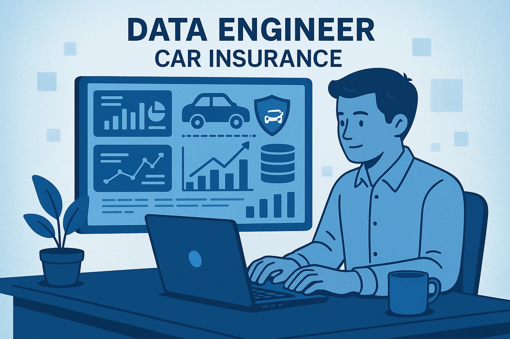

# Data Engineering Case Study: Car Insurance Industry

# Objective

Explore how data engineering concepts are applied in the car insurance industry. This activity willhelp you build foundational knowledge, practice critical thinking, and understand the real-world impact of data engineering.

# Instructions:

- Work in groups.
- Use the guiding questions below to structure your research and discussion.
- Prepare to present your findings in a 5-minute presentation, focusing on the story of a data engineer’s role in a car insurance company.

# Tasks:

## 1. Types of Data

- **Identify and describe** the main types of data used in car insurance:
  - Structured (e.g., policy records, claims tables)
  - Semi-structured (e.g., JSON from telematics devices)
  - Unstructured (e.g., accident photos, call center transcripts)
- **Questions to consider:**
  - What are real examples of each data type in this industry?
  - How might this data be collected?

## 2. Types of Databases

- **Research and discuss** how both relational and non-relational databases are used.
- **Questions to consider:**
  - What data would be stored in a relational database (like PostgreSQL or MySQL)?
  - What data might be better suited for a NoSQL database?
  - When would a car insurance company use:
    - A **Time Series Database** (e.g., for storing sensor data from vehicles)?
    - A **Document Database** (e.g., for storing customer profiles or claims in JSON format)?

## 3. Data Warehouse vs. Data Lake vs. Lakehouse

- **Compare and contrast** these data storage solutions:
  - What are their main differences?
  - What types of data or use cases are best for each?
- **Questions to consider:**
  - How would you map each storage type to a specific business need in car insurance (e.g., reporting, analytics, storing raw sensor data)?

## 4. Big Data in Insurance

- **Discuss the “V’s” of Big Data** (Volume, Velocity, Variety, Veracity, etc.) in the context of car insurance.
- **Questions to consider:**
  - What are examples of big data sources (e.g., telematics, IoT sensors, customer interactions)?
  - How is this data collected and processed?
  - Are there challenges with data quality or speed?

## 5. The Data Engineer’s Value

- **Reflect as a group**: What value do data engineers bring to a car insurance company?
- **Questions to consider:**
  - How do data engineers help improve services, customer experience, or operational efficiency?
  - Can you think of a scenario where a data engineer’s work made a real difference?

## Deliverable

- **Presentation:** Prepare a 5-minute group presentation.
  - Tell a story from the perspective of a data engineer at a car insurance company.
  - Highlight the types of data you work with, the technologies you use, and the impact of your work on the business.