# Getting Started with Glue

**AWS Glue** is a serverless data integration service, which means that you only pay for usage and don't pay for idle time. With AWS Glue, data scientists, analysts, and developers can discover, prepare, and combine data for various purposes. Examples include analytics, machine learning (ML), and application development. AWS Glue provides visual and code-based interfaces for data integration activity and transforms data using built-in transformations.

You can also quickly locate and access data through the **AWS Glue Data Catalog**. Data engineers and extract, transform, and load (ETL) developers can create, run, and monitor ETL workflows using AWS Glue Studio. Data analysts can use the no-code capabilities of **AWS Glue DataBrew** to enrich, clean, and normalize data without writing any code. Data scientists can use AWS Glue interactive notebooks to quickly start querying their data for interactive analytics, rather than spending months creating infrastructure.

## **How is AWS Glue used to architect a cloud solution?**

With AWS Glue, you can identify and build a technical data catalog for various data storage locations. You can use this **data catalog** as input and then carry out ETL or extract, load, transform (ELT) processes based on their requirements. Later, **crawl** the data to identify the schema, clean and standardize, and author the ETL process to generate raw data. Then, use the same ETL utilities provided by AWS Glue to create refined data. This data can finally be consumed through analytical query engines like Amazon Athena, Amazon Redshift, and Amazon QuickSight.

----

# Download the files for the lab

* Customers dataset https://aws-tc-largeobjects.s3.us-west-2.amazonaws.com/Curation/GettingStarted/AWS+Glue/customers.csv
* Sales dataset https://aws-tc-largeobjects.s3.us-west-2.amazonaws.com/Curation/GettingStarted/AWS+Glue/sales.csv

# Create an Amazon S3 Bucket

1. In AWS Console, navigate to S3, click create bucket.
2. For Bucket type keep it as **General Purpose**
3. For Bucket name pick a globally unique name. For example: `starting-with-glue-FIRSTNAME-LASTNAME`
4. Leave remaining options at default and click **Create bucket**
5. Go to your bucket, and click **Create Folder** to create three folders
   1. `datafiles`
   2. `profile-output`
   3. `shared`

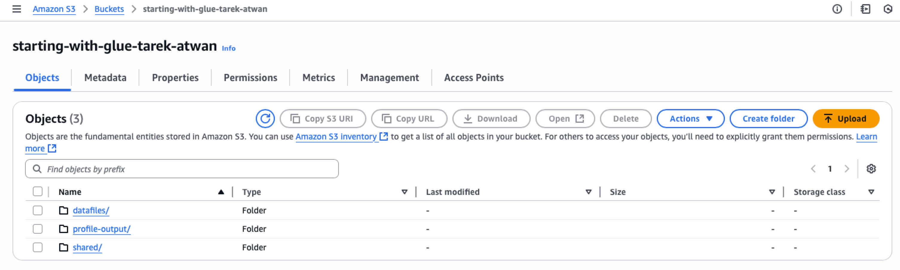

6. Inside the `datafiles` folder create folder, create two more folders:
   1. `customers`
   2. `sales`

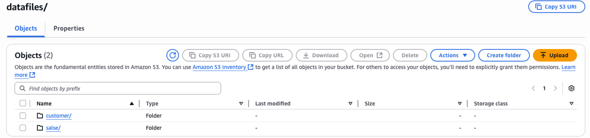

7. Upload the `customers.csv` file to the `customers` folder 
8. Upload the `sales.csv` file to the `sales` folder

# Using AWS Glue to crawl and catalog data

At the heart of AWS Glue is the AWS Glue Data Catalog. It is a central repository to store metadata for all your structured and semi-structured data assets across various data sources. The Data Catalog provides a unified interface to store and query information about data formats, schemas, and sources. When an AWS Glue ETL job runs, it uses this catalog to understand information about the data to ensure that it is ingested, transformed, and stored correctly. 

With the metadata stored in the Data Catalog, it is not only accessible to **AWS Glue**. It is also integrated with other AWS services, such as **Amazon Athena**, **Amazon EMR**, and **Amazon Redshift Spectrum**, and many third-party services. The Data Catalog is a key driver of data-driven innovation and data governance

1. In the search type `glue` and select **AWS Glue** service to go to the main page
2. On the left panel you will see **Data Catalog** section, from there choose **Crawlers**
3. Click **Create crawler**, for the name enter `learn-glue-crawler-YOURFIRSTNAME` then hit **next**.
4. In Step 2, choose **Data Sources and Classifiers**. For **Data source configuration**, choose **Not yet**. Then, choose **Add a data source**.
5. In **Add data source**, for **S3 path**, choose **Browse S3** and Select the bucket name you created (you can use the search box to help you find your bucket). 
6. Choose the radio button to the left of the `datafiles` folder, and then select **Choose**. You will return to the **Add data** source window.

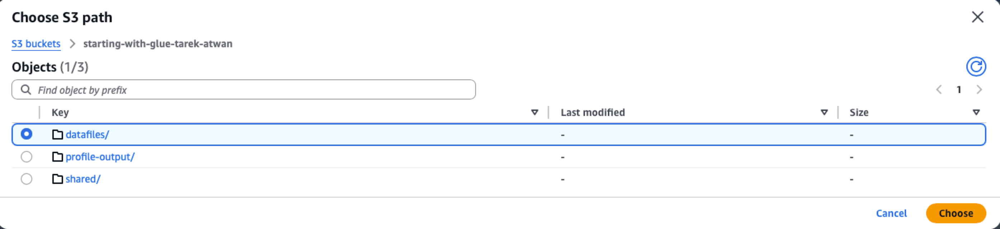

7. For **Subsequent crawler runs**, choose **Crawl all subfolders**. To complete the data source addition, choose **Add an S3 data source**

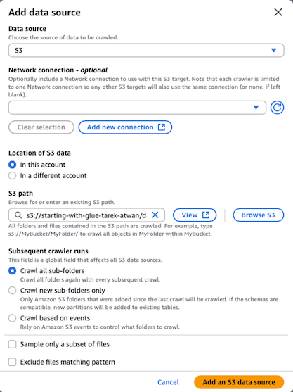

8. Back on the **Choose data sources and classifiers** page, verify the S3 data source. Choose **Next**.
9. In Step 3, configure security settings. Choose **Create new IAM role**. 
10. In the **Create new IAM role** pop-up window, enter `-learn-glue-role-YOURFIRSTNAME`to the end of the existing `AWSGlueServiceRole` text in the **Enter new IAM role** box. The full IAM Role name is `AWSGlueServiceRole-learn-glue-role-YOURFIRSTNAME`. This will automatically provision and assign an AWS Identity and Access Management (IAM) role for the crawler to use. Choose **Create**.

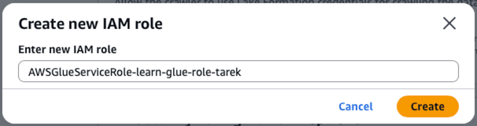

It may take few seconds for the IAM role to be created. On the **Configure security settings** page, a green banner at the top of the page indicates the new IAM role is created. 

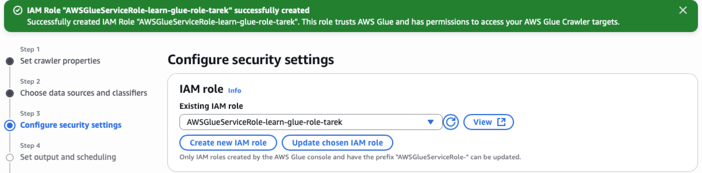

Choose **Next**.

11. In Step 4, set the output and scheduling for your crawler. To create a new Data Catalog database that will store source metadata, choose **Add database**. The **Create a database** page will open in a new browser tab.
12. On the **Create a database** page, for Name, enter `sales_data_YOURFIRSTNAME`. In a future step, the crawler will populate the database with table and schema information. Choose **Create database**. Then, navigate back to the Set output and scheduling page.

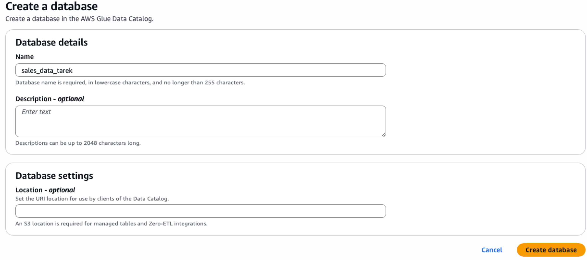

13. On the **Set output and scheduling** page,  **refresh** the Target database list by choosing the refresh icon (circular arrow). For Target database, choose `sales_data_YOURFIRSTNAME`. For Frequency, keep **On demand** selected, and then choose **Next**

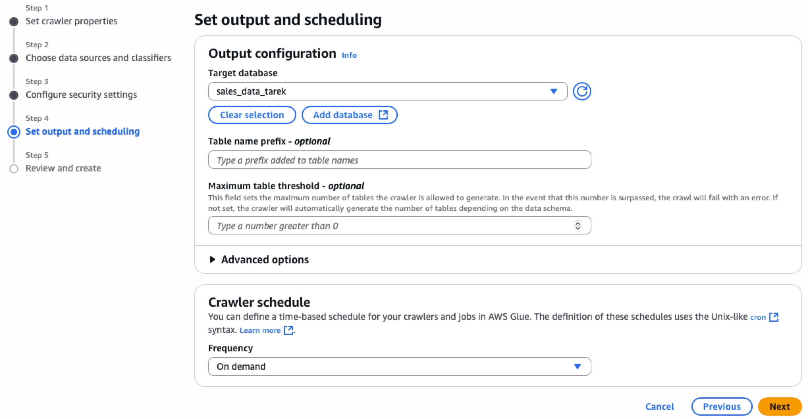

14. In Step 5, Review and create, choose **Create crawler**.

15. With the crawler successfully created, choose **Run crawler**. This will initiate an interrogation of the source data that will populate the `sales_data_YOURNAME` database in the Data Catalog with source schema and data types.

In the Crawler runs section, the status will change to **Running**. On successful completion, the crawler run status will change to **Completed** and two tables will be added to the` sales_data_YOURNAME` Data Catalog database.

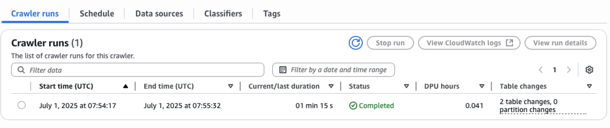

To navigate to the Crawlers page, choose Crawlers in the left navigation pane. On the Crawlers page, review the Status, Last run, and Table changes from last run for `learn-glue-crawler-YOURNAME`. Notice the crawler created two tables.

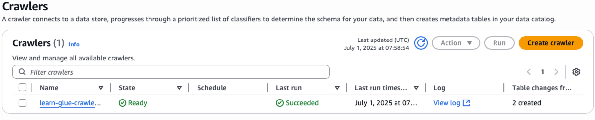

In the Data Catalog section, in Databases, choose Tables. The crawler added two new tables named sales and customers based on the analyzed data files in Amazon S3. To browse the metadata, choose the sales table by selecting the table name.

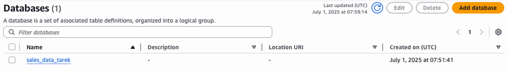

Notice inside the Database I now have two tables

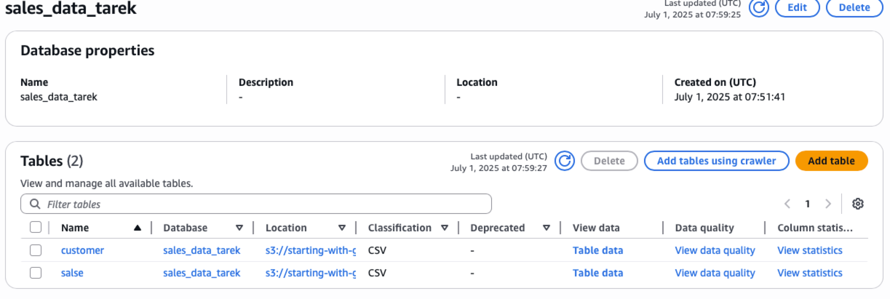

Expand and review the tables, check out the schema for each. All metadata the crawler discovered is available to view.

----

# Using AWS Glue to Perform ETL on Data

AWS Glue Studio is a visual interface for AWS Glue that helps ETL developers author, run, and monitor AWS Glue ETL jobs. AWS Glue Studio provides a streamlined visual interface to compose jobs that move and transform data and then run them on AWS Glue. You can use the AWS Glue Studio job run dashboard to monitor ETL pipelines and help ensure that your jobs are operating as intended.

In this section, you will use the default transformations offered by AWS Glue Studio to create an AWS Glue ETL job with two flows. First, you will read `customer` data, rename a column, and rewrite the output into optimized Apache Parquet files. 

Then, you will read the `customer` and `sales` data, aggregate the total sales by customer, and output the result into comma-separated values, or CSV, files.

1. With the Data Catalog populated, it is time to perform ETL on the customer and sales data. In the **Data Integration and ETL section**, choose **Visual ETL.**

   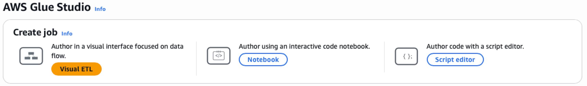

2. Inside the Canvas you will create your ETL pipeline. In the top left changed from `Untitled job` to `learn-glue-etl-job-firstname` 

   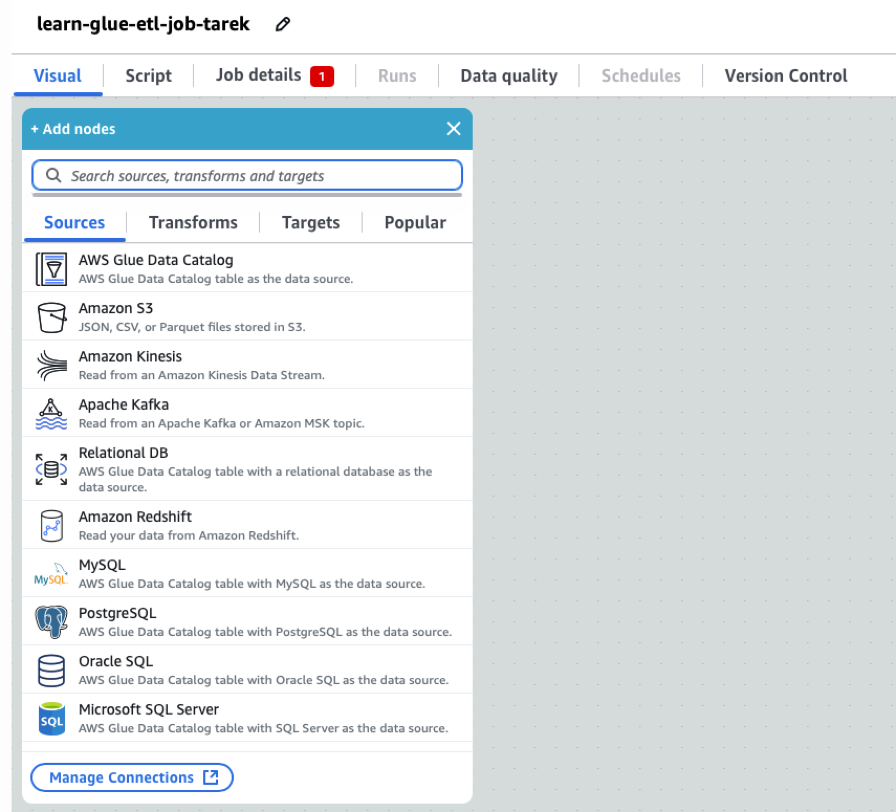

   3. In the **Job details** tab, for **IAM Role** select the IAM role you created in the previous section 

   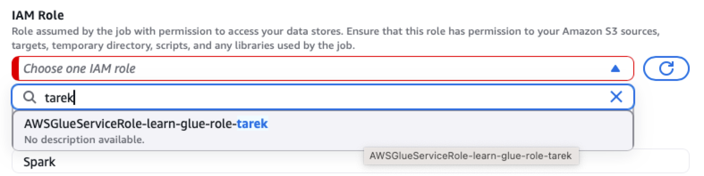

   4. Keep defaults for the remaining options then hit **Save**
   5. Back to the **Visual** tab. Click on the big blue `+` and from the **Sources** menu choose **Amazon S3**
   6. It will add a box like this

   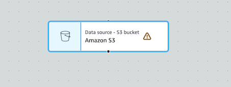

   7. Click on the box to configure the Amazon S3 source
      1. S3 source type select **Data Catalog table**
      2. Select your Database
      3. Select the `customer` table 

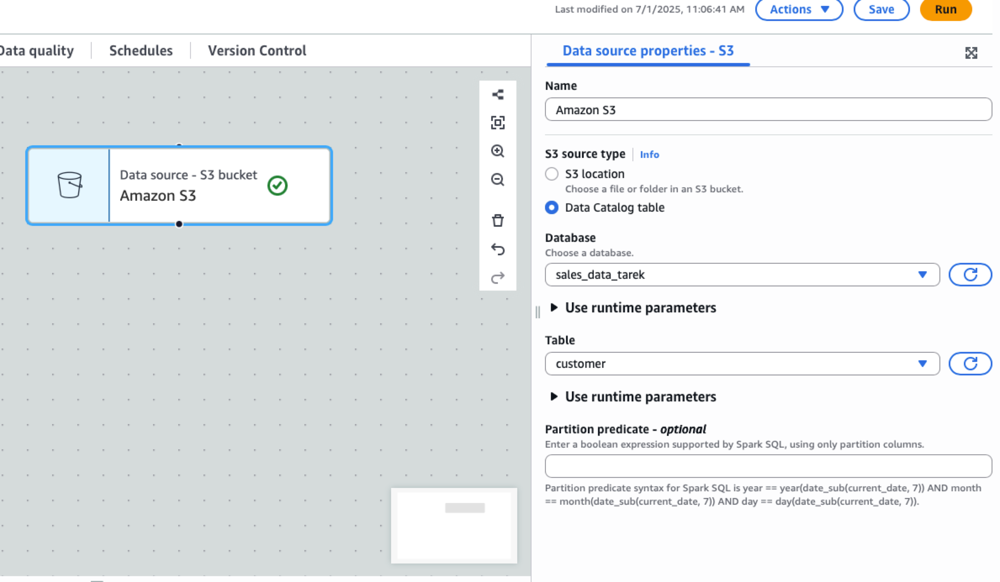

8. Add another node. Click the blue +, and in the **Transforms** section select **Change Schema**.  Click not he **Change Schema** box, on the Transform tab, for Name, enter `Customer-Data-Mapping`. In the **Change Schema (Apply mapping)** section, in the Source key column, for `dob`, enter `date_of_birth` in the Target key column.

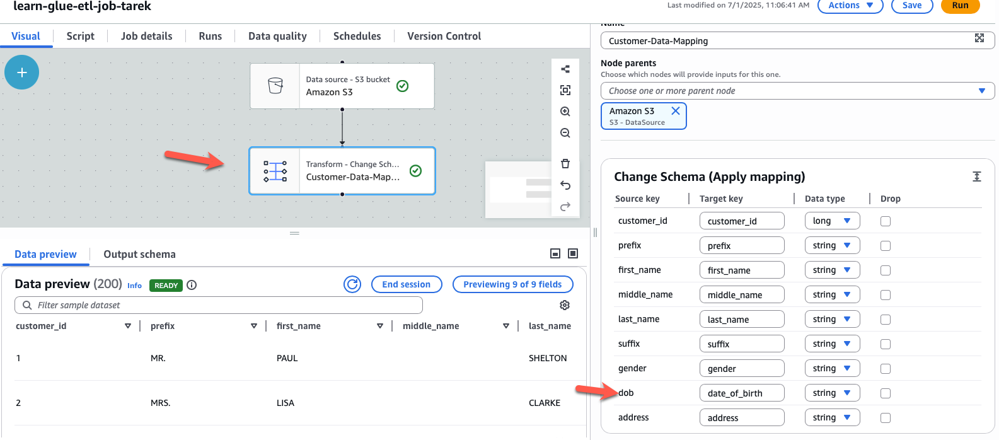

9. On the graph, add **Amazon S3** by selecting it from **Targets**. choose the `Data target - S3 bucket` node for its configuration options. On the **Data target properties - S3** tab, for Name, enter `Customer-Data-Processed`.
10. Next, we need to configure the file type, location, and compression. 
    1. For **Format**, choose `Parquet`. 
    2. For **Compression Type,** choose `Snappy`. 
    3. For **S3 Target Location**, choose **Browse S3**, and then choose the bucket beginning with `starting-with-glue-firstname-lastname`. Remember, your bucket will have a unique string added to the end of the bucket name. Choose `datafiles`. 
    4. For the S3 Target Location input, enter `parquet-customers/` to the end of the S3 Target Location. Here is mine looks like `s3://starting-with-glue-tarek-atwan/datafiles/parquet-customers/`
11. The first portion of the job is now complete. Choose **Save**. When the green banner appears at the top of the page indicating the job is saved, choose X in the top right to close the message.

----

The remainder of the demonstration will add source, target, and transform nodes to the job using the Add nodes widget, accessed by choosing the plus sign contained within the blue circle on the left side of the graph.

12. To add a second source to the job, open the Add nodes widget by choosing the plus sign contained within the blue circle on the left side of the graph. From Popular transforms & data, choose **Amazon S3** (**source**). 
13. On the visual graph, choose the **Data source - S3 bucket** node, and then choose the **Data source properties - S3 tab**. Complete the configuration by setting the following options: 
    1. For Name, enter Sales-Data. 
    2. For S3 source type, choose **Data Catalog** table. 
    3. For Database, choose `sales_data_YOURNAME`. 
    4. For Table, choose `sales`.
14. With the Sales-Data node highlighted, indicated by the node outlined in blue on the graph, add a new transform by choosing the Add nodes widget plus sign. In the transforms section choose the **Change Schema** transform .
15. On the visual graph, choose the Change Schema node and select the Transform tab. 
    1. For Name, enter `drop-sales-columns`.
    2. In the **Change Schema (Apply mapping)** section, **drop** unneeded columns and rename the remaining ones for more convenient identification in downstream processes. In the Drop column, select the boxes for:
       1. txn_date
       2. product_id
       3. quantity. 
    3. In the Target key column, for `customer id`, enter `s_customer_id`.

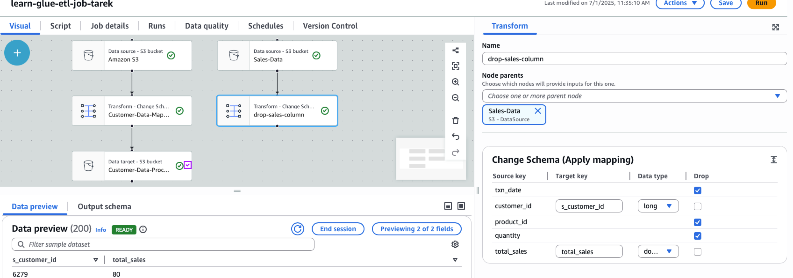

16. On the visual graph, choose the **Customer-Data-Mapping** node and open the Add nodes widget. In the Add nodes widget, add a new **Change Schema** transform to the job. 

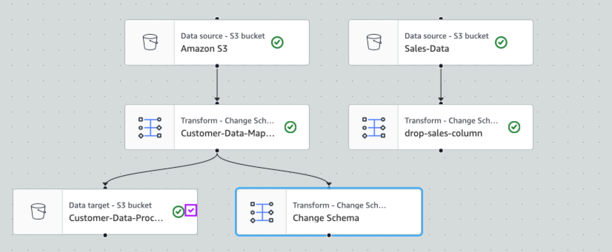

17. Choose the new Change Schema transform node to set focus, select the Transform tab and enter `drop-customers-columns` for Name. We will now drop all columns except `customer_id` and `first_name`. In the Drop column, select the boxes for `prefix`, `middle_name`, `last_name`, `suffix`, `gender`, `date_of_birth`, and `address`.

18. To join the **Customer** and **Sales** datasets together, choose the **drop-customers-columns** node and add a Join transform from the Add nodes widget. In the Transforms tab within Add nodes, select **Join**.

19. Once the Join node is added to the graph, On the Transform tab of the Join node, choose the dropdown for Node parents, and select `drop-sales-columns` and `drop-customers-columns`. To close the dropdown, choose the up arrow in the top right corner of the dropdown.
20. For **Join type**, choose **Inner join** if it is not already selected. To specify the columns used to join the table together, choose Add condition.
21. For` drop-customers-columns`, choose `customer_id`. For `drop-sales-columns`, choose `s_customer_id`. Choose **Save**.

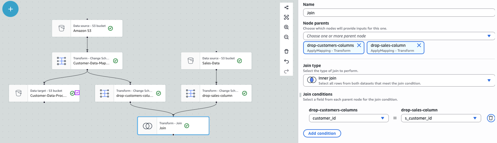

22. When the green banner appears indicating the job has been saved, choose X in the top right to close the message.
23. With the new Join node selected, open the Add nodes widget. From Transform section choose **Aggregate**.
24. Once the Aggregate node is added to the graph, choose the Aggregate node, select the Transform tab, and choose the **Fields to group by - optional** dropdown. Choose` customer_id` and `first_name`. 
25. To select fields for aggregation, choose **Aggregate a column,** selecting `total_sales `for Field to aggregate with **sum** as the Aggregation function.
26. While in the Aggregate node, inspect the  **Data preview** tab

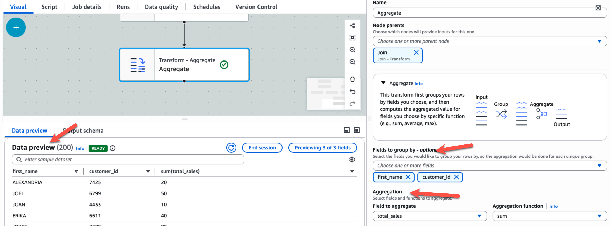

27. The last step is to add a target for the new aggregated data. On the graph, choose the **Aggregate** node. Open the Add nodes widget, and select Amazon S3 from Targets section.  
28. Once the Amazon S3 target node is added to the graph, on the **Data target properties - S3** tab, for **Format**, choose **CSV**. For **Compression Type**, choose **None**. 
29. To set the S3 Target Location, choose Browse S3, and then choose the bucket beginning with `starting-with-glue-firstname-lastname`, select the radio button next to `datafiles` and select **Choose**.  For the S3 Target Location, enter `aggregated-sales-data/ `to the end of the S3 Target Location. For example, mine looks like `s3://starting-with-glue-tarek-atwan/datafiles/aggregated-sales-data/`
30.  Choose **Save**.
31. If the job is successfully saved, the Successfully updated job message will appear at the top of the page. To run the job, choose **Run**. 
32. On the design canvas, choose the **Runs** tab, and monitor the job's Run status. In a minute or 2, the job should show the `Succeeded` status.

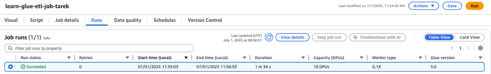

33. When you use the visual editor to create a job, the ETL code is automatically generated for you. To see the automatically generated ETL code, choose the Script tab.  To verify the output of the ETL job, navigate to the Amazon S3 console. Choose your bucket , and then choose the `datafiles` folder within. Check the folder content to ensure that the `aggregated-sales-data/` and `parquet-customers/ `folders were created by the AWS Glue job .

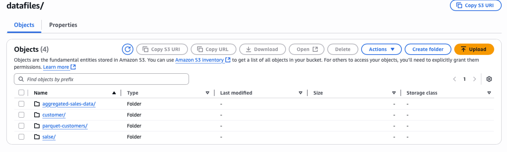

34. To quickly view or search the content of the files, use **Query with S3 Select.** With S3 Select, you can use SQL statements to query a single Amazon S3 object. S3 Select works on objects stored in CSV, JSON, or Parquet format.  In the datafiles folder,  choose the `parquet-customers/` folder. Select a single file to query by placing a checkmark to the left of the file name. Choose the **Actions** dropdown, and select **Query with S3 Select**.

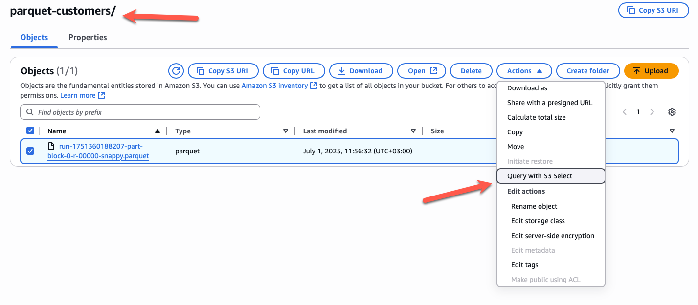

35. In Input settings, for Format, choose **Apache Parquet**. In Output settings, for Format, choose **JSON**.
36. Scroll down and choose **Run SQL query.** Validate the query results. As intended, `dob` is renamed to `date_of_birth`.
37. To search the aggregated sales data, navigate to the `aggregated-sales-data` folder. Select a single file to query, choose the Actions dropdown, and choose Query with S3 Select. In Input settings, for Format, choose **CSV**. For CSV delimiter, choose **Comma**. For Compression, choose **None**. Scroll down.
38. In Output settings, for Format, choose **CSV**. For CSV delimiter, choose **Comma**. Choose **Run** SQL query.
39. Validate the query results. The sum of total sales is available by customer_id and first_name. Toggle between **Raw** and **Formatted** view.

----

# Loading Customer Dataset into AWS Glue DataBrew

1. In the AWS Management Console, search for **AWS Glue DataBrew**. Select AWS Glue DataBrew.
2. Once you are on the AWS Glue DataBrew console, select **DATASETS**. 
3. Now, select Connect new dataset.
4. For Dataset name, enter `Customers YOURINITIALS`. Then, select Amazon S3. For Enter your source from S3, enter the S3 bucket that you created in an earlier demonstration. Then, navigate to the `customers` folder.

5. In the same page, scroll down to Additional configurations. Select the file type as **CSV**. Then, choose **Create dataset**.

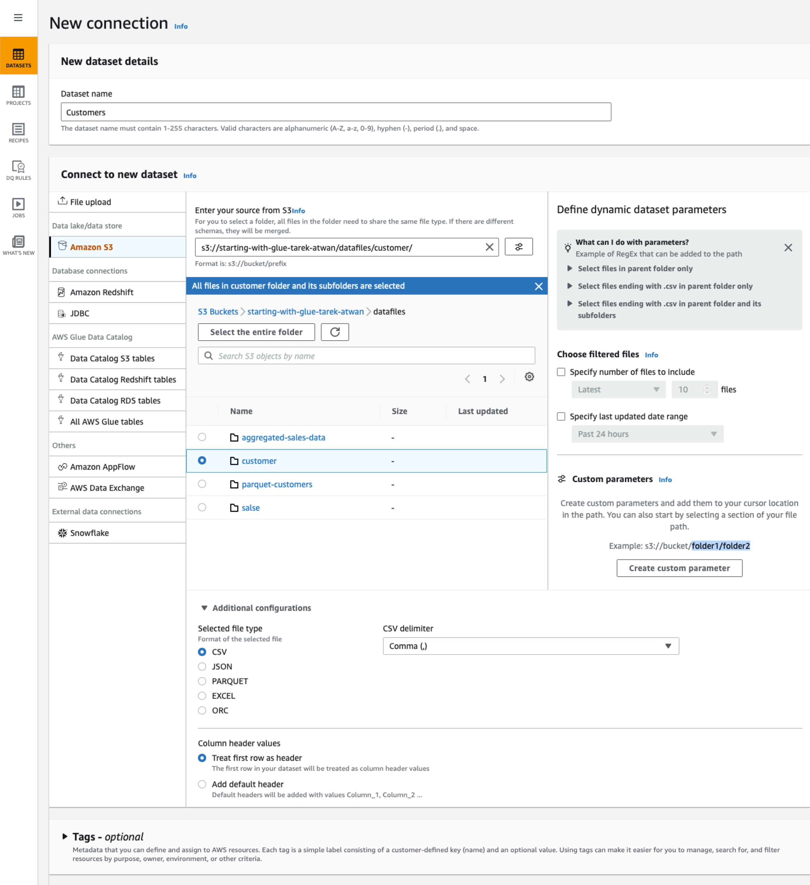

6. A green banner will appear on the top to indicate that the dataset was successfully created. Choose the Customers dataset. The Data previewer will load records for preview.
7. You can preview the dataset on this screen. Once you have previewed the data, select Datasets in the left navigation pane.

---

# Loading Sales dataset into DataBrew

1. In the DataBrew console, select Datasets from the left navigation pane. Next, choose Connect new dataset.
2. This will take you to the **New connection** page. Enter `Sales YOURINITIALS` for the Dataset name. In the Connect to new dataset section, select Amazon S3 as your service. In the Enter your source from S3 textbox, browse to the S3 bucket that was created earlier. Navigate to datafiles, and then select the **sales** folder.
3. Scroll down to Additional configurations, and select **CSV** as the file type. Make sure to select **Treat first row as header**. Then, choose **Create dataset**.
4. A sales dataset is created in the Datasets page of the DataBrew console. You can preview the dataset by choosing the sales dataset.

Now, you will create a data quality **ruleset** and apply it by running a profile job. A **ruleset** is a set of rules that compare different data metrics against expected values. If any of a rule's criteria isn't met, the ruleset as a whole fails validation. You can then inspect individual results for each rule. For any rule that causes a validation failure, you can make the necessary corrections and revalidate. 

5. In the DataBrew console, from the left navigation pane, select **DQ Rules**. Then, choose **Create data quality ruleset**.

6. This will take you to the **Create data quality ruleset** page. Enter `Sales DQ YOURINITIALS` Checks as the Ruleset name. Then, in the Associate dataset section, choose Browse datasets. Choose the `sales` dataset in the pop-up menu. Select **Choose**. 

7. To preview your dataset, choose **View associated dataset details**. This will load the Dataset preview on the right side of the Create data quality ruleset page. Scroll to the right to check more columns, such as Quantity and Total_Sales. If some rows in the Quantity column contain zeroes, even though you have total sales recorded for this row, this violates the data quality check. 

8. In the **Associated dataset details** section, choose the **Recommendations tab** to view some of the recommendations provided by DataBrew. For this dataset, DataBrew is recommending **duplicate rows** and **missing values**.

9. Next, create your first rule. Scroll down to the Rules section. In Rule 1, enter **Duplicate** rows as the Rule name. For Data quality check scope, choose `Individual check for each column`. Then, for Rule success criteria, choose` All data quality checks are met (AND)`. In Check 1, for Data quality check, choose **Duplicate** rows. For Condition, choose `Is equals`. For Value, enter `0`, and choose rows from the dropdown menu. You will find a logical explanation of this check in Rule Summary.

   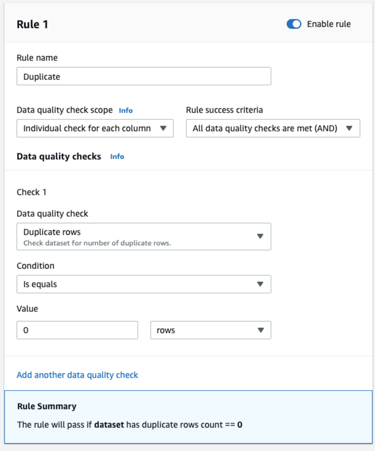

10. Now, add another data quality check on the dataset. Choose **Add another rule**. Name this rule `Quantity and total Sales should be >0`. For Data quality check scope, select `Common checks for selected columns`. For Rule success criteria, select `All data quality checks are met (AND).` For Selected columns, choose `Selected columns`. 
11. Next, choose **Select columns**, and then select `Quantity` and `Total_Sales` from the dropdown on the pop-up that appears. In Check 1, for **Data quality check**, choose `Numeric values` from the dropdown.
12. For **Condition**, choose `Greater than`. For Value, enter `0` as the Custom value. For **Threshold**, choose `Greater than equals` with Threshold as `100` for `percent of rows` from the dropdown menu. A logical explanation of the check can be found in Rule Summary.

13. Choose **Create ruleset** to save the data quality checks. This will take you to Data quality rulesets in the DQ RULES navigation pane.

# Create a Customer Profile Job in DataBrew

Profile jobs run a series of evaluations on a dataset. The information that data profiling gathers helps you decide what kind of data preparation steps you need. In this demonstration, you will activate the **PII detection** feature in your profile job to identify **sensitive PII** data present in your dataset.

1. Navigate to the Datasets page in DataBrew. Select the `Customers YOURINITIALS` dataset you created in the previous demonstration. Then, choose **Run data profile**.
2. Choose **Create profile job**.
3. On the **Create job** page, enter the job name as `Customers profile job YOURINITIALS`. For Job run sample, select **Full dataset**.
4. In the Job output settings section, select browse and navigate to the folder called` profile-output`. Choose select to select the` profile-output` folder as the S3 location.
5. Scroll down to the **Dataset level configurations** section. Select **PII statistics**, and then select **Enable** PII statistics. This is to identify PII columns when running the data profile job. Then, for PII categories, select **All categories**.
6. Scroll down to the **Permissions** section. For the **Role name** dropdown section, select **Create new IAM** role. In the New IAM role suffix text box, type `ID-YOURINITITALS`. This creates a new IAM role in the format `AWSGlueDataBrewServiceRole-ID-YOURINITITALS`, for example mine would be `AWSGlueDataBrewServiceRole-ID-TA` . Then, choose **Create and run job**.
7. This will take you to the Data profile overview tab of the Customers dataset. There will be a green banner if the profile job is created successfully. Monitor the status of the profile job run. The job will take approximately 5 minutes to complete.
8. Once the job is done, scroll down. You will find a list of identified PII columns mapped to PII categories with column statistics, including potential PII columns to review. Select the Column statistics tab. In this tab, you can see other statistics like Value distribution and Data insights, mostly on data cardinality, outliers, and missing data.

---

# Create a Sales Profile Job in DataBrew

1. In the DQ Rules navigation pane, create a profile job to apply the new ruleset on the sales dataset. Select `Sales DQ YOURINITIALS Checks`, and then choose **Create profile job with ruleset**.
2. This will take you to the Create job page. For Job name, enter `sales profile job YOURINITIALS`. In the Job run sample section, under Data sample, select **Full dataset**.
3. Scroll down to Job output settings. For S3 location, choose Browse. Choose the S3 bucket you created in a previous demonstration. Select the `profile-output` folder, and then choose **Select**. This will set the S3 location to the `profile-output folder `in your S3 bucket.
4. Scroll down to the **Data quality rules** section. Confirm that ruleset `Sales DQ YOURINITIALS` Checks is being applied for this profile job.
5. Scroll down to the Permissions section. From the Role name dropdown list, select the `AWSGlueDataBrewServiceRole-ID-YOURINITIAL`  role that you created earlier. Choose Create and run job. Profile jobs run a series of evaluations on the sales dataset, generating statistics both at a dataset level and column level.
6. This will take you to the Data profile overview tab of the sales datasets. It will take approximately 5 minutes for the job to complete.  Once the job is done, you can view the value distribution. This will take you to the Data profile preview tab. Choose the Data quality rules tab, and you can see that both data quality checks have failed. Later, you can apply these rules to filter out the columns that have failed the data quality rule. 

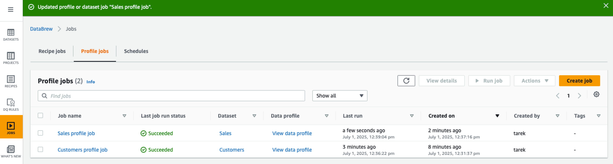

---

# Create a project in a DataBrew

 In this demonstration, you will create a **project** to work on the customer datasets. The interactive data preparation workspace in DataBrew is called a project. Using a data project, you can manage a collection of related items like data, transformations, and scheduled processes. As part of creating a project, you choose or create a dataset to work on. Then, you create a recipe, which is a set of instructions or steps that you want DataBrew to act on. These actions transform your raw data into a form that is ready to be consumed by your data pipeline.

1. In the left navigation pane of the DataBrew console, select **PROJECTS**.
2. Now that you have loaded the dataset in a previous demo, you can start transforming the data. Choose **Create project**.
3. This will take you to the Create project page. For Project name, enter `CleanCustomer-YOURINITITALS`. Leave the auto-populated Recipe name as it is. In the **Select a dataset** section, select **My datasets**.
4. Scroll down. Select the `Customers` dataset you created in a previous demo. Open the Sampling section. Then, for Type, select Random rows. For sample size, select 1,000.
5. Scroll down to the Permissions section. For Role name, select `AWSGlueDataBrewServiceRole-ID-YOURINITITAL` you created earlier. Choose **Create project**.

The new project will take a few minutes to initialize.

---

# Build a recipe in AWS Glue DataBrew

 A **recipe** is a set of instructions or steps for data that you want DataBrew to act on. A recipe can contain many steps, and each step can contain many actions. You use the transformation tools on the toolbar to set up all the changes that you want to make to your data. DataBrew stores the instructions about the data transformation, but it doesn't store any of your actual data. The project loads a first `n` sample of the dataset by default. DataBrew auto-generates statistics for the dataset and provides a grid (tabular, Excel-like visualization of the sampled dataset), schema, and profile (statistics for the full dataset) view of the data. You can update the sampling to retrieve different slices of the data to work with at any point in the transformation process.

In this demonstration, you will use **Merge** and **Format** transforms to standardize the Name column. You will use Format transform to standardize the date of birth (DoB) column. Then, you will use **Clean** and **Split** transforms to standardize the Address column. Finally, you will redact PII data present in the final output.

1. Once your project has been successfully created, select **Merge**.
2. For Source column, select the columns `Prefix`, `First_Name`, and `Last_Name`. These are the source columns that you want to merge in the recipe section. For **Separator** just type a space ` `. For **New column name**, enter `Name`. Select **Preview** changes, and verify that this is the expected result. Choose **Apply**.

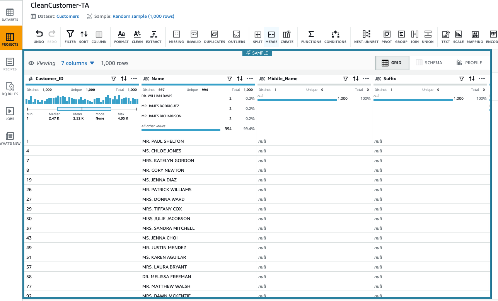

3. Next, change the characters of the `Name` column to uppercase. Select the ellipsis that appears above the new column you created earlier. Select Format from the menu that appears. Then, select Change to **capital case**.

4. You can preview the changes by selecting Preview changes. Then, choose **Apply**.

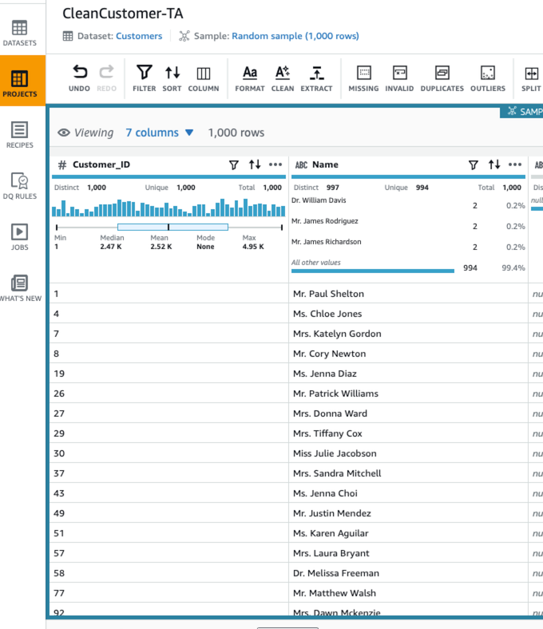

5. Next, delete the columns used to build the merged Name column. Select the **COLUMN** icon, and then choose **Delete** from the dropdown menu.  For Source columns, select `Middle_Name` and `Suffix`. Choose **Apply**.
6. Next, you will adjust the change date format for the DoB column. Select the ellipsis above the DoB column, and then choose For**m**at. Now, select **Date-time formats**. Choose `mm-dd-yyyy` from the menu that appears.

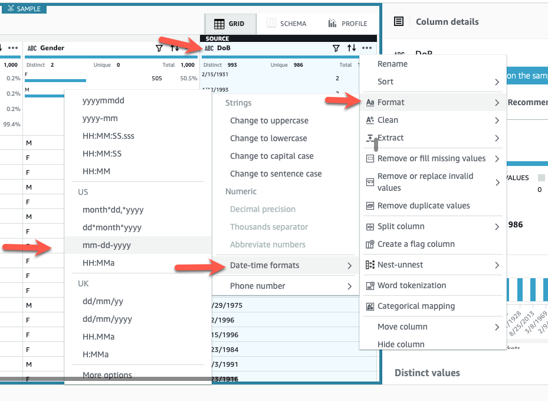

7. Choose **Apply**.
8. Next, you will remove the special character in the `Address` column. Select the ellipsis from Address column header, and then select **Clean**. In the Remove section, select **Special characters**.
9. In Specify values to remove, select Special characters. Then, select Custom special characters and enter less than, greater than, ampersand (`<>&`)in the Enter custom special characters text box.

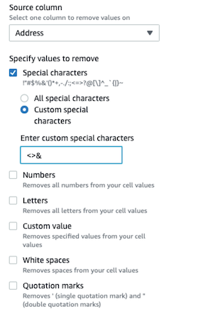

10. Scroll down to **Apply** transform to, and keep the default as All rows. Select Preview changes, and then choose Apply. Verify that the result is as expected.  Choose **Apply**.
11. Next, you will split the Address column to extract the zip code. Select the **SPLIT** icon from the top menu, and then select On a single delimiter.

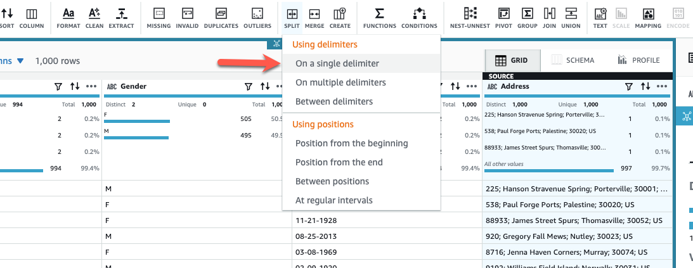

12. From the Source column, select Address and leave the Split column options as their default values. For Delimiter, select Enter custom value and semicolon as the delimiter.
13. Scroll down. For Number of times to split, enter 4. In Apply transform to, leave All rows as selected. To verify results, select Preview changes, and then select Apply.
14. Rename Address_4 to Zip. In the Address_4 column, select the ellipsis. Select Rename from the menu that appears. For New column name, enter `Zip` in the text box. Choose Apply.
15. In the Source column drop down, choose Address_3. Enter `City` in the New column name text box. Choose Apply. Repeat these steps to rename the Address_5 column to `Country`.
16. Next, to redact PII data in the Customers dataset, choose **MORE** from the  top menu. Select **SENSITIVE**. Then, select **Redact values** from the dropdown that appears.

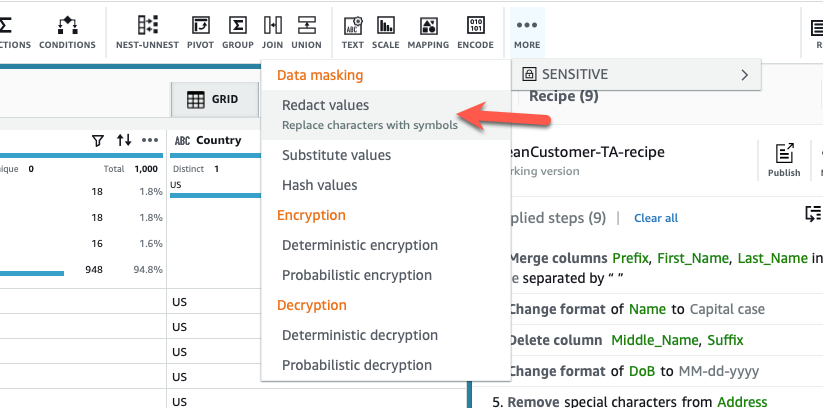

17. For Source columns, choose `DoB`, `Address_1`, and `Address_2`. Notice that columns `DoB`, `Address_1`, and `Address_2` are redacted with number values (`#`).  Select Preview changes to verify, and then select Apply.
18. Open your recipe by selecting RECIPE on the far right of the top menu. Then, verify that your recipe contains 10 steps that look like the ones shown.

19. In the DataBrew console page, from the left navigation menu, choose the RECIPES view. In the dropdown next to the search bar, choose All recipes or Working from the filter option.
20. Select the `CleanCustomer-YOURINITIAL` link. This will open the recipe that was created earlier. Select **Create job  with this recipe** from the top right menu.
21. On the Create job page, for Job name, enter `CleanCustomer-YOURINITIAL`.
22. Scroll down to Job output settings, and specify the output location of the job. DataBrew gives you the flexibility to generate multiple formats of the output from a single job. From **Choose dataset** select `Customers`. From **Job output settings** for the File type dropdown, select **CSV**. Keep the rest of the settings as default. Choose **Browse** to select an Amazon S3 location. Then, choose the S3 bucket you created in a previous demonstration. Select the `shared` folder.
23. Scroll down to the Permissions section. The same IAM role you have been using from the Role name dropdown. Choose **Create and run job**.
24. You can monitor the job in the **JOBS** section of the left navigation pane. The job will run, and a link to the output file will be placed in the Job output column. Once the job CleanCustomer changes its status to **Succeeded**, you can select the Job output link to show the location of the output file.
25. This will take you to the Amazon S3 service, where you can view the output file in the Amazon S3 console.

Now, you can observe how DataBrew tracks your data in a visual interface to determine its origin, called a data lineage. This view shows you how the data flows through different entities from where it originally came. You can see its origin, other entities it was influenced by, what happened to it over time, and where it was stored. Choose DATASETS from the left navigation pane, and then select the Customers dataset.

To find data lineage for the Customers dataset, select the Data lineage tab. You can view the data transformation from raw data to curated data.

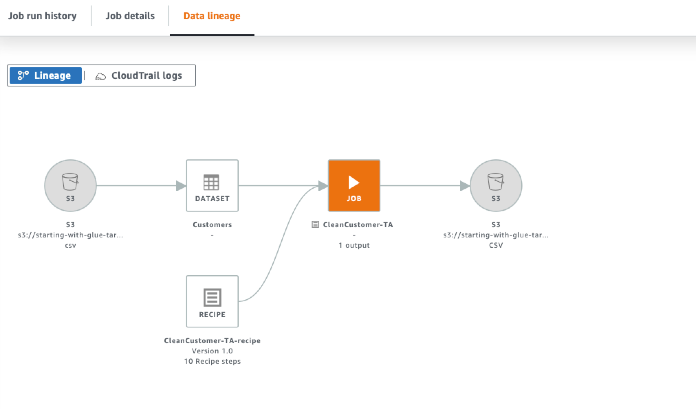

---

# Delete Resources

1. Navigate to the AWS Glue Studio page. In the navigation pane, choose Jobs. Select `learn-glue-ETL-job-yourname`. Choose the Actions dropdown, and then choose Delete job(s).
2. In the Delete job(s) pop-up window, to confirm the deletion of the learn-glue-ETL-job, choose Delete.
3. On the AWS Glue Studio page, in the navigation pane, choose Crawlers.
4. Select `learn-glue-crawler.-yourname` Choose the Action dropdown, and then choose Delete crawler.
5. In the Delete Crawlers pop-up window, to confirm the deletion of learn-glue-crawler, choose Delete.
6. To delete the database and tables, on the AWS Glue Studio page, in the navigation pane, choose Databases. Select `sales_data_yourname`, and then choose Delete.
7. In the Delete Database(s) pop-up window, to confirm the deletion of the sales_data databases and associated tables, choose Delete.
8. To delete an S3 bucket, you must delete the folder and files inside the bucket. The quickest way to do this is to empty the bucket using the Empty option. Navigate to the Amazon S3 service page. Select the bucket name you created for this demonstration, and then choose Empty. 
9. In the pop-up window, to confirm deletion, enter permanently delete, and then choose Empty. This will empty the bucket.
10. Choose the bucket again, and this time choose Delete. 
11. To confirm deletion, enter the name of the bucket in the pop-up window, and then choose Delete bucket. This will delete the bucket.
12. [YOU MAY NOT HAVE ACCESS TO THIS I WILL CLEAN IT UP LATER] Now, delete the IAM policy that we created for the AWS Glue Studio job. Open the console. To go to the AWS Identity and Access Management page, in the search bar, enter IAM. Choose IAM.  In the navigation pane, choose Policies. In the search bar, enter AWSGlueServiceRole-learn-glue-role. Select AWSGlueServiceRole-learn-glue-role. Choose the Actions dropdown, and then choose Delete.  
13. [YOU MAY NOT HAVE ACCESS TO THIS I WILL CLEAN IT UP LATER] Finally, delete the IAM role that we created for the AWS Glue Studio job. On the AWS Identity and Access Management page, in the navigation pane, choose Roles. In the search bar, enter AWSGlueServiceRole-learn-glue-role. Select AWSGlueServiceRole-learn-glue-role, and then choose Delete.  In the Delete AWSGlueServiceRole-learn-glue-role? pop-up window, to confirm deletion, enter AWSGlueServiceRole-learn-glue-role in the text input field. Then, choose Delete.