# AWS S3 Hands-On Lab

### Prerequisites:

Inside `Lab Resources` folder:

* An image file named `hartford.jpeg`
* A Word document file ready `intro.docx` for upload.
* An image `coffee.jpg`

### Instructions:

> When following the tutorial do take your time. Check out what other options are available in each page, and consider this as an opportunity to learn. 

#### 1. Create an S3 Bucket

1. Log in to the AWS Management Console.
2. Navigate to the S3 service.
3. Click on the “**Create bucket**” button.
4. Bucket type should be **General Purpose**. 
5. Enter a unique bucket name (e.g., `your-unique-bucket-name`).
6. Keep the remaining options at their default setting for now.
7. Click "**Create bucket**" at the bottom of the page.

#### 2. Upload the Image "hartford.jpeg"

1. Open the newly created bucket by clicking on its name.
2. Click on the “**Upload**” button.
3. Click “Add files” and select the `coffee.jpg` file from your local machine.
4. Click “**Upload**” to upload the image. Once uploaded you can click the “https://grok.com” button on the top right corner
5. Click on the image you just uploaded and test by clicking the “Open” button

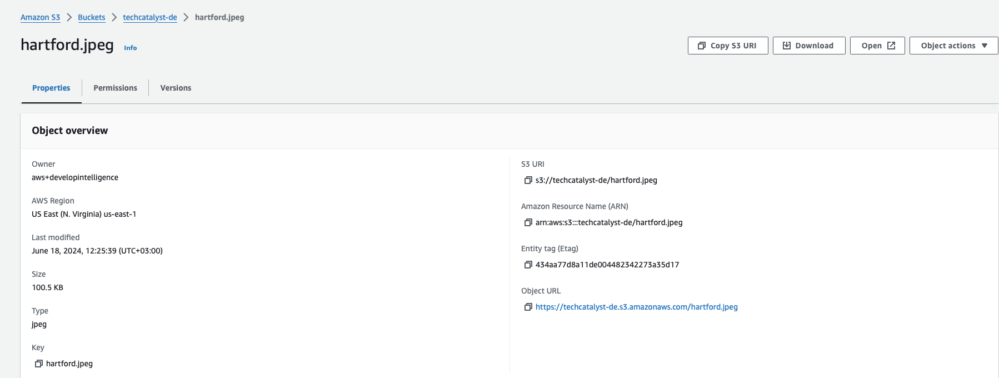


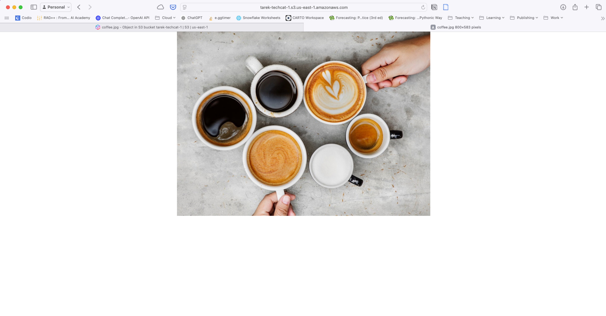

6. There is an Object URL that may look like this https://YOURBUCKETNAME.s3.us-east-1.amazonaws.com/coffee.jpg
6. Test the Object URL in your browser. Did it work? What do you see?

```
<Error>
<Code>AccessDenied</Code>
<Message>Access Denied</Message>
<RequestId>YFCAQXZYRVYH58VB</RequestId>
<HostId>
BbKK/cptchGtGG3CB6QbJ42PDWvUZk0HQyfAw0t5Aflm5n5jypDjcbgB+z8v1qM4/Ej6d/YzVJU=
</HostId>
</Error>
```

#### 3. Make the Image Public and Add a Bucket Policy

**Make the Image Public:**

1. Go back to your bucket. Click on the **Permissions** tab
2. In the page, you will see **Block public access (bucket setting)**. Click the **Edit** button.
3. Uncheck the box “Block all public access” and save changes.

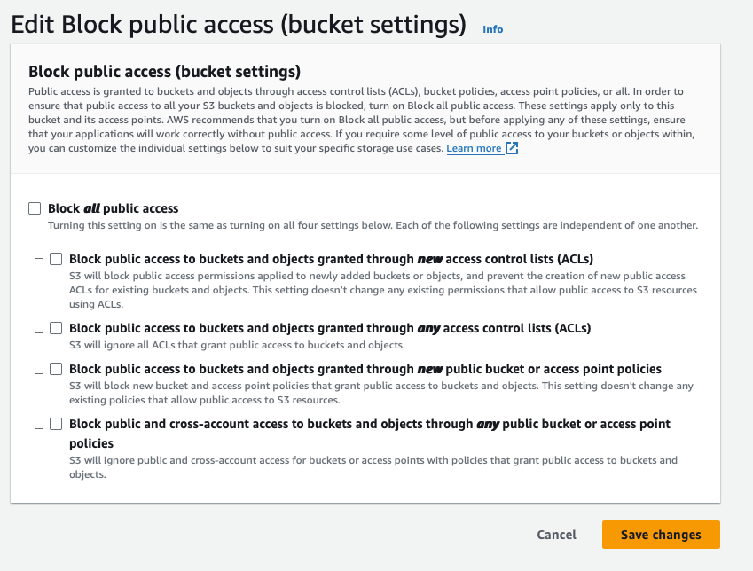

4. A window will pop asking you to confirm the decision. Type `confirm` and click the **confirm** button.

5. Now test the Object URL.  Did that work? 

**Add a Bucket Policy:**

1. Navigate back to the bucket.
2. Click on the “**Permissions**” tab.
3. Scroll down to the “**Bucket policy**” section and click “**Edit**.”
4. Use the AWS “**Policy Generator**” to create a new policy:
   - Step1:
     - Type of policy: Select “S3 Bucket Policy” as the type of policy.
   - Step 2:
     - Effect: Allow
     - Principal: `*`
     - Action: `GetObject`
     - Resource: `arn:aws:s3:::your-unique-bucket-name/*` you can find this in the same **Edit bucket policy** page under Bucket ARN. Make sure to add `/*` after the Bucket ARN.
5. Click “Add Statement” and then “Generate Policy.”
6. Copy the generated policy and paste it into the bucket policy editor.
7. Save the bucket policy.

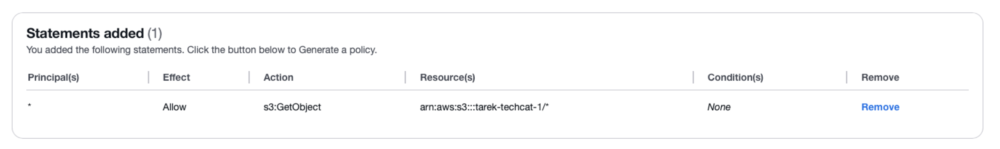

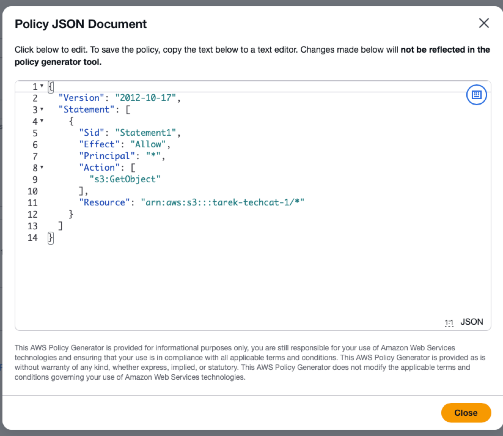

8. Now test the Object URL. Did it work? You should be able to see this on a new browser page or tab


#### 4. Upload a Word Document and Enable Versioning

1. In the bucket, click on the “Upload” button.
2. Click “Add files” and select a Word document file from your local machine. I provided a file called `intro` that you can use.
3. Click “Upload” to upload the document.
4. Enable Versioning for the bucket:
   - Go to the bucket's “**Properties**” tab.
   - Under “Bucket Versioning,” click “Edit.”
   - Click **Enable** to Enable versioning then click save changes.

#### 5. Modify and Upload the Document Again

1. Make some changes to the Word document on your local machine.
2. Upload the modified document to the same bucket.
3. Ensure that you are overwriting the existing document. 

#### 6. Check the Versions

1. In the bucket, click on the “Objects” tab.
2. Enable “Show versions” 

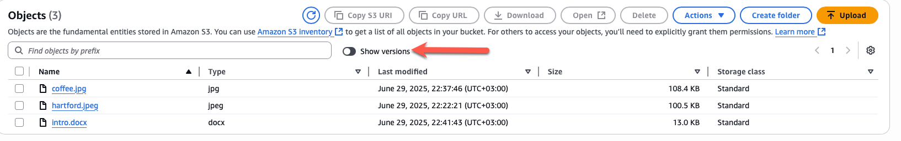

3. You will see multiple versions of the Word document.

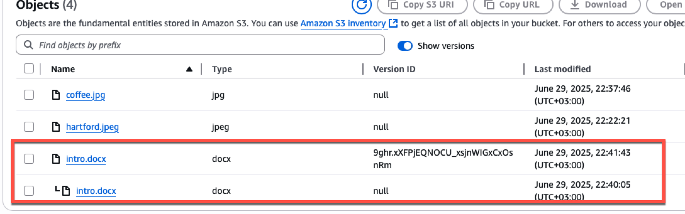

#### 7. Create a Delete Marker and Restore the Word Document

1. In the bucket, click on the “Objects” tab.  Uncheck the **Show versions** for now.

2. Click on the “intro.docx” file and click “Delete “. Confirm the delete by typing `delete` then click **Delete objects**.

3. The delete marker will be created.

4. Verify that the file is no longer visible under the “Objects” tab.

5. Click on **Show version** to enable that view. Notice a delete market is created 

   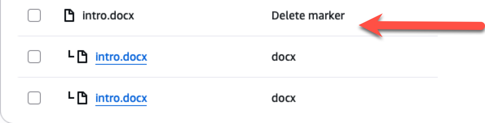

6. To restore the document, **delete** the delete marker:
   - Select the delete marker version and delete it.

   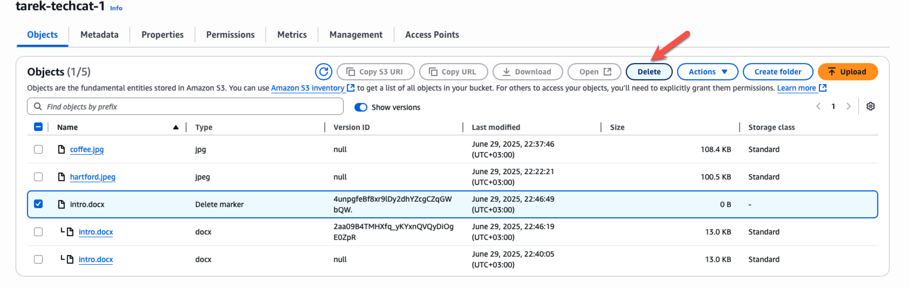

7. Validate that the file is restored (turn off the **Show versions**. 

#### 8. Create a Lifecycle Rule

1. Go to the bucket's “Management” tab.
2. Click on “Create lifecycle rule”
3. Enter a rule name (e.g., “MoveDataRule”).
4. Choose the scope of the rule (e.g., apply to the entire bucket).
   1. For example, Select “Apply to all objects in the bucket”
5. Navigate to the “Lifecycle rule actions”
   1. Which option would you be selecting? 
   1. For this activity, select the first option **Transition current versions of objects between storage classes**
6. Add transitions:
   - Transition to Standard-IA after 30 days.
   - Transition to One Zone-IA after 60 days.
   - Transition to Glacier Deep Archive after 120 days.
7. Configure expiration if needed.
8. Review and create the rule.

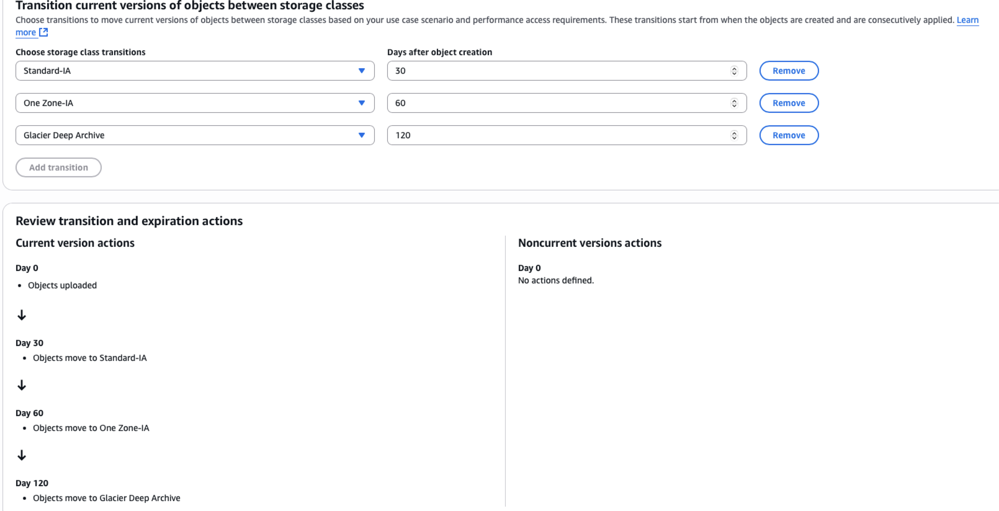

9. Once done you should see it created with a status “Enabled”

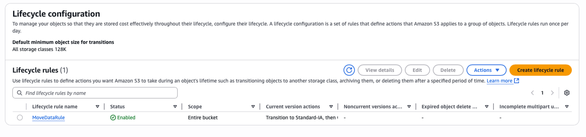

#### 9. Create Event Notification Using SQS

**Create SQS Queue:**

1. Navigate to the SQS service in the AWS Management Console.
2. Click on “Create queue.”
3. Keep type as Standard
4. Enter a queue name (e.g., `my-s3-notification-queue-yourinitials`).
5. Leave other settings as default and create the queue.

**Create SQS Access Policy:**

1. Navigate to the SQS queue you just created.
2. Click on the “Queue policies” tab.
3. Click “Edit” under “Access policy ”
4. Scroll down to “Access Policy” section
5. Use the AWS Policy Generator to create a new policy:
   - Select “SQS Queue Policy” as the type of policy.
   - Add a statement with the following details:
     - Effect: Allow
     - Principal: `*`
     - Action: `SendMessage`
     - Resource: you can copy it from the original policy for example mine is this: `arn:aws:sqs:us-east-1:535146832369:my-s3-notification-TA`
     - Condition: Add a condition for “StringEquals” with `aws:SourceArn` as the key and the ARN of your S3 bucket as the value.
     - Click **Add Condition**
   - Click **Add Statement**
   - Click **Generate Policy**
6. Copy the generated policy and paste it into the queue policy editor.
7. Save the queue policy.

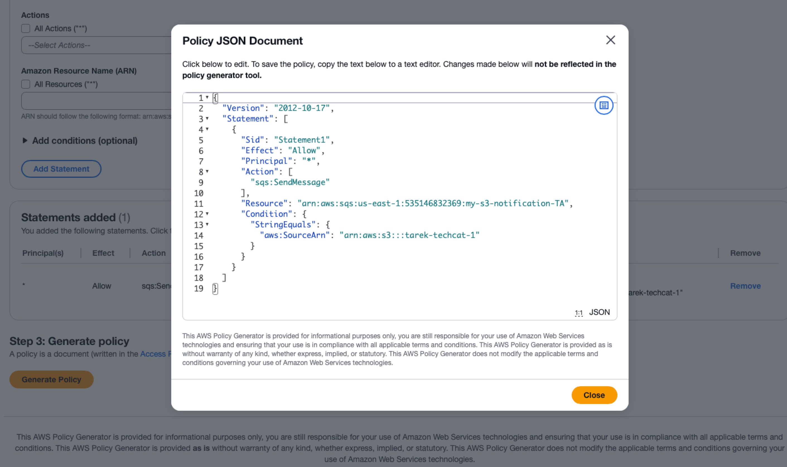

**Create S3 Event Notification:**

1. Go back to the S3 bucket you created.
2. Click on the “Properties” tab.
3. Scroll down to “Event notifications” and click “Create event notification.”
4. Enter a name for the notification (e.g., `S3ToSQSNotification`).
5. Select the event type (e.g., “All object create events”).
6. Scroll down to the **Destination** section. Choose “SQS queue” and select the SQS queue you created.
7. Click Save changes 
8. Go to SQS and open the queue you just created, click the “Send and receive messages” on the top menu.
9. The click “Poll for messages”
10. Go, and upload a new file for example `hartford.jpeg` or any new file you have to that same S3 bucket and check SQS messages again. 
11. Open the message. What do you see?

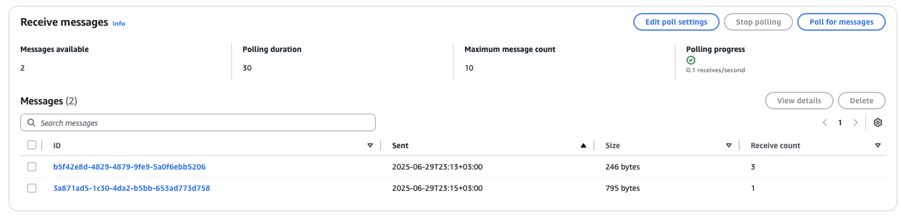

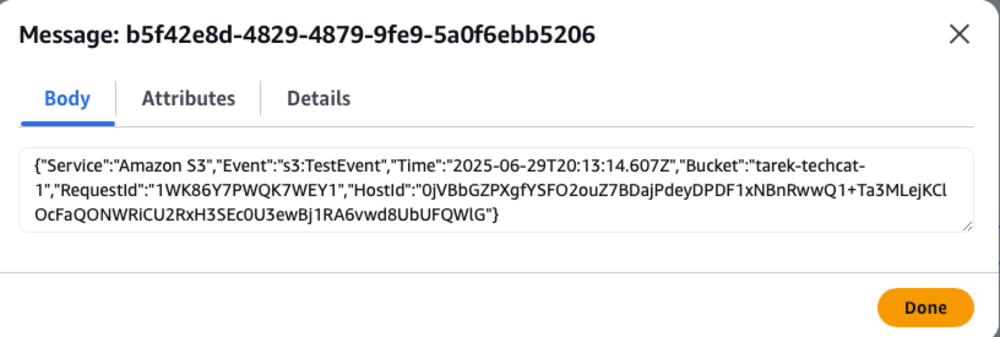

This shows a message regarding the file I just uploaded. You can also create a message body in the Send Message option.

This concludes the hands-on lab. Ensure all steps are completed and verified for successful execution.

## Final Clean up

* Delete the bucket you just created. It will ask you to empty the bucket. Just click empty bucket, once done, hit Exit, then click delete bucket again. 
* Delete the SQS Queue you just created 
* Double check if everything has been deleted (make sure you only delete your items)