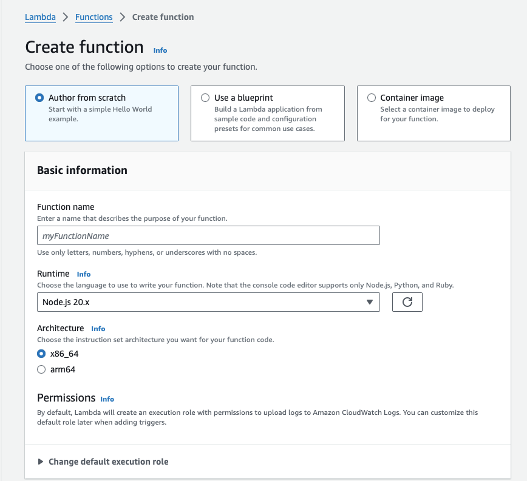
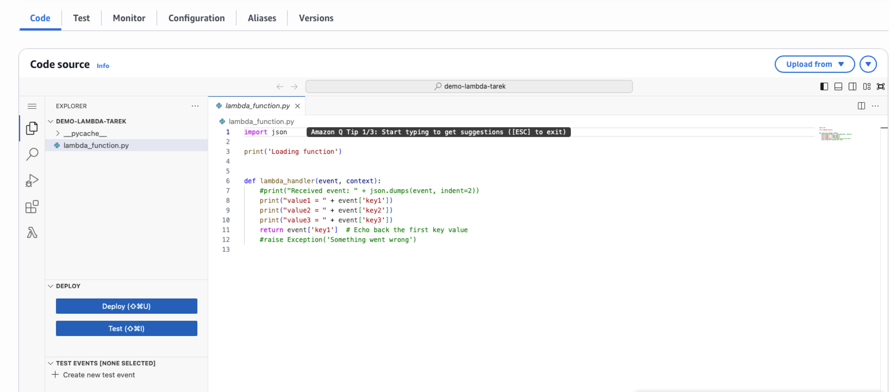
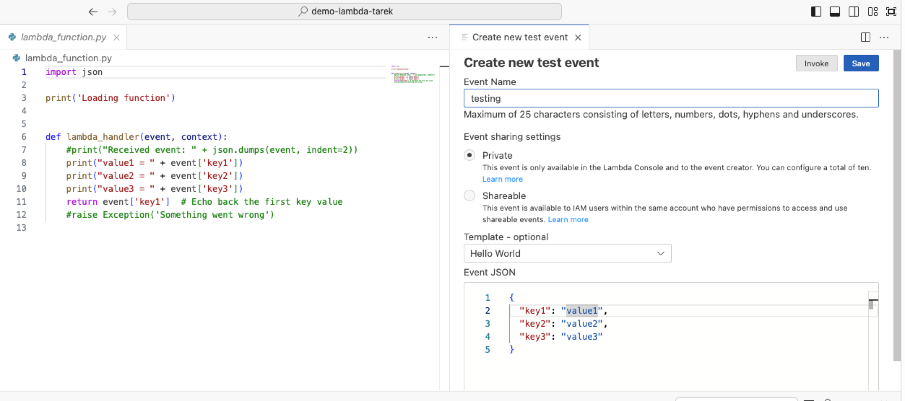
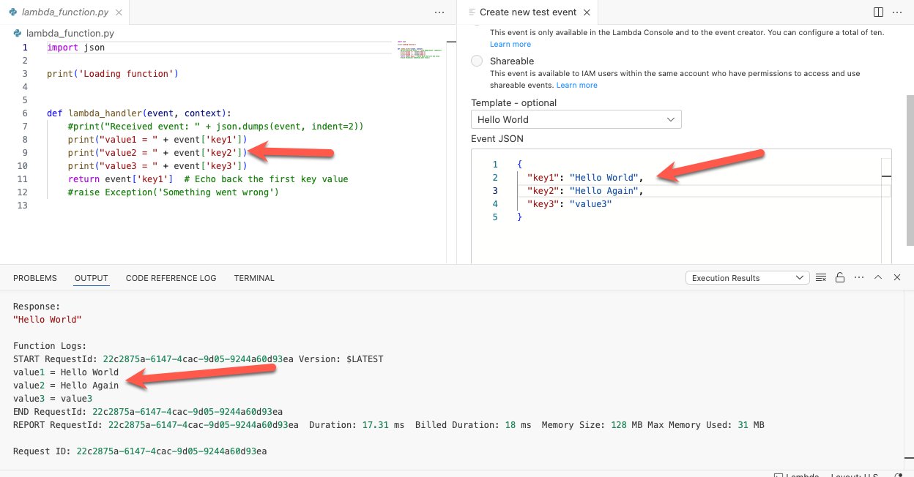

# AWS Lambda

* Create a new Lambda Function

* Select “**Use a blueprint**”

* In the “**Blueprint name**” choose **Hello World** the `Python` version 

* Name your function `demo-lambda-yourname`, for example, `demo-lambda-tarek`

* Click “Create Function”

  

* Click the blue **Test** button. A small window will show up, click `Create new test event`

* You can give the event a name
* You can also test it by hitting **Invoke**. You haven’t learned Python yet  so the function may not make sense yet. But go ahead and change `value1` and `value2` and try invoke again

* Look at the output window to see the print output 

* Delete the lambda function. From the Action drop down, just select delete. Confirm delete.

