# AWS Glue and Athena

> Note: If you run into an issue using the **Cloud Shell** due to limit number of concurrent users per region you can try a different region for example I fly code uses `us-east-1` you can try `us-east-2` or `us-west-1`. If you do some of the commands will change as shown:
```shell
aws s3api create-bucket --bucket [your-bucket-name]-raw --region us-east-2 --create-bucket-configuration LocationConstraint=us-east-2
```
You will need to add `--create-bucket-configuration LocationConstraint=us-east-2` 

### Building a Serverless Data Lake 

---

# Overview 

In preparation for the workshop, we will create Amazon S3 buckets, copy sample data files to Amazon S3, and create an IAM service role.

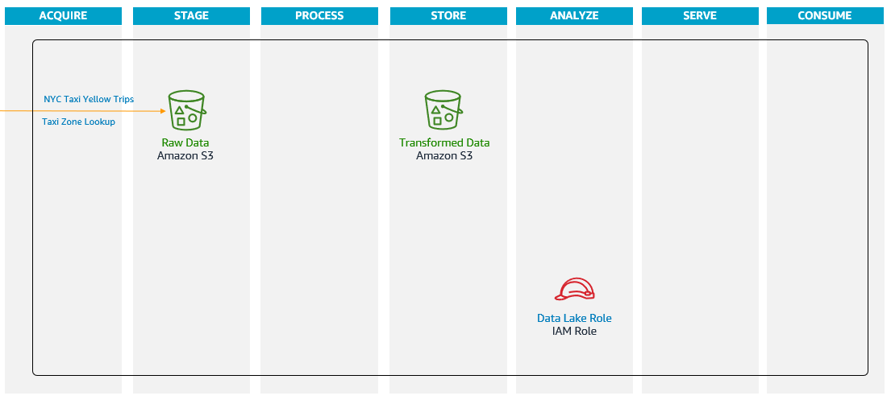

### What is a data lake?

A data lake is a **centralized** repository that allows you to store all your structured and unstructured data at any scale. You can store your data as-is, without having to first structure the data, and run different types of analytics—from dashboards and visualizations to big data processing, real-time analytics, and machine learning to guide better decisions.

### Introducing Amazon S3

Amazon Simple Storage Service (S3) is the largest and most performant object storage service for structured and unstructured data and the storage service of choice to build a data lake. With Amazon S3, you can cost-effectively build and scale a data lake of any size in a secure environment where data is protected by 99.999999999% (11 9s) of durability.

With data lakes built on Amazon S3, you can use native AWS services to run big data analytics, artificial intelligence (AI) and Machine Learning (ML) to gain insights from your unstructured data sets. Data can be collected from multiple sources and moved into the data lake in its original format. It can be accessed or processed with your choice of purpose-built AWS analytics tools and frameworks. Making it easy and quick to run analytics without the need to move your data to a separate analytics system.

# Start an AWS CloudShell environment

> You will build the solution from ground up instead of using a CloudFormation template to provision the base resources. We will use the Command Line Interface (CLI) to accomplish this.

AWS CloudShell is a browser-based, pre-authenticated shell that you can launch directly from the AWS Management Console. You can run AWS CLI commands against AWS services using your preferred shell (Bash, PowerShell, or Z shell). And you can do this without needing to download or install command line tools.

1. Login to the AWS Management Console.

2. In the upper right menu section, select **N. Virginia (us-east-1)** region.

3. Start an AWS CloudShell session by clicking the CloudShell icon on the top menu bar. 

   

4. A welcome dialog box will pop up, check **do not show this again**, and then click **Close**. 

5. CloudShell will start preparing a Linux environment and you should see a terminal in your browser in a few moment. 

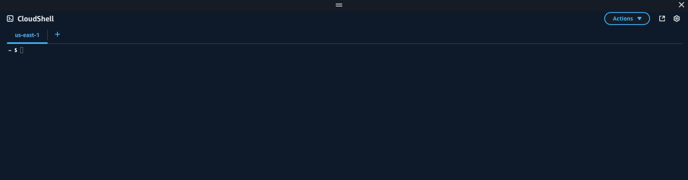

# Create S3 buckets and upload data

----

### Create an S3 bucket to store raw data and upload dataset

> An **S3 bucket** is a storage resource that act as a container for objects stored in Amazon S3. You can review the [naming rules ](https://docs.aws.amazon.com/AmazonS3/latest/userguide/bucketnamingrules.html) before creating your buckets.

1. In the CloudShell terminal, run the following command to create a **unique S3 bucket**. Remember, an S3 bucket name needs to be globally unique. Use the example below `firstname-lastname-raw` for your **raw** data 

```shell
aws s3api create-bucket --bucket [firstname-lastname]-raw --region us-east-1
```

### Upload the datasets to your Amazon S3 bucket

> We will use the New York City Taxi and Limousine Commission (TLC) Trip Record Data. You can find more information about the dataset in the [Registry of Open Data on AWS ](https://registry.opendata.aws/nyc-tlc-trip-records-pds/)and by visiting the New York City Taxi and Limousine Commission (TLC) [data record page ](https://www1.nyc.gov/site/tlc/about/tlc-trip-record-data.page)

I have already downloaded the data and placed in a public S3 bucket for you to use. This is includes two file for **April and May 2025**.

2. Run the following command to upload the yellow taxi trip data dataset to the S3 bucket you just created.

```shell
aws s3 cp s3://tarek-atwan-raw/ s3://[your-bucket-name]-raw/nyc-taxi/yellow-tripdata/ --exclude "*" --include "yellow_tripdata_2025*" --recursive 
```

3. Run the following command to upload the taxi zone lookup table to the same S3 bucket.

```shell
aws s3 cp "s3://tarek-atwan-raw/taxi_zone_lookup.csv" s3://[your-bucket-name]-raw/nyc-taxi/taxi_zone_lookup/taxi_zone_lookup.csv
```

4. Run the following command to list the files you uploaded.

```shell
aws s3 ls s3://[your-bucket-name]-raw --recursive
```

### Create another Amazon S3 bucket to store transformed data

1. Run the following command to create another unique S3 bucket. We will use this bucket to store transformed data.

```shell
aws s3api create-bucket --bucket [your-bucket-name]-transformed --region us-east-1
```

---

## Create an IAM Service Role

### Create an IAM Service role for AWS Glue

> **IAM Service Role** defines a set of permissions for making service requests that a trusted entity, an AWS service, can assume and perform.

1. In the CloudShell terminal, run the following command to download and install Nano Text Editor. When prompted with "Is this ok", type `y`.

   ```shell
   sudo yum install nano
   ```

2. Start nano to create a file.

   ```shell
   nano trust-policy.json
   ```

3. In the editor, paste the following content. Type **Ctrl-X**, type **Y** and then **ENTER** to save and exit.

   ```json
   {
      "Version":"2012-10-17",
      "Statement":[
         {
            "Effect":"Allow",
            "Principal":{
               "Service":"glue.amazonaws.com"
            },
            "Action":"sts:AssumeRole"
         }
      ]
   }
   ```

4. Create another file using nano editor.

   ```shell
   nano s3access-policy.json
   ```

5. In the editor, paste the following content and update the bucket name. Type **Ctrl-X**, type **Y** and then **ENTER** to save and exit.

   ```json
   {
       "Version": "2012-10-17",
       "Statement": [
           {
               "Effect": "Allow",
               "Action": [
                   "s3:PutObject",
                   "s3:GetObject",
                   "s3:ListBucket"
               ],
               "Resource": [
                   "arn:aws:s3:::[your-bucket]-raw/*",
                   "arn:aws:s3:::[your-bucket]-raw",
                   "arn:aws:s3:::[your-bucket]-transformed/*",
                   "arn:aws:s3:::[your-bucket]-transformed"
               ]
           }
       ]
   }
   ```

6. In the CloudShell terminal, run the following commands to create an IAM role and attach permissions.

   ```shell
   aws iam create-role --role-name AWSGlueServiceRole-SDL-Jumpstart-YOURINITITALS --assume-role-policy-document file://trust-policy.json
   ```

```shell
aws iam put-role-policy --role-name AWSGlueServiceRole-SDL-Jumpstart-YOURINITITALS --policy-name Glue-SDLS3Access --policy-document file://s3access-policy.json
```

```shell
aws iam attach-role-policy --role-name AWSGlueServiceRole-SDL-Jumpstart-YOURINITITALS --policy-arn arn:aws:iam::aws:policy/service-role/AWSGlueServiceRole
```


7. To check if the IAM role was successfully created, run the following commands.

```shell
aws iam get-role --role-name AWSGlueServiceRole-SDL-Jumpstart-YOURINITITALS 
```

```shell
aws iam  list-role-policies --role-name AWSGlueServiceRole-SDL-Jumpstart-YOURINITITALS 
```

```shell
aws iam  list-attached-role-policies --role-name AWSGlueServiceRole-SDL-Jumpstart-YOURINITITALS 
```

> It is a best practice to follow the **principle of least privilege**. Grant only permissions required to perform a task. Determine what users and/or roles need to do and then craft policies that allow them to perform only those tasks.

----

# Lab 1 - Discovering and Cataloging your Data

With an array of data sources and formats in your data lake, it's important to have the ability to discover and catalog it order to better understand the data that you have and at the same time enable integration with other purpose-built AWS analytics.

In this lab, we will create an AWS Glue Crawlers to auto discover the schema of the data stored in Amazon S3. The discovered information about the data stored in S3 will be registered in the AWS Glue Catalog. This allows AWS Glue to use the information stored in the catalog for ETL processing. It also allows other AWS services like Amazon Athena to run queries on the data stored in Amazon S3.

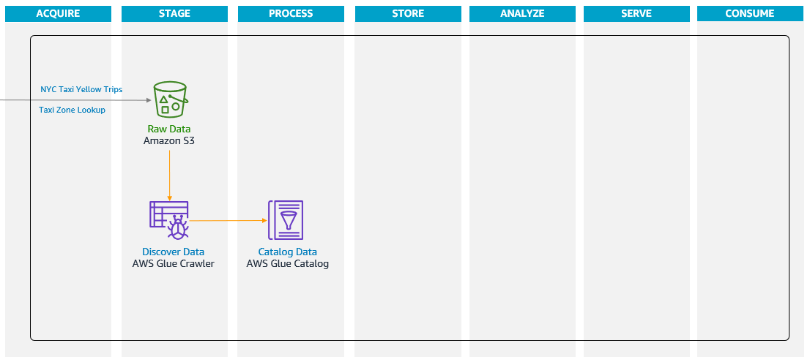

## Introducing AWS Glue

***AWS Glue*** is a fully managed serverless extract, transform, and load (ETL) service that makes it simple and cost-effective to categorize your data, clean it, enrich it, and move it reliably between various data stores. AWS Glue consists of the following core components:

- **Data Catalog** – a central repository to store structural and operational metadata of your data assets.
- **ETL Engine** – automatically generate Scala or Python code.
- **Jobs System** – provides managed infrastructure to orchestrate your ETL workflow.

AWS Glue also includes additional components like:

- [AWS Glue DataBrew ](https://aws.amazon.com/glue/features/databrew/) - A visual data preparation tool that makes it easy for data analysts and data scientists to prepare data with an interactive, point-and-click visual interface without writing code.
- [AWS Glue Elastic Views ](https://aws.amazon.com/glue/features/elastic-views/) - Build materialized views that combine and replicate data across multiple data stores without you having to write custom code.

Together, these automate much of the undifferentiated heavy lifting involved with discovering, categorizing, cleaning, enriching, and moving data, so you can spend more time analyzing your data.

---

## Create a Glue Crawler

> **Glue Crawler** is a feature that automatically infer database and table schema from your source data then stores the associated metadata in the AWS Glue Data Catalog.

1. Go to the AWS Glue Console.
2. In the left navigation menu, click **Crawlers**.
3. On the Crawlers page, click **Create a crawler**. 
4. Specify `nyc-taxi-yellow-trips-parquet-crawler-YOURINITIALS` as the crawler name, click **Next**.
5. On the Choose data sources and classifiers screen, specify the following information, and then click **Next**.
   - Click **Add a data source**
   - Choose a Data source – **S3**
   - Select Location of S3 data - **In this account**
   - Include S3 path – `s3://[your-bucket-name]-raw/nyc-taxi/yellow-tripdata`
   - For Subsequent crawler runs, select to **Crawl all sub-folders**
   - Then click **Add an S3 data source**.
6. On Configure security settings, choose **AWSGlueServiceRole-SDL-Jumpstart-YOURINITITAL** from the Existing IAM role (This is the one you created in previous step.), click **Next**. 
7. On the Set output and scheduling screen, click **Add database**.
8. Specify `nyctaxi_db_YOURINITIALS` (**all lower case**) as the unique database name, and then click **Create database**.
9. Go back to the previous tab (Set output and scheduling screen), **refresh** the selection for Target database and choose the newly created database `nyctaxi_db_initials`.
10. Specify `raw_` in the Table name prefix - optional field.
11. On the Crawler schedule, leave the frequency **On demand**, click **Next**.
12. Review the crawler details, click **Create crawler**.

## Run the Glue Crawler

1. On the Crawlers page, select `nyc-taxi-yellow-trips-parquet-crawler-YOURINITIALS `you just created, and then click **Run crawler**.

2. Upon successful completion of the crawler, you should see a value of **1** in the Tables added column. 

   

   Notice we had two large Parquet files, one for April and another for May. The crawler realized they are the same schema, and created one table for us instead of two. Which is exactly what we want.

## Review the metadata in Glue Data Catalog

> **Glue Data Catalog** contain references to data that is used as sources and targets of your extract, transform, and load (ETL) jobs in AWS Glue. It also maintain a unified view of the data and enables various AWS services such as Athena, EMR, and Redshift Spectrum to access it.

1. In the left navigation menu, click **Databases**. Locate your Database, **nyctaxi_db_initials**, then click on that. Inside, you should see the list of tables. Currently there should be one table.
2. Click on the name **raw_yellow_tripdata** to review the table metadata and schema information.

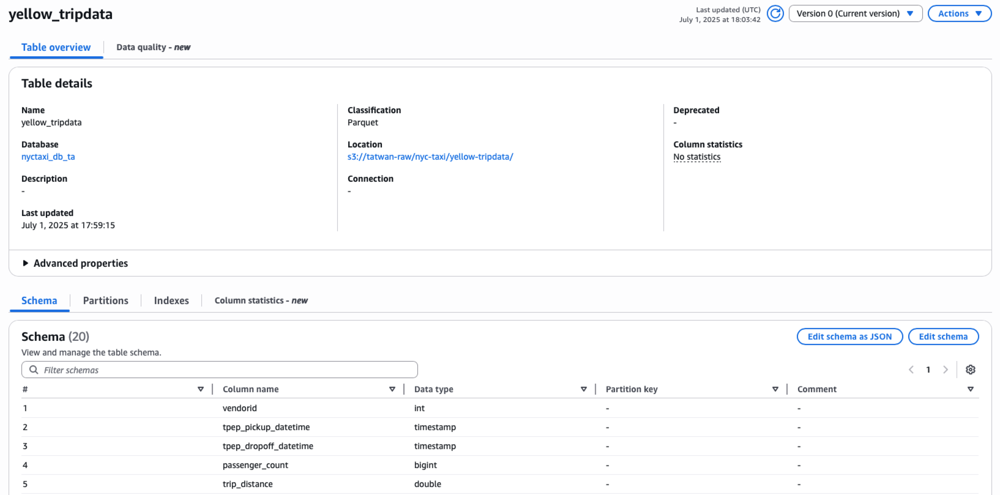

## Create another Glue Crawler

Repeat the same steps to "crawl" the taxi zone lookup data stored in S3

1. In the left navigation menu, click **Crawlers**.
2. On the Crawlers page, click **add crawler**.
3. Specify `nyc-taxi-zone-lookup-csv-crawler-initials` as the crawler name, click **Next**.
4. On the Choose data sources and classifiers screen, specify the following information, and then click Next.
   - Click Add a data source
   - Choose Data source - **S3**
   - Select Location of S3 data - **In this account**
   - Include S3 path - `s3://[your-bucket-name]-raw/nyc-taxi/taxi_zone_lookup`
   - For Subsequent crawler runs, select to **Crawl all sub-folders**
   - Then click **Add an S3 data source**.
5. On the Configure security settings, choose **AWSGlueServiceRole-SDL-Jumpstart-initials** from the Existing IAM role, click **Next**.
6. On the Set output and scheduling screen, choose **nyctaxi_db_initials** as the database (same one as the yellow taxi).
7. On the Crawler schedule, leave the frequency **On demand**, click **Next**.
8. Review the crawler details, click **Create crawler**.
9. On the Crawlers page, select **nyc-taxi-zone-lookup-csv-crawler-initials**, and then click **Run**
10. A new table, `taxi_zone_lookup`, will be created in the Glue Catalog after the crawler successfully completes. Review the metadata and schema information of the table.

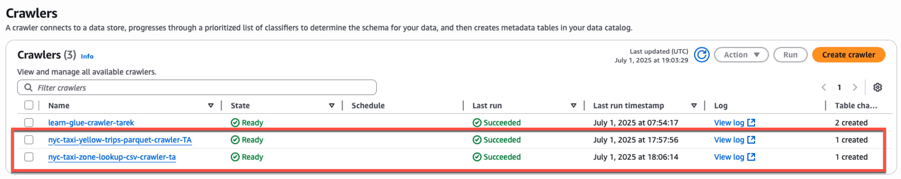

Go to the **Databases** section, click on **your database**, and then inside you should see **two** tables listed as shown. 

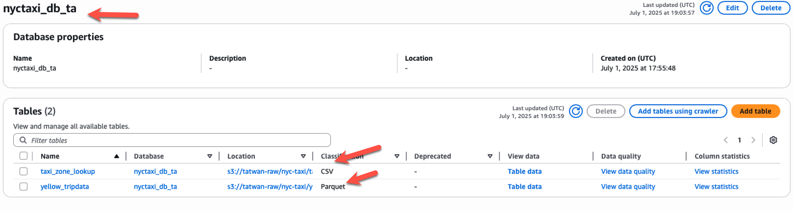

# Lab 2 - Exploring your Data

In this lab, we will use Amazon Athena to explore our data and identify data quality issues. We will also learn how to update table properties in AWS Glue Catalog.

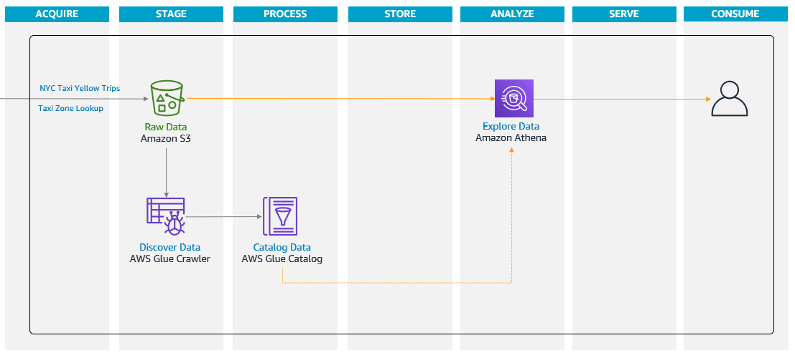

### Introducing Amazon Athena

***Amazon Athena*** is an interactive query service that makes it easy to analyze data in Amazon S3 using standard SQL. Athena is serverless, so there is no infrastructure to setup or manage, and you can start analyzing data immediately. You don’t even need to load your data into Athena, it works directly with data stored in S3.

> Amazon Athena automatically stores query results and metadata information for each query that runs in a query result location that you can specify in Amazon S3. If necessary, you can access the files in this location to work with them. You can also download query result files directly from the Athena console.

1. Launch a CloudShell terminal, and then run the following command to create an S3 bucket to store Athena’s query results.

```shell
aws s3api create-bucket --bucket aws-athena-query-results-us-east-1-yourname --region us-east-1
```

For example `aws-athena-query-results-us-east-1-tarek`

2. Go to Athena console. On the **Get Started** click **Launch Query Editor** or just select Query Editor from the left side panel/menu. 

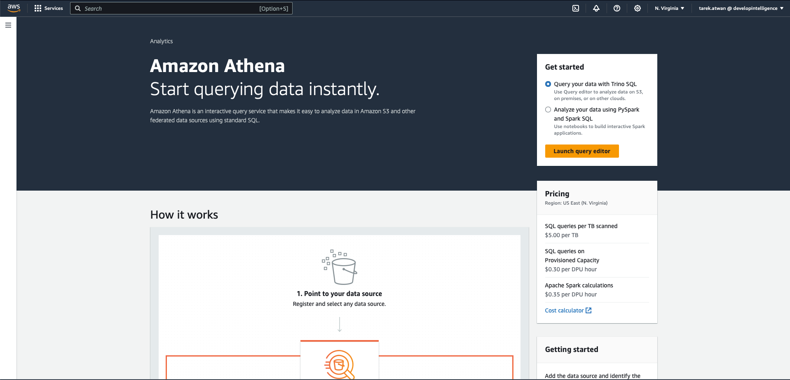

Select the **Settings** tab, then click **Manage**

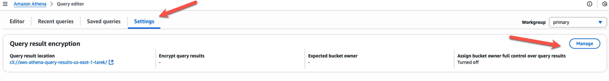

3. Click on **Browse S3** and select **aws-athena-query-results-us-east-1-yourname** as the value for the Location of query result - optional field.

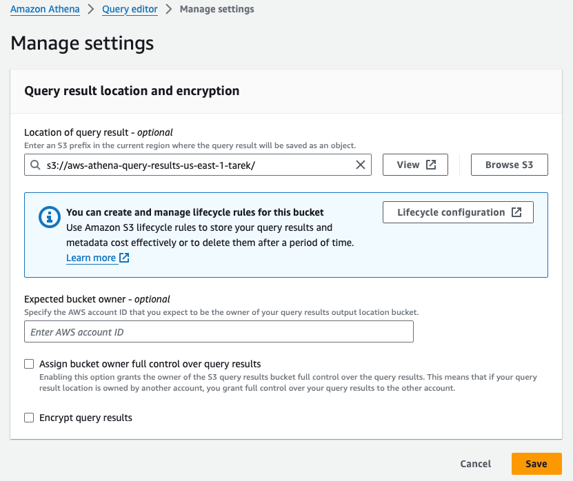

4. Go to the bottom of the page, click **Save**.

5. Go to the top menu, click on **Editor** to return back to the Query editor page.

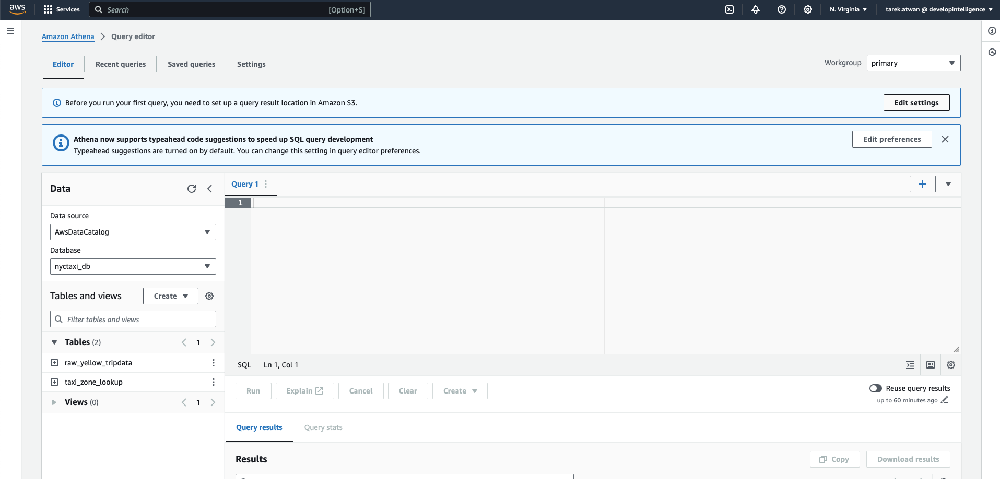

## Preview Table Data

1. On the Query editor page, select the database you just created, for example, **nytaxi_db_initials**, then you should see the list of Tables available.  Click on the actions menu icon `⋮ `next to the table  **raw_yellow_tripdata**, and then select **Preview table**.
2. Examine the data.

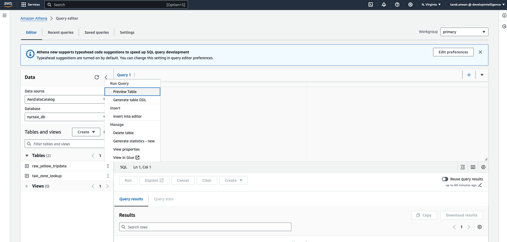

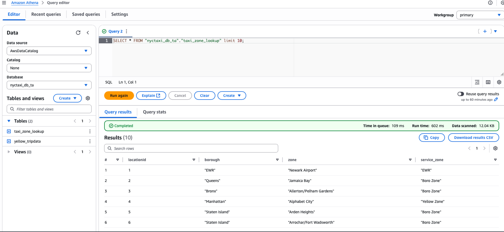

3. Do the same for **taxi_zone_lookup** table. Observe that all string values are enclosed with **“**.

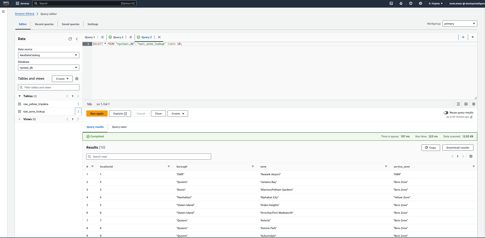

## Working with CSV data enclosed in quotes

> **Working with CSV files enclosed in Quotes**
>
> CSV files occasionally have quotes around the data values intended for each column which aren't part of the data to be analyzed. To read the CSV file properly, we can update the table properties in AWS Glue to use the OpenCSVSerDe. You can read more about it here  https://docs.aws.amazon.com/athena/latest/ug/csv-serde.html

1. Go to Glue console.
2. In the left navigation menu, navigate to Databases, select your database, which should list your Tables.
3. On the Table screen, click on the **taxi_zone_lookup table**.
4. Click **Actions**, then click on **Edit table**.
5. Update the **Serde serialization lib** with `org.apache.hadoop.hive.serde2.OpenCSVSerde`.
6. Remove existing Serde parameters and then add the following:
   - `escapeChar`, enter a backslash `\`
   - `quoteChar`, enter a double quote `"`
   - `separatorChar`, enter a comma `,`


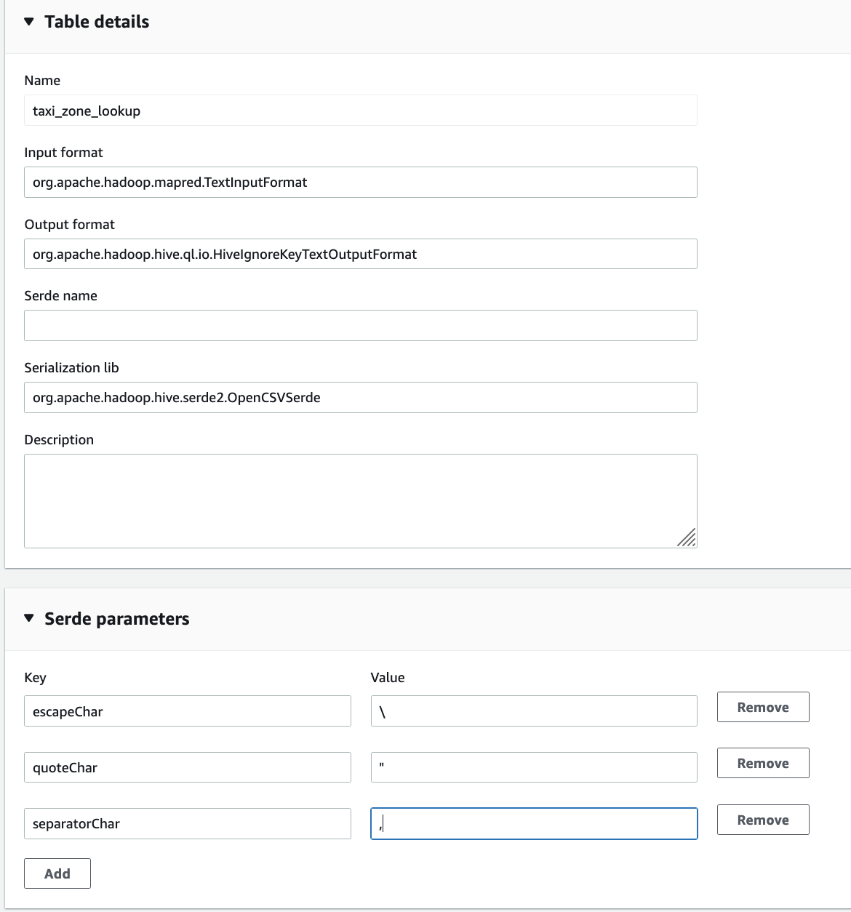

7. Click **Save**
8. Go to back to the Athena console.
9. On the Query editor page, click on the actions menu icon **⋮** besides **taxi_zone_lookup**, and then click **Preview table**.

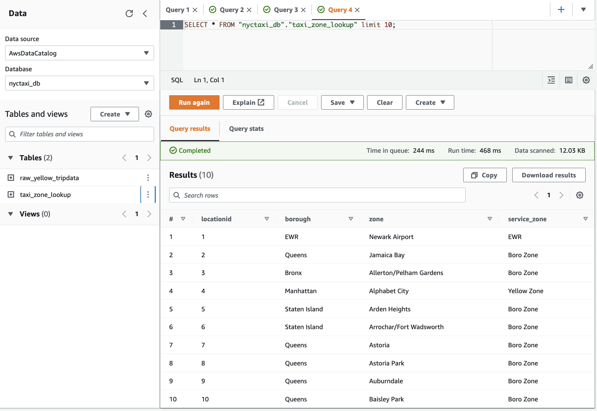

## Run SQL queries to explore the data

1. Check number of yellow taxi trip records.

   ```sql
   -- total records
   -- 8562398 (This is combination of the two parquet files)
   SELECT COUNT(*) "Count" FROM raw_yellow_tripdata;
   ```

2. Explore data categories.

   ```sql
   SELECT vendorid, COUNT(*) "Count"
   FROM  raw_yellow_tripdata
   GROUP BY vendorid
   ORDER BY 1;
   ```

```sql
-- observe other categories
SELECT pulocationid, COUNT(*) "Count"
FROM   raw_yellow_tripdata
GROUP BY pulocationid
ORDER BY 1;
```

```sql
SELECT payment_type, COUNT(*) "Count"
FROM   raw_yellow_tripdata
GROUP BY payment_type
ORDER BY 1;
```

3. Explore records with NULL Vendor ID.

```sql
-- observe other columns with NULL values
-- passenger_count, ratecodeid, store_and_fwd_flag, payment_type
SELECT * 
FROM   raw_yellow_tripdata
WHERE  vendorid IS NULL
LIMIT 100;
```

4. Explore records by time period.

```sql
SELECT year(tpep_pickup_datetime) "Year", 
       month(tpep_pickup_datetime) "Month", 
       COUNT(*) "Total Records"
FROM   raw_yellow_tripdata
GROUP BY 1,2
ORDER BY 1,2;
```

Do you see any data quality issues?

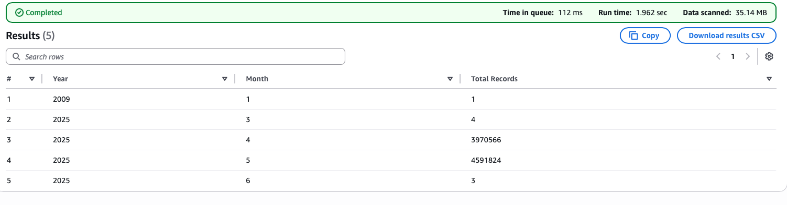

```sql
SELECT date_trunc('quarter', tpep_pickup_datetime) "Quarter", COUNT(*) "Total Records"
FROM   raw_yellow_tripdata
GROUP BY date_trunc('quarter', tpep_pickup_datetime)
ORDER BY 1;
```

5. Count records that falls outside of year 2025.

```sql
-- records with incorrect pickup datetime values
-- 1

SELECT COUNT(*) "Count"
FROM   raw_yellow_tripdata 
WHERE  year(tpep_pickup_datetime) != 2025;
```

**Can you find out which record is that? Which year was outside of 2025?**

6. Count records with NULL values (based on Vendor ID) that falls within 2020.

```sql
-- Records with NULL categories like Vendor ID
-- 0
SELECT COUNT(*) "Count"
FROM   raw_yellow_tripdata
WHERE  vendorid IS NULL
AND    year(tpep_pickup_datetime) = 2025;
```

7. Join taxi trips data with taxi zone look up table.

```sql
-- Count total joined records for May.
-- 8562390
SELECT COUNT(*) AS "Count"
FROM raw_yellow_tripdata td
JOIN taxi_zone_lookup pu ON td.pulocationid = pu.locationid
JOIN taxi_zone_lookup do ON td.dolocationid = do.locationid
WHERE vendorid IS NOT NULL
  AND month(tpep_pickup_datetime) in (4,5);
```

---

# Lab 3 - Transforming your Data

Data enrichment is the process of enhancing existing data with additional data from other sources to provide additional context or meaning, it makes data more useful and insightful during analysis.

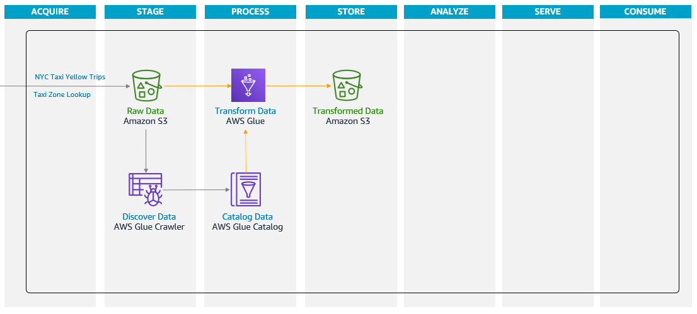

### Introducing AWS Glue Studio

***AWS Glue Studio*** is a graphical interface that makes it easy to create, run, and monitor extract, transform, and load (ETL) jobs in AWS Glue. You can visually compose data transformation workflows, AWS Glue studio will generate Apache Spark code on your behalf, and let it seamlessly run them on AWS Glue’s Apache Spark-based serverless ETL engine.

## Create a job using Glue Studio

### Planning the Data Transformation Steps

It’s a good practice to plan the steps to transform your data. Based on the information we captured during data exploration stage, we can come up with the following transformation step:

1. Read yellow trip data from S3, `raw_yellow_tripdata` table.
2. Clean yellow trip data data.
   - Remove records with NULL values (vendorid, payment_type, passenger count, ratecodeid).
   - Filter records within a time period (remove records with invalid pickup datetime, narrow down data to be processed).
3. Join yellow trip data with taxi zone lookup to obtain pickup location information.
   - Read lookup data from S3, `taxi_zone_lookup` table.
   - Rename column names of lookup data to differentiate pickup locations from drop-off locations.
   - Perform the join.
4. Join yellow trip data with taxi zone lookup to obtain drop-off location information.
   - Read lookup data from S3, `taxi_zone_lookup` table.
   - Rename column names of lookup data to differentiate drop-off locations from pickup locations.
   - Perform the join.
5. Perform data transformation on joined dataset.
   - Rename column names.
   - Set appropriate data types.
   - Remove redundant columns as a result of table joins.
6. Save processed dataset to S3 in a query optimized format.

### Create a job using Glue Studio

1. Go to Glue console.
2. In the left navigation menu, under the ETL section, click **AWS Glue Studio**.

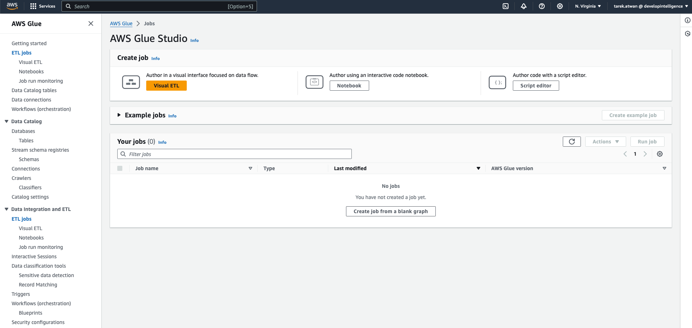

3. On the AWS Glue Studio page, under **Create Job** click  **Visual ETL**.

4. In the Glue Studio editor page, go to the **Job details** tab, set the following configuration:
   1. Name – `Transform NYC Taxi Trip Data YOURINITIALS`
   2. IAM Role – **AWSGlueServiceRole-SDL-Jumpstart**
   3. Glue Version - **Glue 4.0**
   4. Job bookmark – **Disable**
   5. Number of retries - `0`


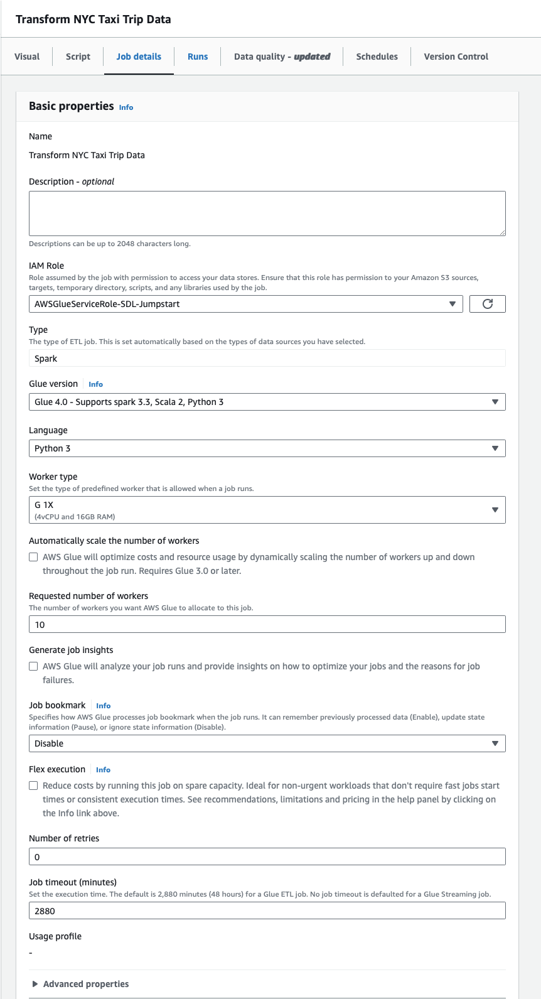

5. Click **Save**. Go back to the Visual tab.

> AWS Glue **job bookmark** feature helps maintain state information and prevent the reprocessing of old data. It enables the job to process only new data when rerunning on a scheduled interval.

---

## Add a data source

### Adding Yellow Trip data from Amazon S3

1. Click on the **Source** icon, choose **S3**.

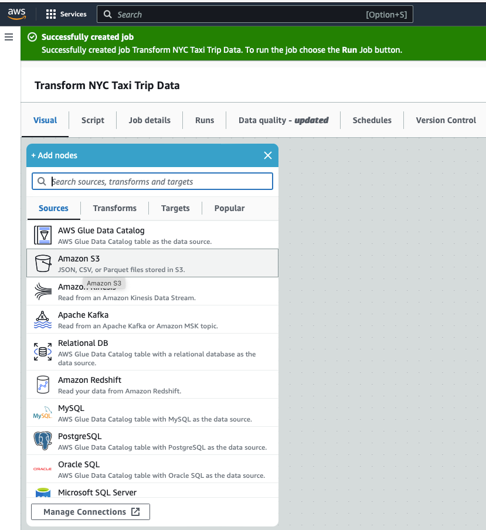

2. In the Data source – S3 bucket node, the specify the following information: 

- Node properties tab, **Name** - `Yellow Trip Data`
- Data source properties tab, **Database** – `nyctaxi_db_initial`
- Data source properties tab, **Table** – `raw_yellow_tripdata`

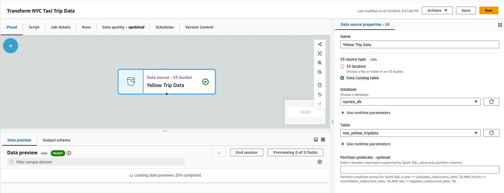

3. Click **Save**. Remember to save your work as you progress on building the transformation steps.

### Review resulting data schema and previewing data

4. Go to the Output schema tab to review the resulting data schema.
5. Go to Data preview tab to check sample data set while editing your job.
   - If asked for an IAM role select **AWSGlueServiceRole-SDL-Jumpstart**

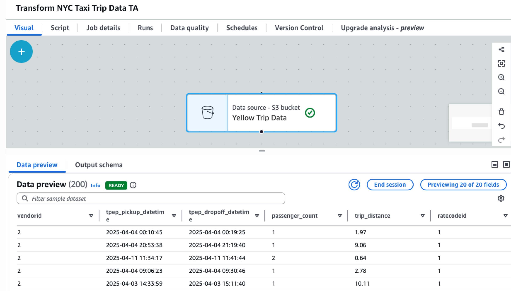

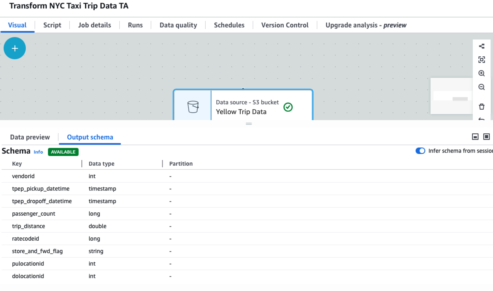

> AWS Glue Studio now allows you to preview your data at each step of the visual job authoring process so you can test and debug your transformations without having to save or run the job.
>
> The first time you choose the Data preview tab, you are prompted to choose an IAM role to use. The IAM role you choose must have the necessary permissions to create the data previews. This can be the same role that you plan to use for your job, or it can be a different role.
>
> After you choose an IAM role, it takes about 20 to 30 seconds before the data appears. You are charged for data preview usage as soon as you choose the IAM role.

## Remove records with NULL values

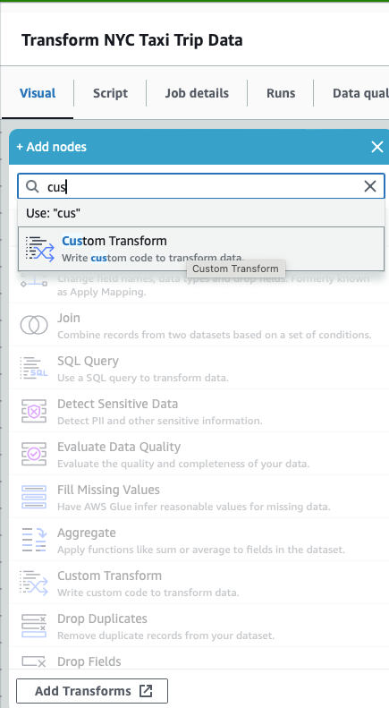

1. Click on the **Transforms** tab and choose **Custom Transform**. You can also search for the specific node.

2. In the Transform – Custom code node, specify the following information:

   - Node properties tab, **Name** - `Remove Records with NULL`

   - Add the following in the Code block:

     ```python
     def MyTransform (glueContext, dfc) -> DynamicFrameCollection:
         df = dfc.select(list(dfc.keys())[0]).toDF().na.drop()
         results = DynamicFrame.fromDF(df, glueContext, "results")
         return DynamicFrameCollection({"results": results}, glueContext)
     ```

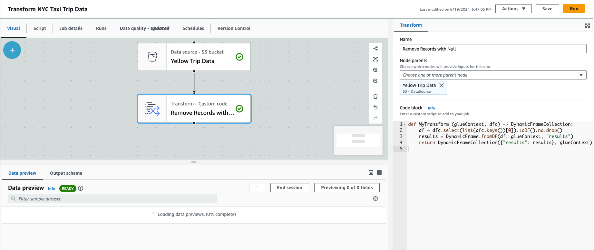

3. Click on the **Transform** icon, choose **SelectFromCollection**.

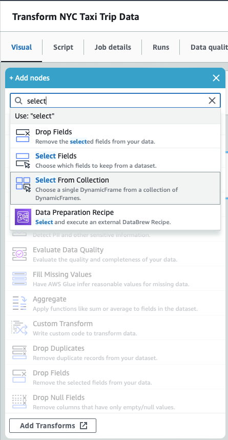

4. Specify the following information:

- Node properties tab, **Name** – `SelectFromCollection`
- Transform tab, **Frame index** – `0`

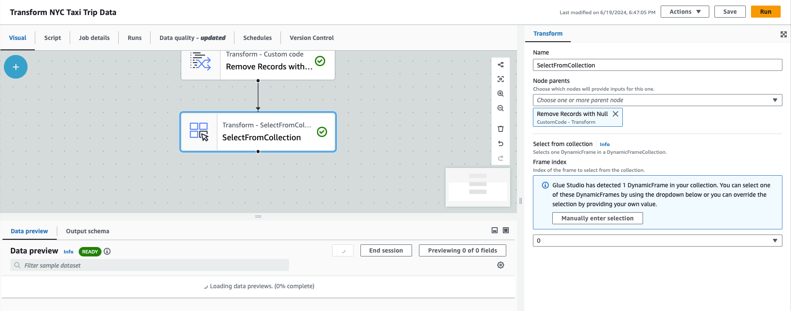

5. Remember to save your work.

---

## Filter Records

**Filter records to remove records with invalid Pickup DateTime**

> In the interest of time, we will filter the records between *October 2020* and *December 2020* to reduce job processing time during the workshop.

1. Click on the **Transform** icon, choose **Filter**.

   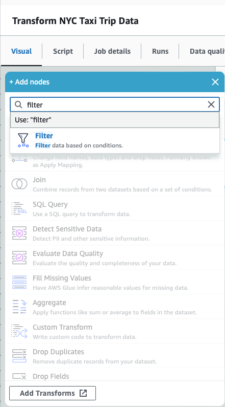

2. Specify the following information:

   - Node properties tab, **Name** – `Filter - Yellow Trip Data`
   - Transform tab, **Filter condition** – `payment_type` `!=` `3`


3. Remember to save your work

## Review the automatically generated script

1. Go to the Script details tab.
2. Observe that the code of the script are automatically generated by Glue Studio.

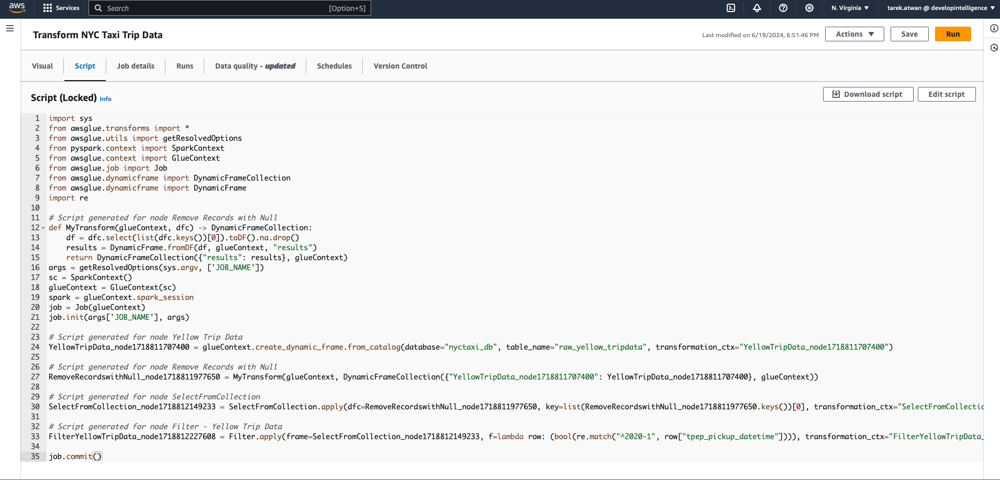

---

## Add another data source

**Add Lookup table for Taxi Pickup Zone**

1. Return to the Visual tab
2. Click on the **Source icon**, choose **S3**
3. In the **Data source – S3 bucket** node, the specify the following information:
   - Node properties tab, **Name** - `Pickup Zone Lookup`
   - Data source properties tab, **Database** – `nyctaxi_db`
   - Data source properties tab, **Table** – `taxi_zone_lookup`

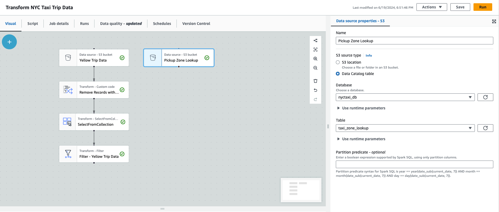

4. Remember to save your work.

## Modify column names of Pickup Taxi Zone Lookup table

1. Make sure the Amazon S3 - Pickup Zone Lookup node is selected.
2. Click on the Transform icon, choose **Choose Schema**. Formerly known as **Apply Mapping**
3. Specify the following information:
   - Node properties tab, **Name** - `ApplyMapping - Pickup Zone Lookup`
   - Transform tab, modify the target key
     - **locationid** to `pu_location_id`
     - **borough** to `pu_borough`
     - **zone** to `pu_zone`
     - **service_zone** to `pu_service_zone`

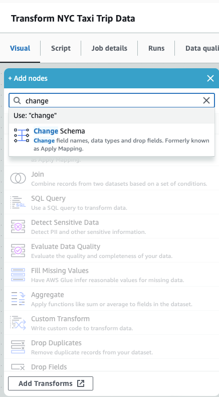

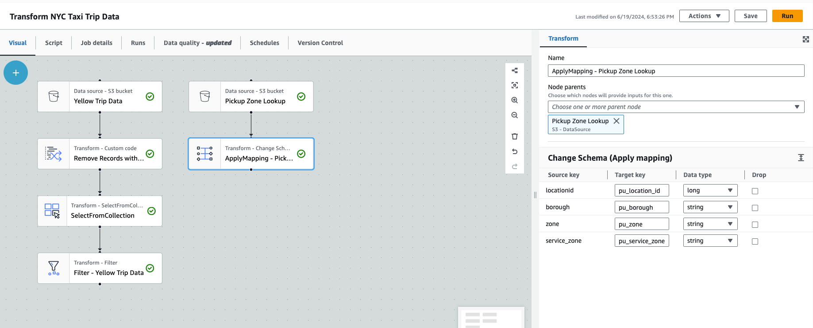

4. Remember to save your work.

## Join Data

**Join the Yellow Trips data with Pickup Taxi Zone Lookup data**

1. Click on the **Transform** icon, choose **Join**.
2. Specify the following information:
   - Node properties tab, **Name** - `Yellow Trips Data + Pickup Zone Lookup`
   - Node properties tab, **Node Parents**
     - `ApplyMapping - Pickup Zone Lookup`
     - `Filter - Yellow Trip Data`


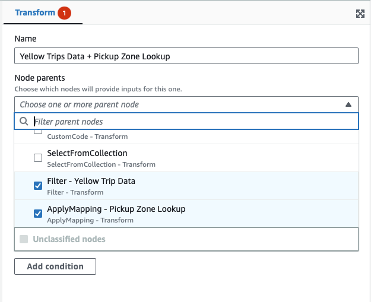


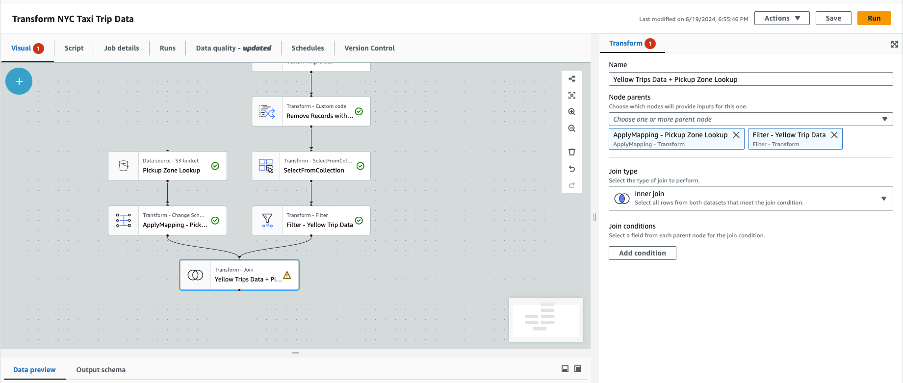

Transform properties tab, under the **Join conditions**, select the following keys:

- **ApplyMapping - Pickup Zone Lookup** - `pu_location_id`
- **Filter - Yellow Trip Data** - `pulocationid`

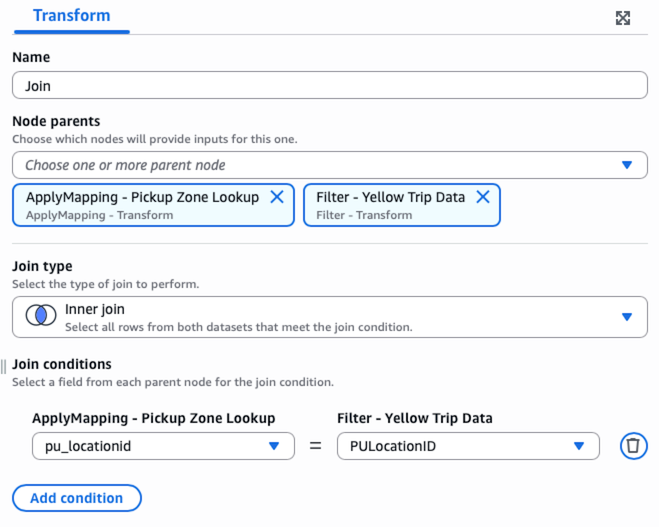

3. Remember to save your work.

## Add and Join another dataset

**Add Lookup table for Taxi Drop-off Zone**

1. Click on the **Source** icon, choose **S3**
2. In the Data source – S3 bucket node, the specify the following information:
   - Node properties tab, **Name** - `Dropoff Zone Lookup`
   - Data source properties tab, **Database** – `nyctaxi_db`
   - Data source properties tab, **Table** – `taxi_zone_lookup`


3. Remember to save your work.

---

### Modify column names of Drop-off Taxi Zone Lookup Table

1. Make sure the Amazon S3 - Dropoff Zone Lookup node is selected.
2. Click on the **Transform** icon, choose **Change Schema**.
3. Specify the following information:
   - Node properties tab, **Name** - `ApplyMapping - Dropoff Zone Lookup`
   - Transform tab, modify the target key of the following:
     - **locationid** to `do_location_id`
     - **borough** to `do_borough`
     - **zone** to `do_zone`
     - **service_zone** to `do_service_zone`

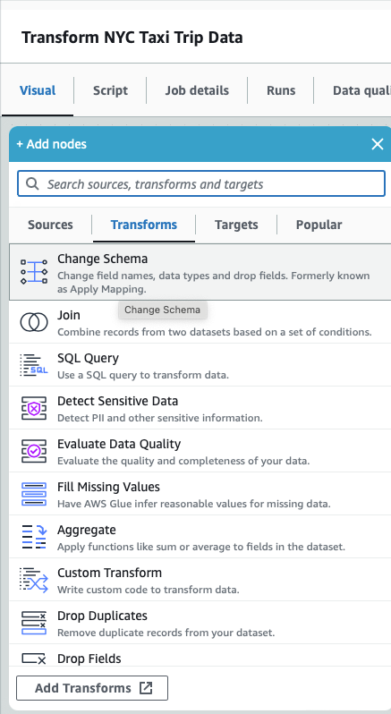

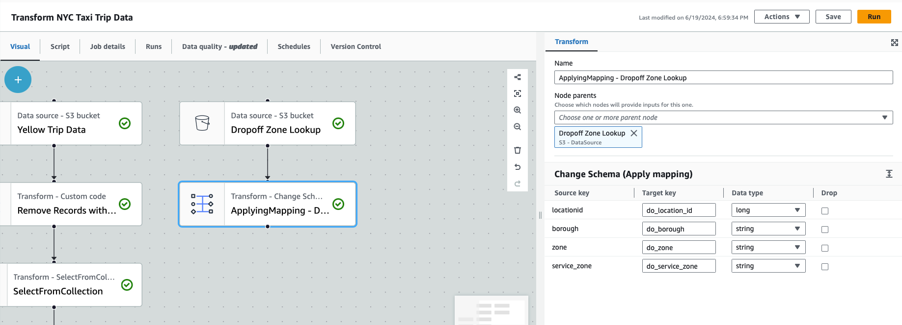

4. Remember to save your work.

### Join Yellow Trips data and Dropoff Taxi Zone Lookup data

1. Click on the **Transform** icon, choose **Join**.
2. Specify the following information:
   - Node properties tab, **Name** - `Yellow Trips Data + Pickup Zone Lookup + Dropoff Zone Lookup`
   - Node properties tab, Node Parents
     - `ApplyMapping - Dropoff Zone Lookup`
     - `Yellow Trips Data + Pickup Zone Lookup`

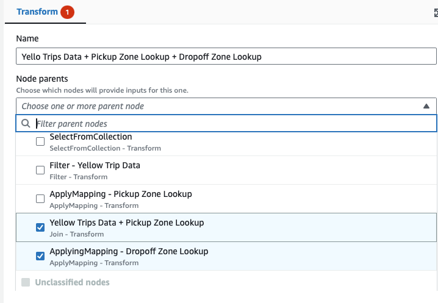

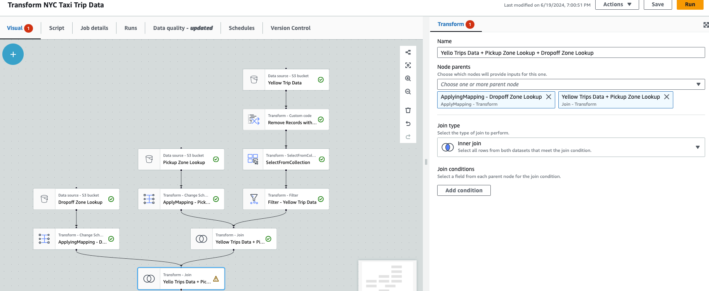

Transform properties tab, under the **Join conditions**, select the following keys:

- **ApplyMapping - Dropoff Zone Lookup** – `do_location_id`
- **Yellow Trips Data + Pickup Zone Lookup** – `dolocationid`

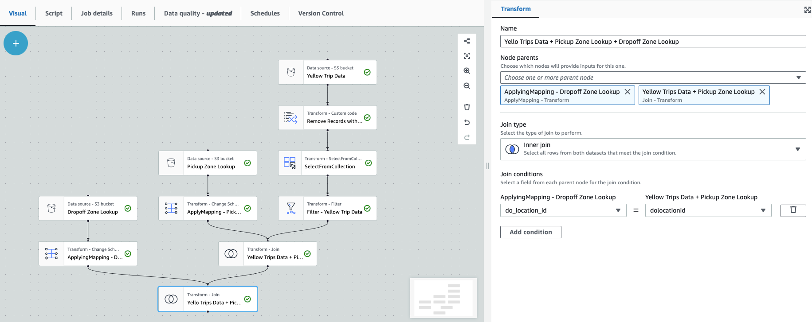

3. Remember to save your work.

---

## Transform data and save to target

**Modify column names and data types of the joined dataset**

1. Click on the Transform icon, choose **Change Schema**.
2. Specify the following information:
   - Node properties tab, **Name** - `ApplyMapping - Joined Data`
   - Transform tab, modify the **Target key** and **Data type** of the following:
     - **vendorid** to `vendor_id`
   - Transform tab, drop the following **Source keys**:
     - `pulocationid`
     - `dolocationid`

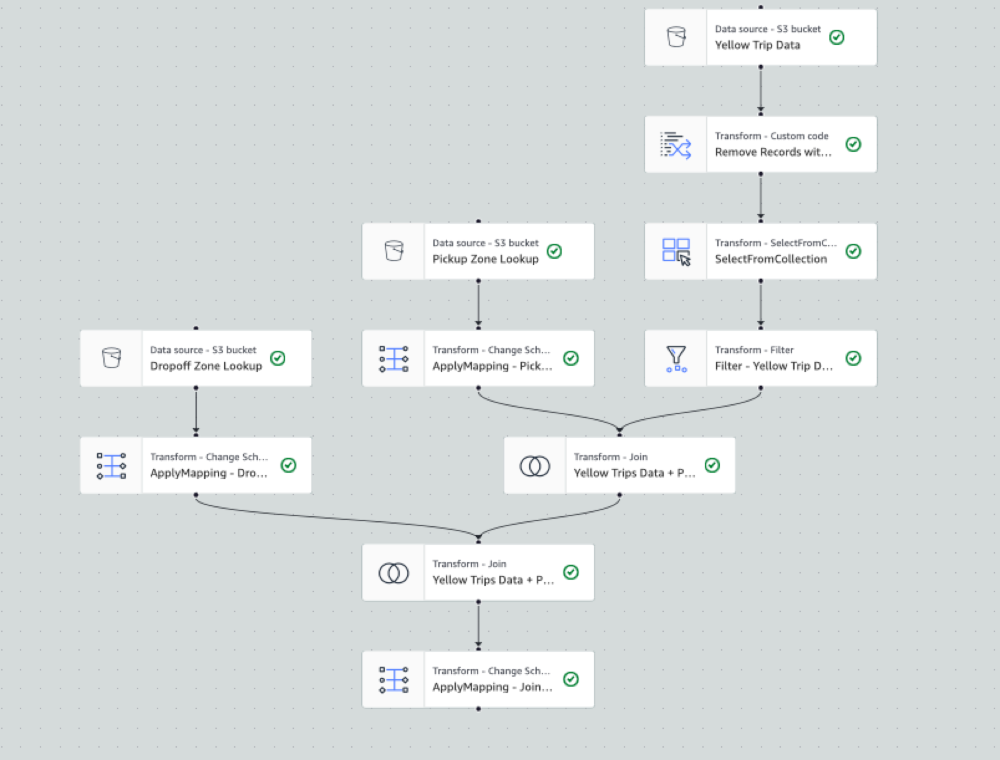

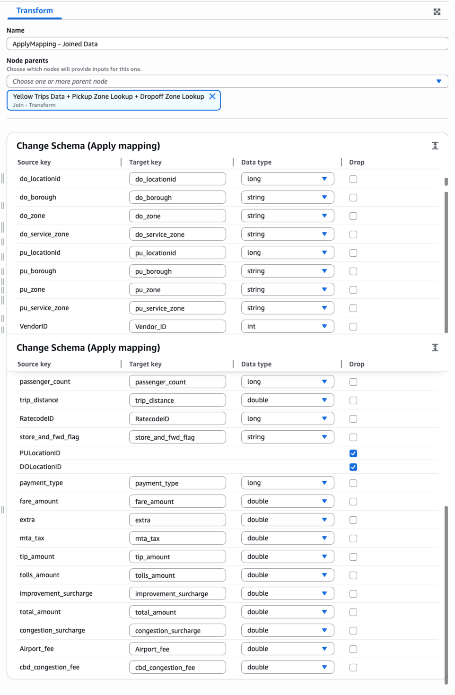

3. Remember to save your work.

---

### Save transformed data to Amazon S3

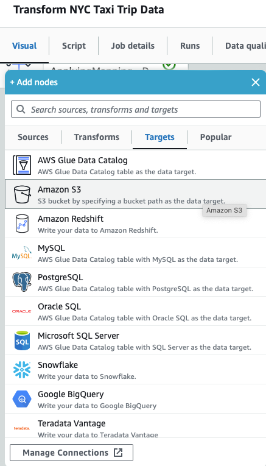

1. Click on **Targets** tab and choose **Amazon S3**
2. Specify the following information:
   - Node properties tab, **Name** – `Transformed Yellow Trip Data`
   - Data target properties – S3 tab, specify the following:
     - **Format** – `Glue Parquet`
     - **Compression Type** - `Snappy`
   - **S3 Target Location** – `s3://[your-bucket-name]–transformed/` for example here is mine `s3://tatwan-transformed/`

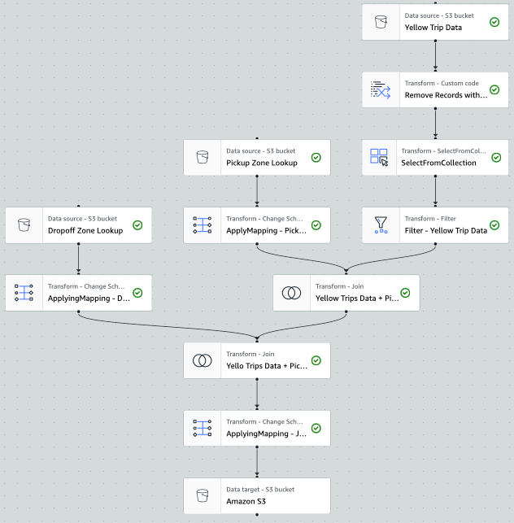

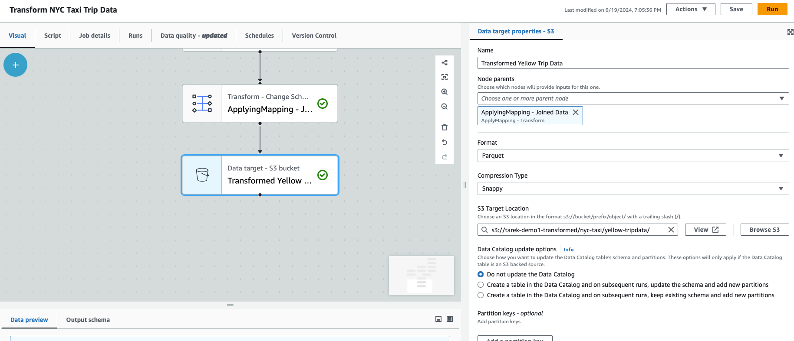


3. Remember to save your work.

## Run the Job

**Run the data transformation job**

1. On the upper right section of the AWS Glue Studio page, click **Run**.

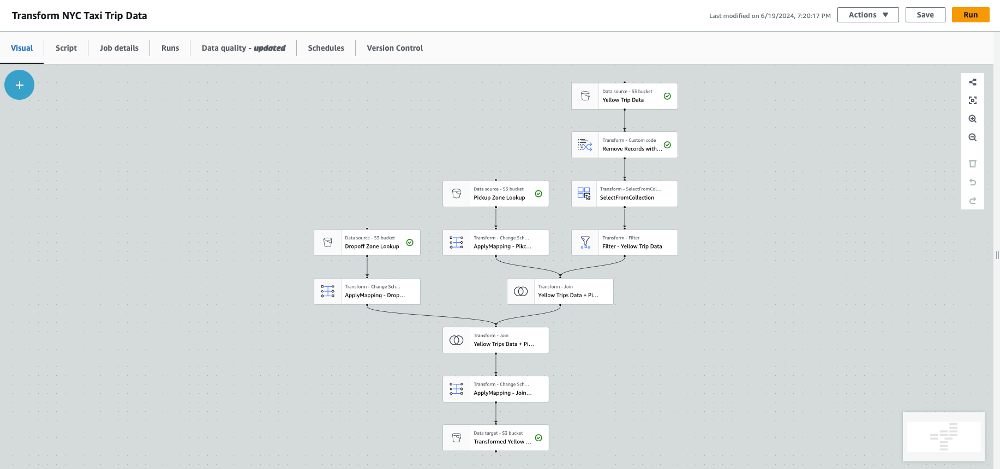

2. Go to the Runs tab to view the status on of the job.
3. Click on the **Job Id** to monitor the job run.

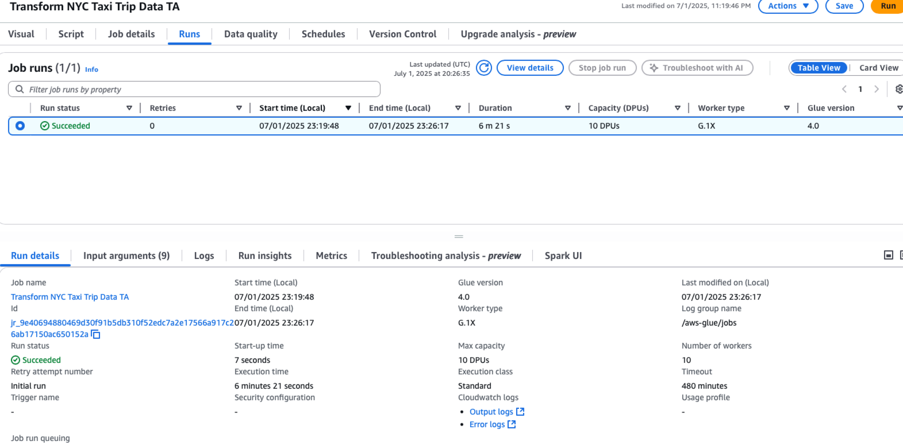

You can click on the **View Details** button to see additional details on the job including metrics 

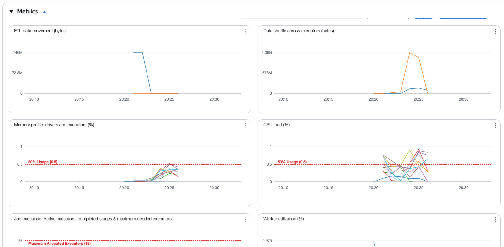

Once the job is completed you can further inspect the S3 bucket to see the newly populated data “transformed data”. Here is an example of the parquet files in the destination/target bucket for the transformed data 

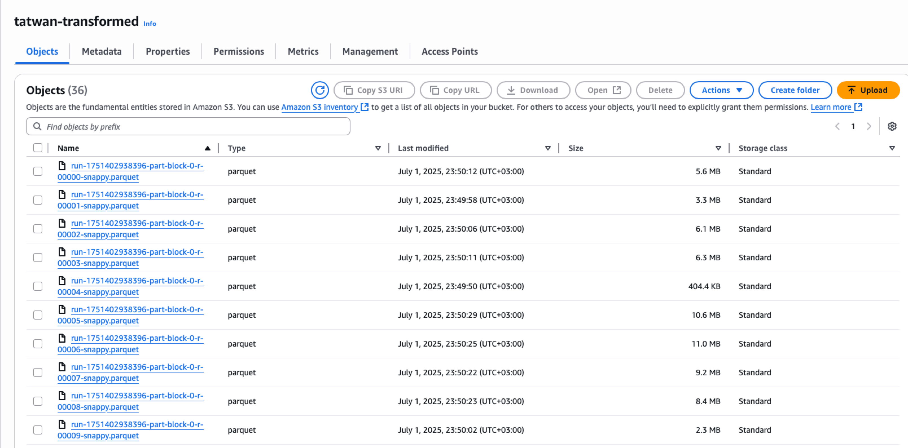

---

# Lab 4 - Enriching your Data

A picture is worth 1000 words. Data visualization presents data in graphical format which makes data easier to digest and understand. It allows users to gain better insights from data to make informed decisions.

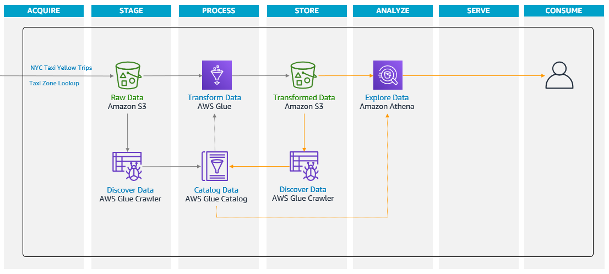

## Catalog Transformed Data

**Create a Glue Crawler**

1. Go to the AWS Glue Console.
2. In the left navigation menu, click **Crawlers**.
3. On the Crawlers page, click **add crawler**.
4. Specify `nyc-yellow-analysis-crawler-firstname` as the crawler name, click **Next**.
5. On the Choose data sources and classifiers screen, specify the following information, and then click **Next**.
   - Click **Add a data source**
   - Choose Data source – **S3**
   - Select Location of S3 data - **In this account**
   - For Subsequent crawler runs, select to **Crawl all sub-folders**
   - Include S3 path – `s3://your-bucket-name-transformed/`
   - For Subsequent crawler runs, select to **Crawl all sub-folders**
   - Then click **Add an S3 data source**.
6. On the Configure security settings, choose **AWSGlueServiceRole-SDL-Jumpstart** from the Existing IAM role, click **Next**.
7. On the Set output and scheduling screen, choose **nyctaxi_db_yourinitials** as the database.
8. On the Crawler schedule, leave the frequency **On demand**, click **Next**.
9. Review the crawler details, click **Create crawler**.
10. On the Crawlers page, select **`nyc-yellow-analysis-crawler-firstname`**, and then click **Run crawler**.

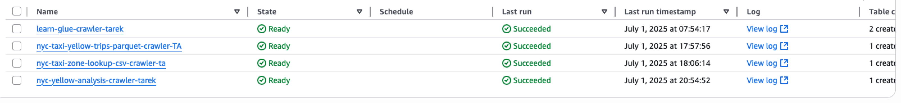

## Validate transformed data

1. Go to Athena console.
2. Your table may be named as the bucket name, in my case it is called **tatwan_transformed** 
3. Select **Preview table** 

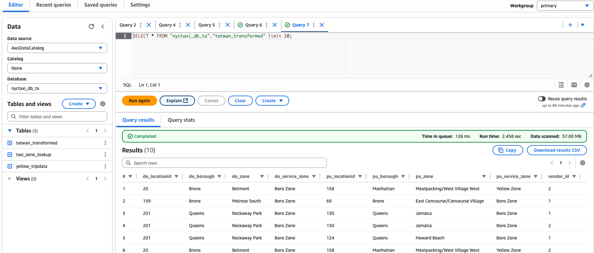

3. On the Query editor page, run the following queries to examine the data.

```sql
-- 6563074 records
SELECT COUNT(*) "Count"
FROM   tatwan_transformed;
```


```sql
SELECT DATE_TRUNC('month', tpep_pickup_datetime) "Period", 
       COUNT(*) "Total Records"
FROM   tatwan_transformed
GROUP BY DATE_TRUNC('month', tpep_pickup_datetime)
ORDER BY 1;
```

## Enrich Transformed Data

1. Run the following query to create a view to enrich the table with additional data.

```sql
CREATE OR REPLACE VIEW v_yellow_tripdata
AS
SELECT CASE vendor_id
            WHEN 1 THEN 'Creative Mobile'
            WHEN 2 THEN 'VeriFone'
            ELSE 'No Data'
       END "vendor_name",
       tpep_pickup_datetime,
       tpep_dropoff_datetime,
       passenger_count,
       trip_distance,
       CASE ratecodeid
            WHEN 1 THEN 'Standard Rate'
            WHEN 2 THEN 'JFK'
            WHEN 3 THEN 'Newark'
            WHEN 4 THEN 'Nassau/Westchester'
            WHEN 5 THEN 'Negotiated Fare'
            WHEN 6 THEN 'Group Ride'
            WHEN 99 THEN 'Special Rate'
            ELSE 'No Data'
       END "rate_type",
       store_and_fwd_flag,
       pu_borough,
       pu_zone,
       pu_service_zone,
       do_borough,
       do_zone,
       do_service_zone,
       CASE payment_type
            WHEN 1 THEN 'Credit Card'
            WHEN 2 THEN 'Cash'
            WHEN 3 THEN 'No Charge'
            WHEN 4 THEN 'Dispute'
            WHEN 5 THEN 'Unknown'
            WHEN 6 THEN 'Voided Trip'
            ELSE 'No Data'
       END "payment_type",
       fare_amount,
       extra,
       mta_tax,
       tip_amount,
       tolls_amount,
       improvement_surcharge,
       congestion_surcharge,
       total_amount
FROM   tatwan_transformed;

```

2. Select **Preview table** to examine the enriched data in **v_yellow_tripdata** view.

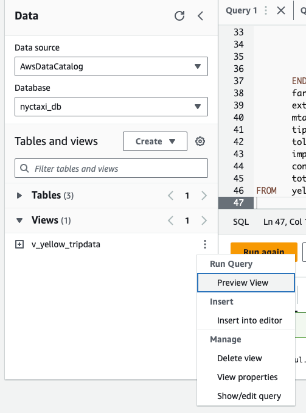

3. Run the following query to get insights.

```sql
SELECT vendor_name "Vendor",
       rate_type "Rate Type", 
       payment_type "Payment Type",
       ROUND(AVG(fare_amount), 2) "Fare",
       ROUND(AVG(extra), 2) "Extra",
       ROUND(AVG(mta_tax), 2) "MTA",
       ROUND(AVG(tip_amount), 2) "Tip",
       ROUND(AVG(tolls_amount), 2) "Toll",
       ROUND(AVG(improvement_surcharge), 2) "Improvement",
       ROUND(AVG(congestion_surcharge), 2) "Congestion",
       ROUND(AVG(total_amount), 2) "Total"
FROM   v_yellow_tripdata
GROUP BY vendor_name,
         rate_type,
         payment_type
ORDER BY 1, 2, 3;

```

