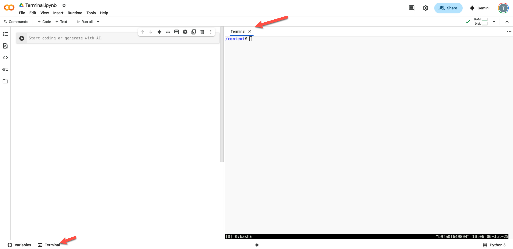

# Terminal in Google Colab

Click on the terminal icon to start the terminal in Colab



# 1. Navigating Your Workspace

### Core Commands Overview

- `pwd` - Print working directory (shows where you are)
- `mkdir` - Make directory (create folders)
- `cd` - Change directory (navigate between folders)
- `ls` - List directory contents (see what's in a folder)

```shell
# Create a new directory called 'tech'
mkdir tech

# Navigate into the tech directory
cd tech

# Check current location
pwd
# Output: /content/tech

# Go back to parent directory
cd ..

# Verify you're back in the root
pwd
# Output: /content
```

> **Pro Tip:** Use `cd ~` to quickly return to your home directory from anywhere!

# 2. File System Exploration

```bash
# Basic listing
ls

# Show all files (including hidden ones starting with .)
ls -a

# Long format with detailed information
ls -l

# Long format with human-readable file sizes
ls -lh

# Navigate to sample_data and explore
cd sample_data/
ls -lh

# List only CSV files using wildcards
ls *.csv

# List only JSON files
ls *.json

# Go back to parent directory
cd ..

# List files in sample_data without navigating there
ls sample_data/
ls sample_data/*.csv
```

### Advanced Listing Options

```bash
# Recursive listing (shows subdirectories too)
ls -R

# Check disk usage
du              # Basic disk usage
du -h           # Human-readable sizes
du -a           # All files, not just directories
du -ah          # All files with human-readable sizes
```

# 3. Creating and Working with Files

### Basic File Operations

```bash
# Create empty files
touch sample.txt
touch data.csv

# Create content using echo
echo "Hello, Data Engineers!" > greeting.txt

# Display file contents
cat greeting.txt
```

# 4. File Content Analysis

### Essential Commands for Data Engineers

- `find` - Search for files and directories
- `cat` - Display entire file contents
- `less` - View file contents page by page
- `head` - Show first few lines
- `tail` - Show last few lines
- `cut` - Extract specific columns
- `wc` - **W**ord **C**ount (counts lines, words, and bytes).

### Upload Required Files

**Before proceeding:** Upload `shakespeare.txt` and `sales.csv` to your `tech` folder.

```bash
# Find all .txt files in current directory and subdirectories
find . -type f -name "*.txt"
# Output: ./tech/shakespeare.txt

# Using quotes for exact pattern matching
find . -name "sh*"
# Output: ./tech/shakespeare.txt
```

### Viewing File Contents

```bash
# Display entire file (careful with large files!)
cat tech/shakespeare.txt

# View file page by page (press 'q' to quit)
less tech/shakespeare.txt

# Show first 5 lines
head -n 5 tech/shakespeare.txt

# Show first 10 lines
head -n 10 tech/shakespeare.txt

# Show last 5 lines
tail -n 5 tech/shakespeare.txt

# Show last 10 lines
tail -n 10 tech/shakespeare.txt
```

### CSV File Analysis

```bash
# Preview CSV structure
head -n 5 tech/sales.csv
head -n 10 tech/sales.csv
tail -n 5 tech/sales.csv
tail -n 10 tech/sales.csv
```

# 5. Data Extraction with `cut` Command

### Working with CSV Columns

```bash
# Extract first column (comma-separated)
cut -d',' -f1 tech/sales.csv 

# Extract first two columns
cut -d',' -f1-2 tech/sales.csv 

# Extract columns 1 and 3
cut -d',' -f1,3 tech/sales.csv
```

> **Key Insight:** The `-d` flag specifies the delimiter, `-f` specifies which fields (columns) to extract.

### Text Analysis with `wc`

```bash
# Count lines, words, and bytes
wc tech/shakespeare.txt 

# Count only lines
wc -l tech/shakespeare.txt

# Count only words
wc -w tech/shakespeare.txt

# Count lines in CSV (including header)
wc -l tech/sales.csv
```


# 6. Data Processing Pipeline Example

## The Power of Pipes: Slicing and Dicing Data

This is where the command line becomes a data engineering powerhouse. We can **pipe** (`|`) the output of one command to become the input of another.

**Concept: The Pipe `|`** Think of it as an assembly line. `command1 | command2` means "take the result of `command1` and immediately use it for `command2`." 

| Command | Description                                          |
| ------- | ---------------------------------------------------- |
| `cut`   | Removes sections (columns) from each line of a file. |
| `sort`  | Sorts the lines of text.                             |
| `uniq`  | Reports or omits repeated lines.                     |

Let's find all the unique names in our `sales.csv` file. We'll build the command step-by-step.

### Finding Unique Values in CSV

```bash
# Step 1: Extract first column (names)
cut -d',' -f1 tech/sales.csv

# Step 2: Sort the values
cut -d',' -f1 tech/sales.csv | sort

# Step 3: Skip header row (tail -n +2 starts from line 2)
cut -d',' -f1 tech/sales.csv | tail -n +2

# Step 4: Sort after skipping header
cut -d',' -f1 tech/sales.csv | tail -n +2 | sort

# Step 5: Get unique values only
cut -d',' -f1 tech/sales.csv | tail -n +2 | sort | uniq
```

> **Data Engineering Insight:** This pipeline demonstrates how Unix commands can be chained together for data processing!

# 7. Advanced Analysis with `awk`

`awk` is a versatile programming language for pattern scanning and processing. It's fantastic for quick analysis on CSVs.

The basic structure is `awk -F'delimiter' 'condition {action}' filename`.

### Understanding `awk` for Data Processing

```bash
# First, let's see the CSV header
head -n 1 tech/sales.csv 
# Output: Name,Count,Revenue

# Display all data except header
awk -F',' 'NR > 1' tech/sales.csv

# Find rows where revenue > 300
awk -F',' '$3 > 300' tech/sales.csv

# Combine conditions: skip header AND revenue > 300
awk -F',' 'NR > 1 && $3 > 300' tech/sales.csv

# Count how many rows meet our criteria
awk -F',' 'NR > 1 && $3 > 300' tech/sales.csv | wc -l
# Output: 15
```

> **Data Engineering Application:** `awk` is powerful for filtering and processing structured data like CSV files.

# 8. Managing Files: Copy, Move, and Delete

As a data engineer, you'll constantly be organizing files, creating backups, and cleaning up.

| Command | Description                                        |
| ------- | -------------------------------------------------- |
| `cp`    | **C**o**p**y a file.                               |
| `mv`    | **M**o**v**e or rename a file.                     |
| `rm`    | **R**e**m**ove (delete) a file.                    |
| `tree`  | Shows a visual tree of your directories and files. |

First, let's install `tree` to get a better view of our file system.

```bash
# This uses the 'apt-get' package manager to install new software.
apt-get install tree
```

Now, let's create some new directories and organize our files.

```bash
# Create directories for backups and archives.
mkdir backup
mkdir archive

# Let's see our current structure.
tree
.
├── backup
├── sample_data
│   ├── ... (many files)
│   └── README.md
└── tech
    ├── sales.csv
    └── shakespeare.txt

# Let's copy our sales data to the backup folder.
cp tech/sales.csv backup/

# Let's copy it again, but give the copy a new name.
cp tech/sales.csv backup/sales_bkup.csv

# Now let's move a file. 'mv' is also used for renaming.
mv backup/sales.csv archive/

# Let's move all the CSV files from the sample_data directory into our archive.
mv sample_data/*.csv archive/

# Let's check our structure now.
tree
.
├── archive
│   ├── california_housing_test.csv
│   ├── california_housing_train.csv
│   ├── mnist_test.csv
│   ├── mnist_train_small.csv
│   └── sales.csv
├── backup
│   └── sales_bkup.csv
├── sample_data
│   ├── anscombe.json
│   └── README.md
└── tech
    ├── sales.csv
    └── shakespeare.txt

# Now for deletion. Be careful with 'rm'! There is no undo.
rm sample_data/anscombe.json

# To remove a directory, it must be empty.
# Let's remove the last file from sample_data and then the directory itself.
rm sample_data/README.md
rmdir sample_data
```

> **Safety Note:** Be careful with `rm` command - deleted files cannot be easily recovered!

> **A Note on `rm -r`**: To delete a directory and everything inside it, you can use `rm -r directory_name`. This is **EXTREMELY POWERFUL AND DANGEROUS**. Double-check your command before you press enter, as it will not ask for confirmation.

# 9. Advanced Command Combinations

Let's combine everything we've learned to solve a real-world problem: **Find the top 5 sales by revenue and save the result to a new file.**

**Concept: Redirection `>`** The `>` symbol takes the output of a command and, instead of printing it to the screen, saves it to a file. If the file doesn't exist, it's created. If it does, it's overwritten. 

> **NOTE**
>
> **`>` (Single Greater Than) - Overwrite**
>
> - **Creates a new file** or **completely replaces** existing file content
> - **Destructive operation** - all previous content is lost
> - Use when you want to start fresh
>
> **`>>` (Double Greater Than) - Append**
>
> - **Adds to the end** of existing file content
> - **Non-destructive operation** - preserves existing content
> - **Creates file if it doesn't exist**
> - Use when you want to add more data

### Output Redirection

```bash
# Save first 5 lines to a new file
head -5 tech/sales.csv > backup/first_n.csv
```

### Complex Data Processing Pipeline

```bash
# Skipping the header.
awk -F',' 'NR > 1' tech/sales.csv

# Filter by Revenue and Skipping the header 
awk -F',' 'NR > 1 && $3 > 300' tech/sales.csv

# Filter and sort data
awk -F',' 'NR > 1 && $3 > 300' tech/sales.csv | sort

# Sort by third column (revenue)
awk -F',' 'NR > 1 && $3 > 300' tech/sales.csv | sort -t',' -k3

# Sort numerically by revenue
awk -F',' 'NR > 1 && $3 > 300' tech/sales.csv | sort -t',' -k3 -n

# Sort in descending order
awk -F',' 'NR > 1 && $3 > 300' tech/sales.csv | sort -t',' -k3 -nr

# Get top 5 by revenue and save to file
awk -F',' 'NR > 1 && $3 > 300' tech/sales.csv | sort -t',' -k3 -nr | head -n 5 > backup/top_five_revenue.csv

# Now, let's verify our work.
cat backup/top_five_revenue.csv
```

> **Real-World Application:** This pipeline filters data, sorts by revenue, and extracts top performers - a common data engineering task!

