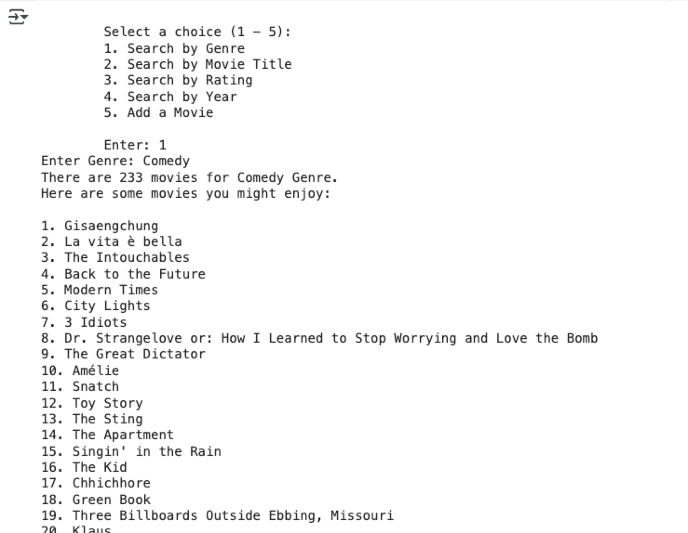
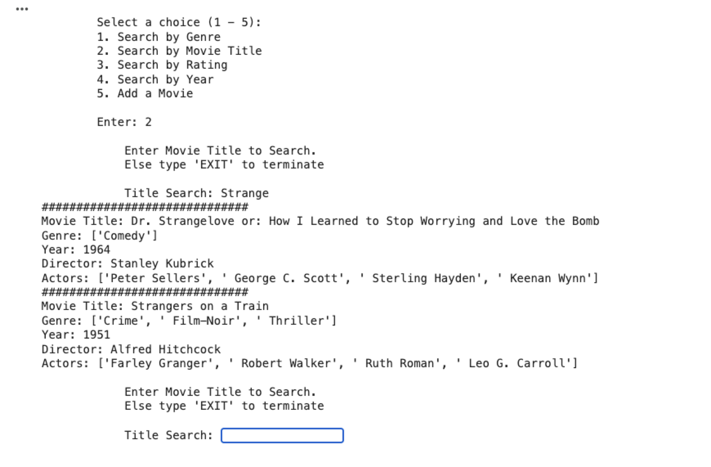
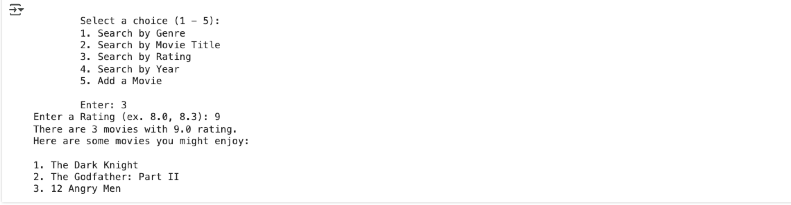
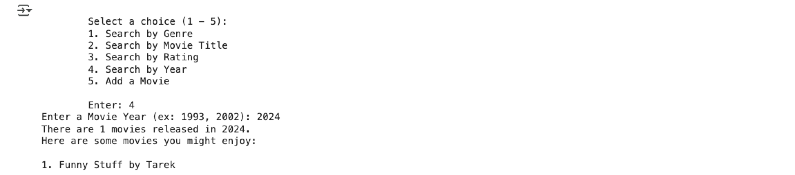

# **Python Data Organization Project:**

## **Movie Recommender System** 

#### **Project Description:**

This project will allow you to practice your Python skills by building a simple movie recommender system.

I have provided a pickle file that contains a Python dictionary. Start by ingesting the data:

```python
import pickle
with open('movie_nested_dict.pickle', 'rb') as file:
    movie_db = pickle.load(file)
```

You will create four functions:

1. `search_by_title`
2. `search_by_genre`
3. `search_by_rating`
4. `search_by_year`
5. `add_movie`

#### Example Usage 

Using Genre to search




Using Title to search



By Movie Rating



Add a Movie


Search by Year (none of the movies have year, so you will need to create one like the above and test the Year functionality as shown)

Search by Year



#### **Functionality:**

1. **Recommendations:**
   * Prompt the user to enter their favorite genre (string).
   * Check if the entered genre exists in your movie data dictionary.
   * If the genre exists, iterate through your movie data and create a new list to store movie titles that match the user's preferred genre.
   * If no matching genre is found, display a message informing the user.
   * Display a personalized recommendation message like: "Based on your love for [genre], here are some movies you might enjoy: [list of recommended movies]"

**3. Find a Movie:**

* Allow the user to search for a specific movie by title. It must be able to retrieve all titles that contain a specific word/substring.
* If a movie is found, display details like director, year, and actors using string formatting.
* Implement a loop to allow the user to search for multiple movies or exit the program.

**4. Filter:**

* Allow the user to filter the movie database based on the rating or year. It must be able to retrieve all titles with the specific rating or year.
*  Print all movie titles, years, and ratings that match the filter.

5. **Insert new Movie Data:**

* Allow the user to add a new movie to the database. Note: use “None” if no information is given.

**Deliverables:**

* Python code for the movie recommender system.
* A sample run of the program showcasing user interaction and recommendations.

**Tips:**

* Start by creating a small dictionary with a few movie entries.
* Use clear variable names and comments to improve code readability.

- Use functions to implement the different functionality mentioned above.
- Test your code thoroughly with different user inputs.
- The first screen, when starting the program, should ask the user for the function that he needs to apply

