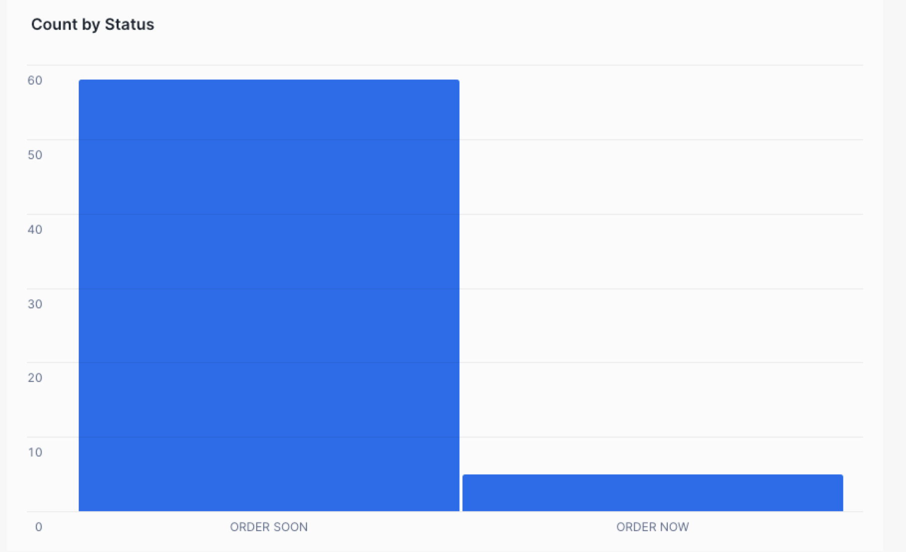

## 3.2.3  Activity

Add a column named `order_status `to the following query that will use a case expression to return the value `'order now'` if the `ps_availqty` value is less than 100,` 'order soon'` if the ps_availqty value is between 101 and 1000, and `'plenty in stock' `otherwise. 

Starting Query:

```sql
SELECT PS_PARTKEY, 
       PS_SUPPKEY, 
       PS_AVAILQTY
FROM PARTSUPP
WHERE PS_PARTKEY BETWEEN 148300 AND 148450;
```


Then Update the Query to only show ORDER SOON and ORDER NOW


Then create the following visualization 


