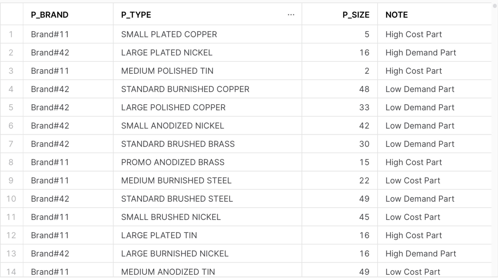

## 3.2.5

Using the `PART` Table we want to focus on two Brands (#11 and #42). 

* For Brand #11 if the size is less than or equal to 20 then it is a “High Cost Part”
* For Brand #11 if the size is greater than 20 then it is a “Low Cost Part”
* For Brand #42 if the size is less than or equal to 20 then it is a “High Demand Part”
* For Brand #42 if the size is greater than 20 then it is a “Low Demand Part”

The new column will be added is called `NOTE`

