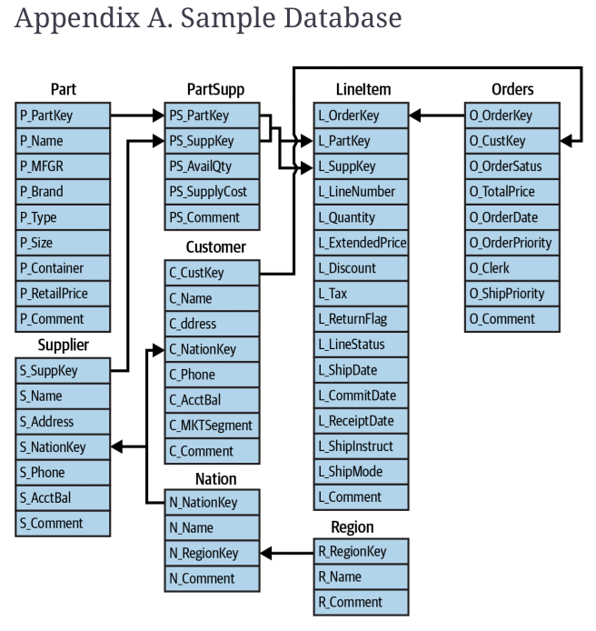

## 3.3.2 Activities



> Hints: 
>
> Account Balance is `s_acctbal` from the `SUPPLIER` table 
>
> Market Segment is `c_mktsegment` from the `CUSTOMER` table

### Exercise 1 **Suppliers with High Account Balance**

- Write a SQL query to retrieve the top 5 suppliers who have the highest account balance. Include the supplier's name, nation, and account balance. Sort the results by account balance in descending order.

### Exercise 2 **Average Order Value by Year**

- Calculate the average order value for each year. Display the year and the corresponding average order value.

### Exercise 3 Total Revenue of Automobile Market Segment

Note: Revenue is calculated is `l_extendedprice*(1-l_discount)`

* Find the total revenue generated from the 'AUTOMOBILE' market segment by Year.

### Exercise 4 Best Nation

* Determine which nation has the most suppliers.

### Exercise 5 Which Month?

* Find the month in which the highest number of orders were placed.

### Exercise 6 Average Discount by Market Segment

* Calculate the average discount given on orders for each market segment.

### Exercise 7 Top 3 Nations

* Determine the top 3 nations that have the highest average account balances for their suppliers.


# Challenge Activity

### Exercise: Identifying Customer Spending Behavior

#### Description

In this exercise, you will learn how to determine if a specific condition is met for any record in a related table using a case expression with a correlated subquery. The goal is to identify customers who have ever placed an order over $400,000. It doesn't matter how many such orders were placed; we only need to know if at least one exists.

#### Scenario

You are working with a retail database and want to classify customers based on their spending behavior. Specifically, you want to label customers who have placed any order over $400,000 as "Big Spender" and others as "Regular."

#### Task

Write an SQL query to find out if customers in a **specific range** have ever placed an order over $400,000. Use the `CASE`expression with a correlated subquery to achieve this.

For now, you can use the range of customers from 74000 to 74020

#### SQL Query Template

Here is the template of the SQL query you will be working with (fill in the blanks):

```sql
SELECT c_custkey, c_name,
       CASE
         WHEN [........]
          (SELECT [.........]) THEN [.........]
         ELSE 'Regular'
       END AS cust_type
FROM customer c
WHERE c_custkey [........];
```


