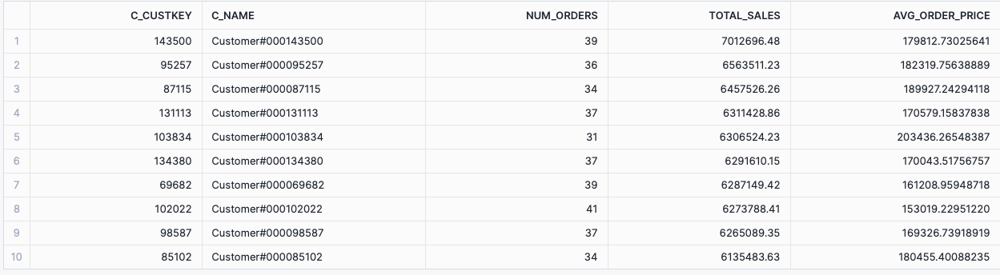
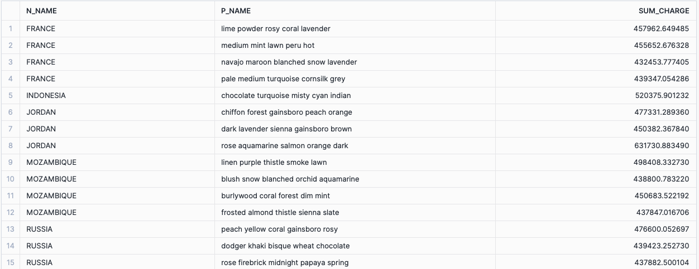
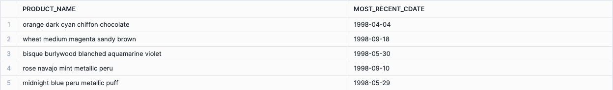
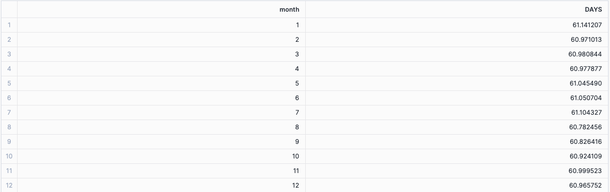
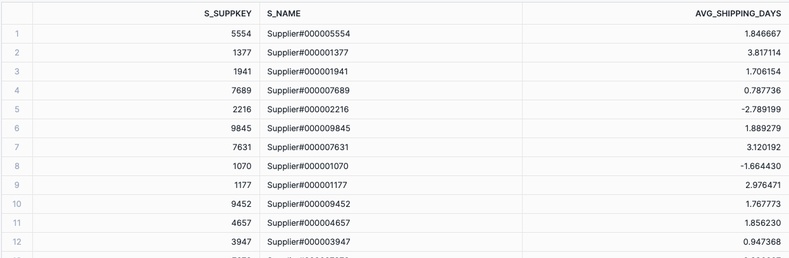

## 3.4.1 Activity 

**Exercise 1**

* As a data analyst for NorthWind Traders, you are tasked with identifying the top 10 customers in terms of total sales. Additionally, you need to provide insights on the number of orders each of these top customers has made and calculate the average price per order. The average price per order is defined as the total order price divided by the total number of orders made by the customer.

  

  **Task**: Write an SQL query to achieve the following:
  
  - Identify the top 10 customers based on total sales.
  - Show the number of orders made by each of these top 10 customers.
  - Calculate the average price per order for each of these customers.
  
  **Hint**: Use aggregation functions and consider using a common table expression (CTE) to structure your query effectively.

**Exercise 2**

* As a data analyst for NorthWind Traders, you are tasked with identifying the top-performing nations and their best-selling products. Your goal is to determine the top 5 nations by total order sales, broken down by market segment, and then find the top 3 selling products for these nations based on Sum Charge.
  
  **Task**: Write an SQL query to achieve the following:
  
  1. Identify the top 5 nations based on total order sales
     - Create a Common Table Expression (CTE) to store these results.
  2. Using the CTE, find the top 15 selling products by Sum Charge for these top nations.
     - Sum Charge is defined as `Extended Price x (1 - Discount) x (1 + Tax)`.
  
  **Hint**: Use aggregation functions, JOINs, and consider using a Common Table Expression (CTE) to structure your query effectively.

**Exercise 3**

* **Common Table Expressions (CTE)**
  * As a data analyst for NorthWind Traders, you are tasked with analyzing the sales performance of parts. Your goal is to identify the top 5 selling parts in 1997, broken down by month, and then determine the last time these parts were ordered.
    
    **Task**: Write an SQL query to achieve the following:
  
    1. Identify the top 5 selling parts in **1994**
       - Top selling parts are based on `Sum Charge = Extended Price x (1 - Discount) x (1 + Tax)`.
       - These are parts that have been fulfilled (Line States is F) and not returned (Return Flag is A or N but not R)
       - Create a Common Table Expression (CTE) to store these results.
    2. Using the CTE, find the last order date for these top parts.
       - Use the Commit Date for determining the last order date.
    
    **Hint**: Use aggregation functions, JOINs, and consider using a Common Table Expression (CTE) to structure your query effectively.

**Exercise 4**

As a data analyst for NorthWind Traders, you are tasked with evaluating the efficiency of order fulfillment in 1994. Specifically, you need to determine the average number of days it takes to ship an order from the order date, broken down by month.

**Task**: Write an SQL query to achieve the following:

- Calculate the average number of days it takes to ship an order from the order date, for each month in 1994.

**Hint**: Use date functions to calculate the difference in days between the order date and the ship date. Aggregate the results by month and calculate the average shipping time.

**Exercise 5**

As a data analyst for NorthWind Traders, you need to determine the efficiency of suppliers in shipping orders. Specifically, you want to find out the average number of days it takes for each supplier to ship an order from the commit date.

**Task**: Write an SQL query to achieve the following:

- For each supplier, calculate the average number of days it takes to ship an order from the commit date.

**Hint**: Use date functions and aggregation functions to calculate the average shipping time. You may need to join the `lineitem` and `supplier` tables to get the necessary information.

**Note** It’s OK if your results don’t match the screen below exactly. But you need to validate some of the results here with yours. **How would you do that?**

