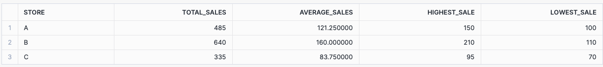

### Challenge Activity: Comprehensive Sales Data Analysis with SQL and Snowflake

#### Description

In this final challenge, students will apply multiple data transformation concepts they have learned to perform a comprehensive analysis of sales data using SQL and Snowflake. They will aggregate data, create new features, manipulate datetime data, use window functions for rolling averages and lagged features, rank data, and categorize sales into bins.

**Setup: Create Table and Insert Data**

```sql
-- Use the right Role and Warehouse
USE ROLE DE;
USE WAREHOUSE COMPUTE_WH;

-- Create the sales_data table
CREATE OR REPLACE TRANSIENT TABLE TECHCATALYST.<YOURSCHEMA>.sales_data (
    Store STRING,
    Product STRING,
    Sales INT,
    Date DATE
);

-- Insert sample data into the sales_data table
INSERT INTO TECHCATALYST.<YOURSCHEMA>.sales_data (Store, Product, Sales, Date) VALUES 
('A', 'Apples', 100, '2024-07-01'),
('A', 'Oranges', 150, '2024-07-02'),
('B', 'Apples', 200, '2024-07-01'),
('B', 'Oranges', 120, '2024-07-02'),
('C', 'Apples', 90, '2024-07-01'),
('C', 'Oranges', 80, '2024-07-02'),
('A', 'Apples', 130, '2024-07-03'),
('B', 'Oranges', 110, '2024-07-03'),
('C', 'Apples', 95, '2024-07-03'),
('A', 'Oranges', 105, '2024-07-04'),
('B', 'Apples', 210, '2024-07-04'),
('C', 'Oranges', 70, '2024-07-04');

```

### Task

**NOTE**: You can just write `SELECT` statements, no need for persisting the results. 

1. **Aggregate the data**: Calculate total sales for each store and product combination.


2. Create new features:

- `Sales_Difference` which is the difference between each `Sales` value and the average sales of the corresponding `Product`.
- `High_Sales` which indicates whether the sales are higher than 100 (True) or not (False).


3. **Manipulate datetime data**: Extract `Year`, `Month`, `Day`, and `Day_of_Week`.


4. **Calculate a 3-day moving average** of sales for each product.


5. **Create a lagged feature `Prev_Day_Sales`** that contains the sales value of the previous day for each product.


6. **Rank the sales** within each store in descending order.


7. **Categorize sales into bins** with the categories: 'Low', 'Medium', 'High'.


8. **Create a summary report** showing total sales, average sales, highest sale, and lowest sale for each store.




