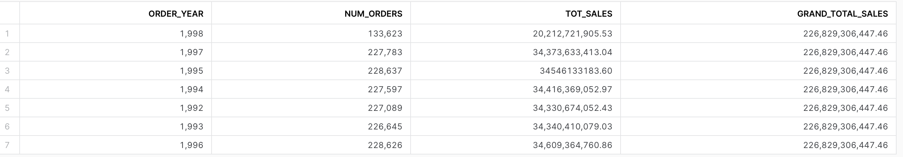
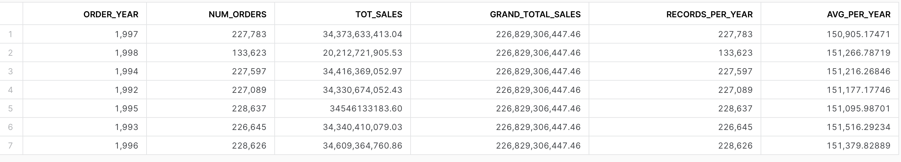

# Challenge 3.5.1

All of the exercises add window functions to the following query:

```sql
USE SCHEMA SNOWFLAKE_SAMPLE_DATA.TPCH_SF1;

select year(o_orderdate) as order_year,
        count(*) as num_orders, sum(o_totalprice) as tot_sales
       from orders
       group by order_year;
```


## Exercise 14-1

Add `grand_total_sales` as shown below

Using Windowing Functions

```sql
SELECT 
    year(o_orderdate) as order_year,
    count(*) as num_orders, 
    sum(o_totalprice) as tot_sales,
    sum(sum(o_totalprice)) over() as grand_total
FROM 
    orders
GROUP BY 
    order_year;
```

Without Windowing Functions (example)

```sql
SELECT 
    year(o_orderdate) as order_year,
    count(*) as num_orders, 
    sum(o_totalprice) as tot_sales,
    (SELECT sum(o_totalprice) FROM orders) as grand_total
FROM 
    orders
GROUP BY 
    order_year
```




## Exercise 14-2

Add `records_per_year` as shown below:

With Windowing Functions

```sql
SELECT 
    year(o_orderdate) as order_year,
    count(*) as num_orders, 
    sum(o_totalprice) as tot_sales,
    sum(sum(o_totalprice)) over() as grand_total,
    sum(count(o_orderkey)) over(partition by year(o_orderdate)) as records_per_year
FROM 
    orders
GROUP BY 
    order_year;
```


## Exercise 14-3

With Windowing functions 

```sql
SELECT 
    year(o_orderdate) as order_year,
    count(*) as num_orders, 
    sum(o_totalprice) as tot_sales,
    sum(sum(o_totalprice)) over() as grand_total,
    sum(count(o_orderkey)) over(partition by year(o_orderdate) order by order_year) as records_per_year,
    sum(avg(o_totalprice)) over(partition by year(o_orderdate) order by order_year) as avg_per_year
FROM 
    orders
GROUP BY 
    order_year;
```


Add `avg_per_year` as shown below:



## Exercise 14-4

Get the top 3 months for each year in terms of Total Sales

**CHALLENGING**

* Hint: consider using CTEs
* Hint: consider using RANK()

```sql
with cte
as
(
select year(o_orderdate) as order_year,
        month(o_orderdate) as order_month,
        count(*) as num_orders, 
        sum(o_totalprice) as tot_sales,
       from orders
       group by order_year, order_month
    
 )
, ranked_cte as
(
 select 
 order_year
 ,order_month
 ,num_orders
 ,tot_sales
 ,rank() over(partition by order_year order by tot_sales) as month_rank
  from cte
)
select * from ranked_cte where month_rank <= 3 order by ORDER_YEAR, MONTH_RANK;
    
```

