# Yellow Taxi Min Project


## TASK 1

**Data Migration/ETL**

* Move the data `YELLOW_TAXI_2024_04_RAW`, ``YELLOW_TAXI_2024_05_RAW``, and `YELLOW_TAXI_2024_06_RAW` from the `TECHCATALYST.TAXI` schema into your personal schema. 
* Unify/integrate the four data sets into one large data set with the following definition:
* Make sure it is a `TRANSIENT` table and that it is created in your own schema 

```sql
CREATE OR REPLACE TRANSIENT TABLE TECHCATALYST.TATWAN.YELLOW_TAXI (
    VENDORID NUMBER(38,0),
    TPEP_PICKUP_DATETIME TIMESTAMP,
    TPEP_DROPOFF_DATETIME TIMESTAMP,
    YEAR_SERVICE NUMBER,
    MONTH_SERVICE NUMBER,
    PASSENGER_COUNT NUMBER(38,0),
    TRIP_DISTANCE FLOAT,
    RATECODEID NUMBER(38,0),
    STORE_AND_FWD_FLAG VARCHAR(1),
    PULOCATIONID NUMBER(38,0),
    DOLOCATIONID NUMBER(38,0),
    PAYMENT_TYPE NUMBER(38,0),
    FARE_AMOUNT FLOAT,
    EXTRA FLOAT,
    MTA_TAX FLOAT,
    TIP_AMOUNT FLOAT,
    TOLLS_AMOUNT FLOAT,
    IMPROVEMENT_SURCHARGE FLOAT,
    TOTAL_AMOUNT FLOAT,
    CONGESTION_SURCHARGE FLOAT,
    AIRPORT_FEE FLOAT,
    MONTH_FILE VARCHAR(10) -- or DATE column depending on your needs
);
```

* **NOTE**
  * `TPEP_PICKUP_DATETIME` in the source data is a numeric field and not timestamp. You will need to convert it into a Time Stamp. 
    * Hint: For example, the numeric value "1706731228000000" is a Unix timestamp in microseconds. To convert this to a proper `TIMESTAMP` in Snowflake, you can use the `TO_TIMESTAMP` function, which can handle this conversion.
      * Two options:
        * You can use `scale` in to_timestamp
          * For seconds, scale = `0`.
          * For milliseconds, scale = `3`.
          * For microseconds, scale = `6`.
          * For nanoseconds, scale = `9`.
        * OR You can simply divide the value by 1,000,000 to get it into seconds (the standard Unix timestamp) in order for the conversion to work
  * Same applied to `TPEP_DROPOFF_DATETIME`
  * `MONTH_FILE` is based on the year/month from the file name. For example, `2024-04`, `2024-05`, `2024-06` this way you can reference the data from each file
  * `MONTH_SERVICE` and `YEAR_SERVICE` are the month and year extracts from the `TPEP_PICKUP_DATETIME` after conversion. Hint: You may need to convert the datetime to date first.
  
* Write your `INSERT INTO` statement for each file from the Public schema into the table in your schema. In the end, your YELLOW_TAXI table should contain the following number of records 

**Write your own query**

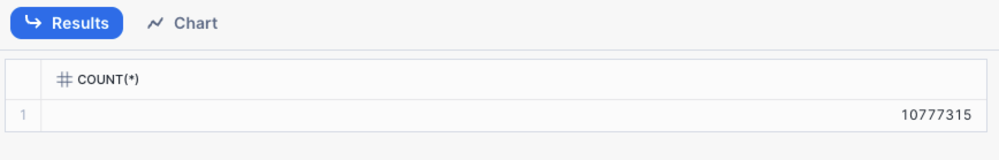

## TASK 2 

**Data Validation**

* Check the number of records form each file. USE the `MONTH_FILE` column

  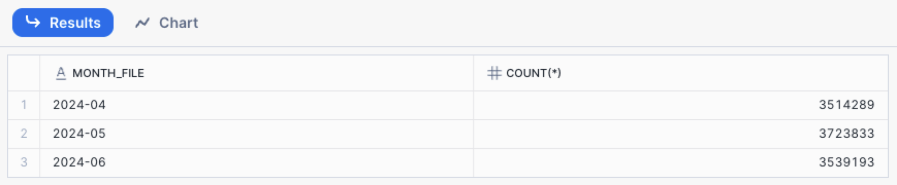

* Count the total number of trips and sum up the fare amounts for each month. USE the `MONTH_FILE` column 

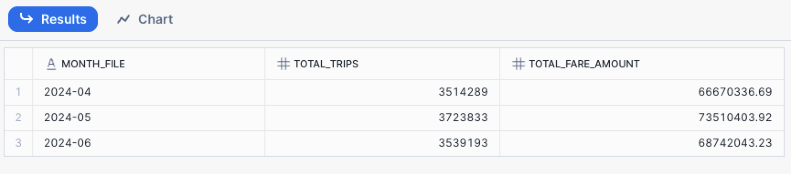

* Observe the distribution of `vendorid` values, including the count of NULL values.

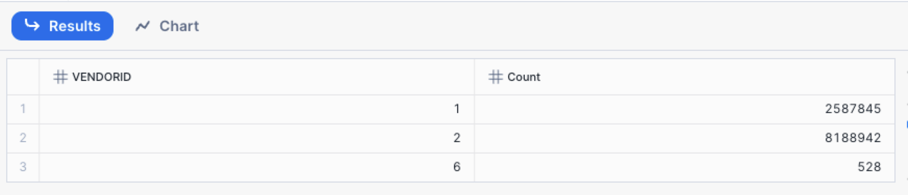

* Observe the distribution of `pulocationid` values.

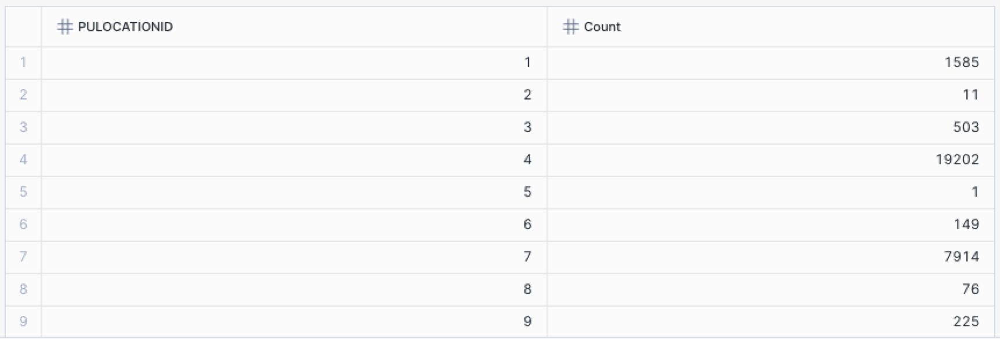

* Observe the distribution of `payment_type` values, including the count of NULL values.

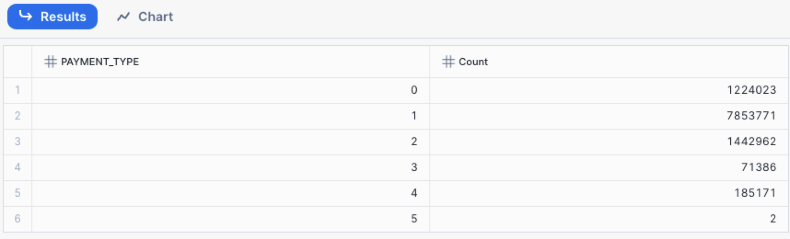

* Explore records with NULL `vendorid` and observe other columns that might also have NULL values.

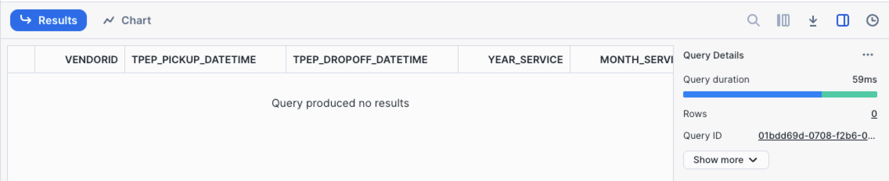

* Observe the count of records grouped by the time period in the format `YYYY-MM` from the `tpep_pickup_datetime` column.

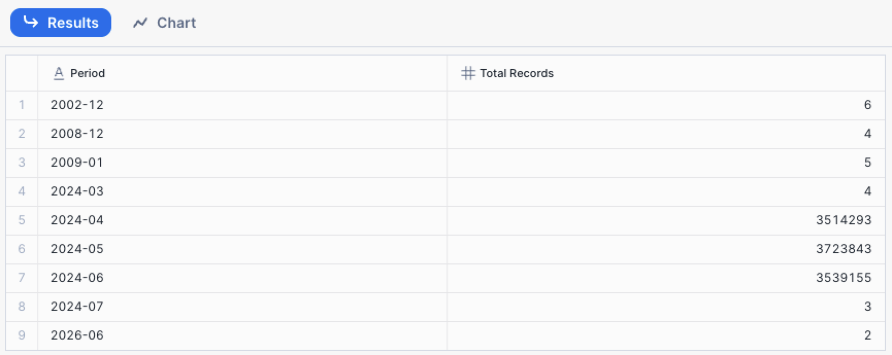

Hint: one option you can consider is using the `SUBSTR` function 

> **Do You Observe Any Data Quality Issues**??

## TASK 3 

**Data Analysis**

* Determine the average fare amount for trips with different payment types in April 2024.

  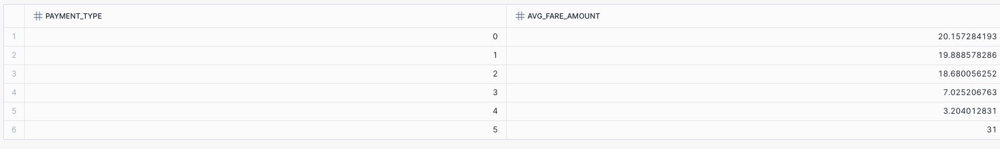

* Find the **percentage** of trips that had tips across all months
  * Use `MONTH_FILE`
  * HINT: USE `CASE WHEN` 
    * `TIP_AMOUNT` indicates the tip amount for each trip. If the value is greater than 0, it means a tip was given.
    * Use the `CASE` statement within the `SUM` function to count the number of trips with a `TIP_AMOUNT` greater than 0. Divide the number of trips with tips by the total number of trips and multiply by 100 to get the percentage.


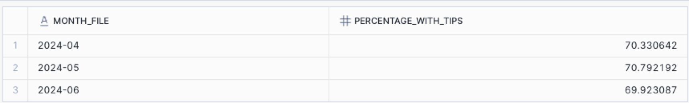

* Calculate the cumulative total fare amount collected up to each trip for each month in 2024.
  * HINT: Use Window Function and GROUP BY
    * `Service_Day_of_Month` you will need to extract 

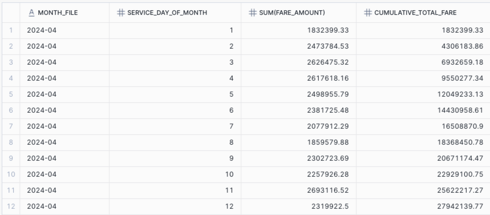


* **CHALLENGE** Identify the trip with the maximum fare amount for each day in May 2024 .
  * Use `MONTH_FILE` 
  * HINT: You can consider using a WINDOW FUNCTION and CTE
  * HINT: Look into ROW_NUMBER() 

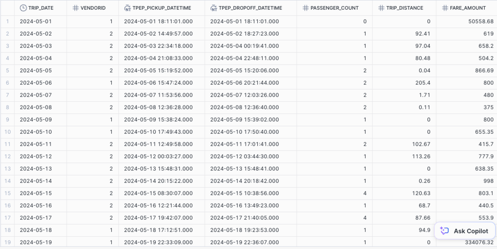

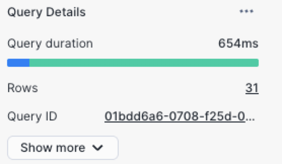


## TASK 4

### Creating a View to Enhance Readability of Yellow Taxi Data for Business Users

In this exercise, you will create a view named `v_yellow_tripdata` that transforms raw taxi trip data into a more readable and meaningful format. This view will replace numeric codes with descriptive text for several key columns, making the data easier to interpret. Follow the steps below to understand the requirements and logic behind this transformation.

#### Step-by-Step Instructions

1. **Understanding the Source Table**: The source table `YELLOW_TAXI` contains the raw trip data. Key columns include:
   - `vendorid`: Numeric identifier for the vendor.
   - `tpep_pickup_datetime` and `tpep_dropoff_datetime`: Timestamps for when the trip started and ended.
   - `passenger_count`: Number of passengers in the trip.
   - `trip_distance`: Distance of the trip.
   - `ratecodeid`: Numeric identifier for the rate code.
   - `store_and_fwd_flag`: Flag indicating if the trip record was held in vehicle memory before sending to the vendor.
   - `payment_type`: Numeric identifier for the payment method.
   - `fare_amount`, `extra`, `mta_tax`, `tip_amount`, `tolls_amount`, `improvement_surcharge`, `congestion_surcharge`, and `total_amount`: Various monetary amounts associated with the trip.
2. **Creating Descriptive Column Values**: (Data Enrichment)
   - Vendor Name as `vendor_name`:
     - `1` should be displayed as "Creative Mobile".
     - `2` should be displayed as "VeriFone".
     - Any other value should be displayed as "No Data".
   - Rate Type as `rate_type`:
     - `1` should be displayed as "Standard Rate".
     - `2` should be displayed as "JFK".
     - `3` should be displayed as "Newark".
     - `4` should be displayed as "Nassau/Westchester".
     - `5` should be displayed as "Negotiated Fare".
     - `6` should be displayed as "Group Ride".
     - `99` should be displayed as "Special Rate".
     - Any other value should be displayed as "No Data".
   - Payment Type as `payment_type`:
     - `1` should be displayed as "Credit Card".
     - `2` should be displayed as "Cash".
     - `3` should be displayed as "No Charge".
     - `4` should be displayed as "Dispute".
     - `5` should be displayed as "Unknown".
     - `6` should be displayed as "Voided Trip".
     - Any other value should be displayed as "No Data".
3. **Constructing the SQL Query**:
   - Use the `CASE` statement to convert numeric codes to descriptive text.
   - Select all relevant columns and apply the `CASE` transformations as necessary.
4. **Creating the View**:
   - Use the `CREATE OR REPLACE VIEW` statement to define the view `v_yellow_tripdata`.
   - Include all transformed columns in the `SELECT` statement.

Example output from the VIEW

```sql
SELECT * FROM v_yellow_tripdata  where passenger_count is not null;
```

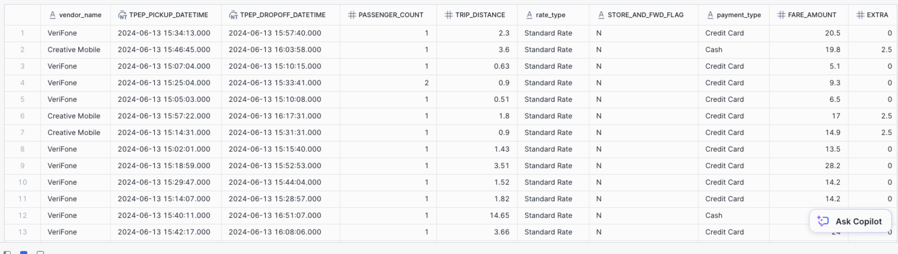

## TASK 5

Finance Team asked you to access the VIEW you just created but you realized that IT security team does not allow anyone to access the VIEW without proper permission. Finance team can access the VIEW under one condition: They can only see `Vendor_name` **VeriFone** and `Payment_Type` **Credit Card**.

Due to the security constraints, you will need to create a new view for Finance that they can access for their own reprint needs with such restrictions. 

* Give the VIEW a unique name so Finance know this is the one to use.

## TASK 6

* Create 2-3 slide presentation for your team 
  * One slide described your process (What you did, how you didi it ..etc) so **business** can appreciate your effort and all the trouble you went through to ensure data is validated.
  * Another 1-2 slides, summarize your findings regarding the Yellow Taxis Data. Any interesting insights? 
* Be ready to present your slides. Make sure you write your team names.


