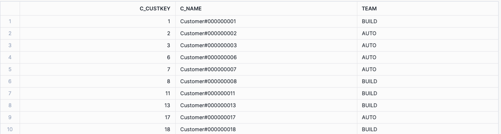

## 3.4.3 Activity

As a data analyst for NorthWind Traders, you are asked to assist two distinct marketing teams. One team focuses on the "AUTOMOBILE" market segment, while the other focuses on the "BUILDING" market segment. Your task is to provide a consolidated list of all customers from both market segments without any duplicates. Customers may belong to multiple market segments over time, so you need to use `UNION` to ensure each customer appears only once in the result.

**Task**: Write an SQL query to achieve the following:

- Identify customers from the "AUTOMOBILE" market segment.
- Identify customers from the "BUILDING" market segment.
- Combine the results using `UNION` to remove duplicates.
- Use Common Table Expressions (CTEs) to structure your query.

**Hint**: Use CTEs to create separate lists of customers for each market segment, then combine these lists using `UNION`.

