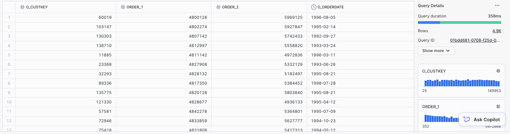

# SQL Drill 2

1. **Suppliers Without Small Parts (Subquery)** Identify all suppliers (`s_name`) who do **not** supply any parts with a size (`p_size`) less than 5.
   
   - **Hint:** Use a `NOT IN` clause with a subquery that finds all suppliers who *do* supply small parts.
   
2. **Order Performance by Clerk (GROUP BY & HAVING)** For each order clerk (`o_clerk`), calculate the total revenue (`o_totalprice`) they have processed. Only show clerks who have processed more than $10 million in total revenue.

3. **Regional Supplier Count (JOIN & COUNT DISTINCT)** Count the number of unique suppliers located in each region. Display the region name (`r_name`) and the corresponding count of suppliers.

4. **Orders Above Average Size (CTE)** Using a CTE, first calculate the overall average number of line items per order. Then, list the `o_orderkey` for all orders that have more line items than this average.

5. **Customer's Last Order Date (Scalar Subquery)** For each customer, display their name (`c_name`) and the date of their most recent order (`o_orderdate`).
   
   - **Hint:** A subquery in the `SELECT` statement can retrieve the latest order date for each customer.
   
6. **Parts Shipped by 'Truck' (JOIN & LIKE)** Find the names of all parts (`p_name`) that have ever been shipped with the instruction (`l_shipinstruct`) 'DELIVER IN PERSON'. Avoid listing duplicate part names.

7. **Top Spending Customers in Germany (Comprehensive)** Find the top 5 customers from 'GERMANY' based on the total value of their orders. Display the customer's name (`c_name`) and their total spending (`o_totalprice`), ordered from highest to lowest.

8. **Profitability Analysis (GROUP BY with Expression)** Calculate the total profit for each part brand (`p_brand`). Profit for each line item is calculated as `l_extendedprice * (1 - l_discount)`. Only show brands with a total profit greater than $5 million.

9. **Self-Join for Same-Day Orders ** Find pairs of orders that were placed by the same customer on the exact same day. Display the customer key, the first order key, and the second order key. Ensure that an order is not paired with itself and that each pair is only listed once (e.g., if you have (OrderA, OrderB), don't also list (OrderB, OrderA)).

   Example output:

   

10. **Delayed Shipments (JOIN & Date Functions)** List the order key (`l_orderkey`) for all line items that were shipped (`l_shipdate`) more than 30 days after the order was placed (`o_orderdate`).

Example output: 

