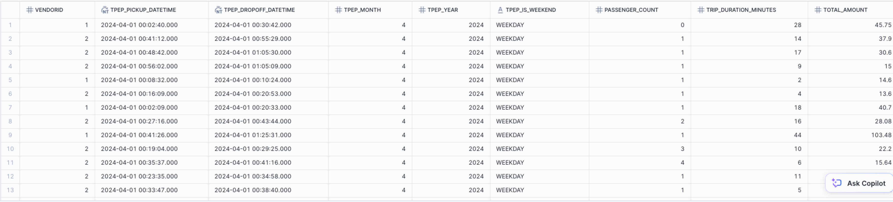

# Snowflake Stages

> [!IMPORTANT]
>
> Make sure to switch to `EXTERNAL_STAGE` schema 
>
> ```sql
> USE ROLE de;
> USE WAREHOUSE COMPUTE_WH;
> USE DATABASE TECHCATALYST;
> USE SCHEMA EXTERNAL_STAGE;
> ```
>
> 

**Objective**: Learn how to read and load data from three different file formats (CSV, JSON, and Parquet) into Snowflake using `COPY INTO` for bulk loading and `INSERT INTO` for performing data transformations.

> [!NOTE]
>
> - **COPY INTO** is designed for efficiently **loading bulk data** from staged files (internal or external stages such as Amazon S3, Azure Blob Storage, or Google Cloud Storage) into a Snowflake table. It is optimized for **high-volume data ingestion** directly from data files, **not from existing tables**. `COPY INTO` loads data from files that are already staged and can handle large datasets with better performance. It does not support complex queries or transformations and is mainly used for loading external file data into Snowflake tables.
> - **INSERT INTO** is used to insert rows of data into an existing Snowflake table, typically from queries or directly specified values. It works well when inserting data from other Snowflake tables, performing transformations during the insert, or inserting specific rows. While INSERT INTO can handle batch inserts and data from within Snowflake itself, it is generally less efficient than COPY INTO for bulk file loading scenarios. INSERT INTO supports transformations, selective column insertion, and can be used inside transaction

### Steps

#### Step 1: Setup Snowflake Environment

1. **Show existing tables, schemas, and stages:**

   ```sql
   SHOW TABLES;
   SHOW SCHEMAS;
   SHOW STAGES;
   show file formats;
   ```

2. **Create an external stage pointing to our S3 bucket `s3://techcatalyst-public` :**

   The `STORAGE_INTEGRATION` object has been created for you and it is named `s3_int`. **You don’t need to create it**. You will just need to create your **STAGE** object.

   > [!NOTE]
   >
   > A **storage integration** in Snowflake is a special named Snowflake object created to securely and centrally manage access to external cloud storage (such as Amazon S3, Google Cloud Storage, or Microsoft Azure Blob Storage) without requiring users to share or embed cloud credentials like secret keys or access tokens directly. It stores a generated identity and access management (IAM) entity that your cloud provider administrators grant permissions to on the specified storage locations, enabling Snowflake users to access these storage buckets seamlessly when creating stages or loading/unloading data
   >
   > To learn more about it refer to the official documentation https://docs.snowflake.com/en/sql-reference/sql/create-storage-integration

   ```sql
   CREATE OR REPLACE STAGE TECHCATALYST_DE.EXTERNAL_STAGE.<YOURNAME_STAGE>
       STORAGE_INTEGRATION = s3_int
       URL='s3://techcatalyst-raw';
   ```

3. **List files in the stage to confirm availability:**

   ```sql
   -- This will list all files
   LIST @<YOURINITIAL_STAGE>; 
   -- Using full path
   LIST @TECHCATALYST_DE.EXTERNAL_STAGE.<YOURNAME_STAGE>;
   -- This will list specific files based on the pattern
   LIST @<YOURINITIAL_STAGE> PATTERN='.*parquet.*';
   LIST @<YOURINITIAL_STAGE> PATTERN='.*csv.*';
   LIST @<YOURINITIAL_STAGE> PATTERN='.*json.*';
   ```

4. **Create file formats for JSON, CSV, and Parquet files:**

   ```sql
   CREATE OR REPLACE FILE FORMAT <YOURNAME>_json_format
   TYPE = 'JSON';
   
   CREATE OR REPLACE FILE FORMAT <YOURNAME>_csv_format
   TYPE = 'CSV'
   FIELD_OPTIONALLY_ENCLOSED_BY = '"'
   SKIP_HEADER = 1;
   
   CREATE OR REPLACE FILE FORMAT <YOURNAME>_parquet_format
   TYPE = 'PARQUET';
   ```

   You can verify the FILE FORMAT has been created with your **name**

   ```sql
   SHOW FILE FORMATS;
   ```

#### Step 2: Load Data using `COPY INTO`

You will do a bulk loading. Think of this as a full data dump from the S3 bucket (for the specific file) to your database. Think of this as a temporary placeholder. You will source from the **ENTERNAL_STAGE** schema and dump it into your personal schema that you created before.

1. **Create tables to store the data:**

   ```sql
   CREATE OR REPLACE TEMPORARY TABLE TECHCATALYST.TATWAN.YELLOW_TAXI_PARQUET (
       VENDORID INT,
       TPEP_PICKUP_DATETIME TIMESTAMP,
       TPEP_DROPOFF_DATETIME TIMESTAMP,
       PASSENGER_COUNT FLOAT,
       TRIP_DISTANCE FLOAT,
       RATECODEID FLOAT,
       STORE_AND_FWD_FLAG VARCHAR,
       PULOCATIONID INT,
       DOLOCATIONID INT,
       PAYMENT_TYPE INT,
       FARE_AMOUNT FLOAT,
       EXTRA FLOAT,
       MTA_TAX FLOAT,
       TIP_AMOUNT FLOAT,
       TOLLS_AMOUNT FLOAT,
       IMPROVEMENT_SURCHARGE FLOAT,
       TOTAL_AMOUNT FLOAT,
       CONGESTION_SURCHARGE FLOAT,
       AIRPORT_FEE FLOAT
   );
   
   CREATE OR REPLACE TEMPORARY TABLE TECHCATALYST.TATWAN.YELLOW_TAXI_CSV (
       VENDORID INT,
       TPEP_PICKUP_DATETIME TIMESTAMP,
       TPEP_DROPOFF_DATETIME TIMESTAMP,
       PASSENGER_COUNT FLOAT,
       TRIP_DISTANCE FLOAT,
       RATECODEID FLOAT,
       STORE_AND_FWD_FLAG VARCHAR,
       PULOCATIONID INT,
       DOLOCATIONID INT,
       PAYMENT_TYPE INT,
       FARE_AMOUNT FLOAT,
       EXTRA FLOAT,
       MTA_TAX FLOAT,
       TIP_AMOUNT FLOAT,
       TOLLS_AMOUNT FLOAT,
       IMPROVEMENT_SURCHARGE FLOAT,
       TOTAL_AMOUNT FLOAT,
       CONGESTION_SURCHARGE FLOAT,
       AIRPORT_FEE FLOAT
   );
   ```

2. **Load data from the stage into the tables using `COPY INTO` Into the following tables:** 

   > [!TIP]
   >
   > All the files are located in S3 under: `s3://techcatalyst-raw/stage/`
   >
   > Remember your STAGE that you created already points to `s3://techcatalyst-raw/` so you just need to include the remaining path to that file for example `@tarek_s3_stage/stage/yellow_tripdata.parquet` for the parquet file. If you are not sure which file, then run the `LIST @<YOURINITIAL_STAGE>; `

   * `YELLOW_TRIPDATA.CSV`
   * `YELLOW_TRIPDATA.PARQUET`

   ```sql
   -- YOUR CODE (THIS IS AN EXAMPLE TEMPLATE)
   COPY INTO -- <YOUR TABLE THAT YOU CREATED IN YOUR SCHEMA>
   FROM @yourstage/stage/file
   FILE_FORMAT = 'techcatalyst.external_stage.<yourfileformat>'
   ON_ERROR = CONTINUE
   MATCH_BY_COLUMN_NAME = CASE_INSENSITIVE; -- this line is only NEEDED for parquet
   ```

   You will do this three times using the appropriate file format for each file, and copying into the appropriate destination.

   Query the temporary tables to validate everything is written properly. You will notice that `TPEP_PICKUP_DATETIME` and `TPEP_DROPOFF_DATETIME` did not load properly. In the next step you will explore another method to load the same data from stage into tables. 

#### Step 3: Perform Data Transformations using `INSERT INTO`

> [!NOTE]
>
> Even though you could just load from the TEMPORARY tables you just created. For this activity, I want you to practice using INSERT INTO from the STAGE (from the external files) directly into the table

1. **Challenge 1: Create a new table schema with only three columns and load data into it:**

   - **Hint**: Select only five columns from the original dataset.

   > [!TIP]
   >
   > You can inspect the schema using INFER_SCHEMA. Here is an example
   >
   > ```sql
   > SELECT *
   > FROM TABLE(
   >   INFER_SCHEMA(
   >     LOCATION => '@tarek_s3_stage/stage/yellow_tripdata.csv',
   >     FILE_FORMAT => 'csv_format'
   >   )
   > );
   > ```

   

   ```sql
   CREATE OR REPLACE TRANSIENT TABLE TECHCATALYST.TATWAN.SIMPLE_TAXI_DATA_CSV (
       VENDORID NUMBER(38,0),
       PICKUP_DATETIME TIMESTAMP,
       DROPOFF_DATETIME TIMESTAMP,  
       TRIP_DISTANCE FLOAT,
       TOTAL_AMOUNT FLOAT
   );
   
   
   INSERT INTO TECHCATALYST.TATWAN.SIMPLE_TAXI_DATA_CSV
   SELECT
       -- your code 
       -- if you run into issues consider TO_TIMESTAMP function
   FROM
       -- your csv file from stage
       (FILE_FORMAT => -- your file format here, remember the file format is in EXTERNAL_STAGE schema);
   
   
   CREATE OR REPLACE TRANSIENT TABLE TECHCATALYST.TATWAN.SIMPLE_TAXI_DATA_PARQUET (
       VENDORID NUMBER(38,0),
       PICKUP_DATETIME TIMESTAMP,
       DROPOFF_DATETIME TIMESTAMP,  
       TRIP_DISTANCE FLOAT,
       TOTAL_AMOUNT FLOAT
   );
   
   
   INSERT INTO TECHCATALYST.TATWAN.SIMPLE_TAXI_DATA_PARQUET
   SELECT
       -- your code 
       -- if you run into issues consider TO_TIMESTAMP function
   FROM
       -- your parquet file from stage
       (FILE_FORMAT => -- your file format here);
   
   ```

2. **Challenge 2: Create a new table schema and perform data type transformation:**

   - **Hint**: Convert the `tpep_pickup_datetime` and `tpep_dropoff_datetime` fields to a different format.

     - Notice: `TOTAL_AMOUNT` you will need to calculate as summation of all fields: fare_amount, extra, tip_amount, tolls_amount, airport_fee

     - Trip Duration is in Minutes 

     - `TPEP_MONTH` and `TPEP_YEAR` are based on TPEP_PICKUP_DATETIME

   ```sql
   CREATE OR REPLACE TRANSIENT TABLE TECHCATALYST.<YOURSCHEMA>.SUMMARY_TAXI_DATA_JSON (
       VENDORID NUMBER(38,0),
       TPEP_PICKUP_DATETIME TIMESTAMP,
       TPEP_DROPOFF_DATETIME TIMESTAMP,
     	TPEP_MONTH NUMBER,
       TPEP_YEAR NUMBER,
   	  TPEP_IS_WEEKEND STRING,
       PASSENGER_COUNT NUMBER(38,0),
       TRIP_DURATION_MINUTES FLOAT,
       TOTAL_AMOUNT FLOAT
   );
   
   CREATE OR REPLACE TRANSIENT TABLE TECHCATALYST.<YOURSCHEMA>.SUMMARY_TAXI_DATA_CSV (
       VENDORID NUMBER(38,0),
       TPEP_PICKUP_DATETIME TIMESTAMP,
       TPEP_DROPOFF_DATETIME TIMESTAMP,
     	TPEP_MONTH NUMBER,
       TPEP_YEAR NUMBER,
   	  TPEP_IS_WEEKEND STRING,
       PASSENGER_COUNT NUMBER(38,0),
       TRIP_DURATION_MINUTES FLOAT,
       TOTAL_AMOUNT FLOAT
   );
   
   
   CREATE OR REPLACE TRANSIENT TABLE TECHCATALYST.<YOURSCHEMA>.SUMMARY_TAXI_DATA_PARQUET (
       VENDORID NUMBER(38,0),
       TPEP_PICKUP_DATETIME TIMESTAMP,
       TPEP_DROPOFF_DATETIME TIMESTAMP,
     	TPEP_MONTH NUMBER,
       TPEP_YEAR NUMBER,
   	  TPEP_IS_WEEKEND STRING,
       PASSENGER_COUNT NUMBER(38,0),
       TRIP_DURATION_MINUTES FLOAT,
       TOTAL_AMOUNT FLOAT
   );
   
   
   INSERT INTO TECHCATALYST.<YOURSCHEMA>.SUMMARY_TAXI_DATA_JSON
   SELECT 
       -- your code 
   FROM 
       @yourstage/filelocation.json
       (FILE_FORMAT => 'yourformat')
   , LATERAL FLATTEN(input => PARSE_JSON($1)) f;
   
   
   INSERT INTO TECHCATALYST.<YOURSCHEMA>.SUMMARY_TAXI_DATA_PARQUET
   -- YOUR CODE
   
   
   INSERT INTO TECHCATALYST.<YOURSCHEMA>.SUMMARY_TAXI_DATA_CSV
   -- YOUR CODE
   
   
   ```
   
   