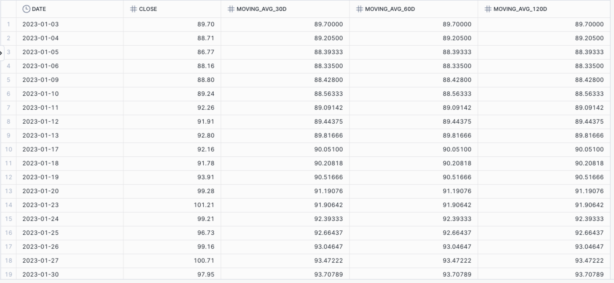

#### Drill 1: Calculate Daily Price Change

**Objective**: Calculate the daily price change (difference between the closing price of the current day and the previous day).

**Instructions**:

1. Use the `LAG` function to get the previous day's closing price.
2. Calculate the difference between the current day's closing price and the previous day's closing price.
3. Calculate the Percent Change 

> [!TIP]
>
> Read this about [Percent Change](https://www.investopedia.com/terms/p/percentage-change.asp)
>
> Percent Change = ((Current Price - Previous  Price) / Previous Price) * 100

#### Drill 2: Calculate 30-Day Moving Average of Closing Prices

**Objective**: Calculate the 30-day, 60-day, and 120-day moving averages of the closing prices.

**Instructions**:

1. Use the `AVG` function with the `ROWS BETWEEN` clause to calculate the moving average over the last 30 days.

After you visualize, what do you observe? Can you spot overall trend?

#### Drill 3: Identify the Highest and Lowest Closing Prices Over the Past 60 Days

**Objective**: Computes the 60-day rolling maximum and minimum closing prices for Google stocks

**Instructions**:

1. Use the `MAX` and `MIN` functions with the `ROWS BETWEEN` clause to get the highest and lowest closing prices over the past 60 days.

What do you observer?

#### Drill 4: Calculate Z-Score of Closing Price (Rolling Standard Score)

**Objective:**
Standardize the closing price with a rolling Z-score to identify how many standard deviations a closing price is from its rolling mean (e.g., 30-day z-score). This is often used for mean-reversion trading signals or anomalies.
$$
\text{Z-Score} = \frac{\text{Close}-\text{Rolling Mean}}{\text{Rolling Std Dev}}
$$

> [!TIP]
>
> ## Why Do We Use Z-Scores?
>
> - **Standardization:**
>   Z-scores let us compare data points from different times, datasets, or scales by putting them all on a "level playing field."
> - **Detecting Outliers:**
>   Large positive or negative z-scores highlight values that are unusually high or low compared to the average.
> - **Context:**
>   A z-score of 0 means the value is exactly average; positive means above average, negative means below average.
> - **Financial Insights:**
>   In time series, z-scores reveal if today’s closing price is far above or below its recent average, which can indicate rare price moves or trading signals.
>
> | Z-Score Value | Interpretation                            |
> | :------------ | :---------------------------------------- |
> | 0             | Exactly average                           |
> | +1            | 1 standard deviation above average        |
> | -1            | 1 standard deviation below average        |
> | > +2 or < -2  | Unusually high or low (potential outlier) |
>
> In short, z-scores help us understand how "unusual" or "typical" a value is, relative to its recent history or a group of values.

What do you observer? An interring data points?

Calculate Z-Score of Closing Price (Rolling Standard Score)

#### Drill 5: Calculate Z-Score of Closing Price (Rolling Standard Score) 

**Objective**: Expand your SQL code for the **30-day rolling Z-score** to add a new column highlighting potential outliers—those where the z-score is above **+3** or below **-3**.

Can you filter and only show the Potential Outliers:

