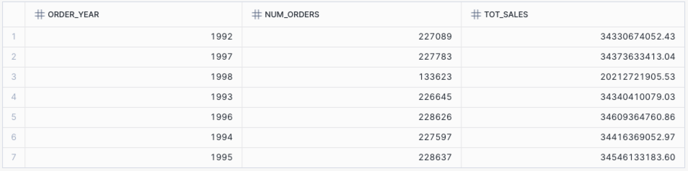
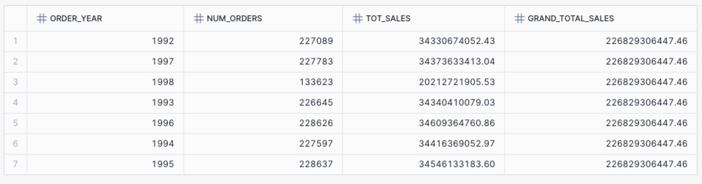
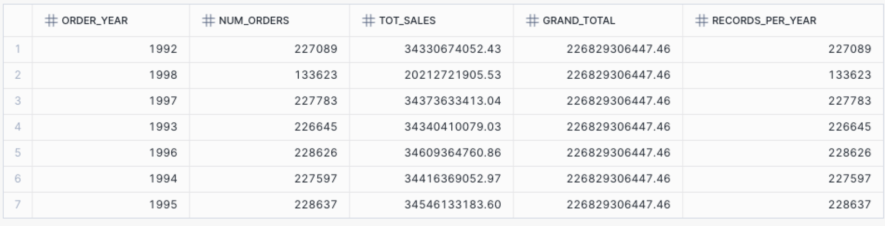
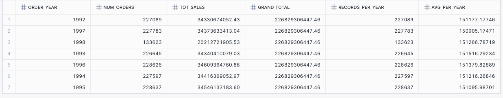
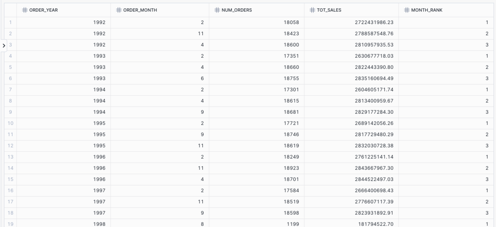

# Challenge 3.5.1

All of the exercises add window functions to the following query:

```sql
USE SCHEMA SNOWFLAKE_SAMPLE_DATA.TPCH_SF1;

select year(o_orderdate) as order_year,
        count(*) as num_orders, sum(o_totalprice) as tot_sales
       from orders
       group by order_year;
```



## Exercise 14-1

Add `grand_total_sales` as shown below



## Exercise 14-2

Add `records_per_year` as shown below:



## Exercise 14-3

Add `avg_per_year` as shown below:



## Exercise 14-4

Get the top 3 months for each year in terms of Total Sales

**CHALLENGING**

* Hint: consider using CTEs
* Hint: consider using RANK()



