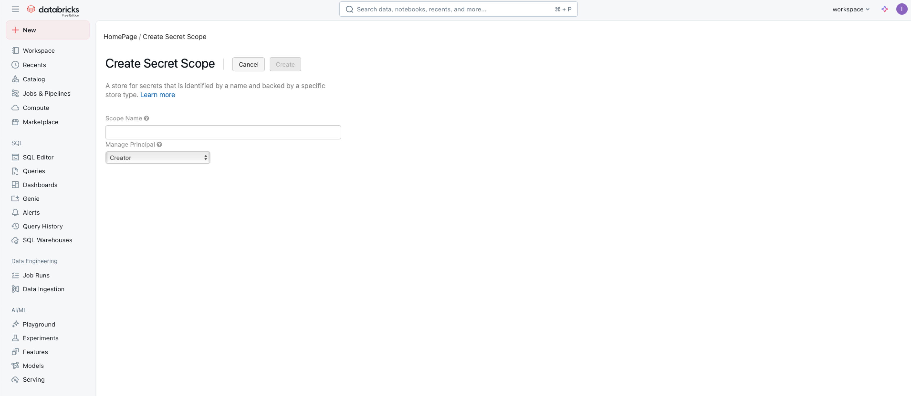
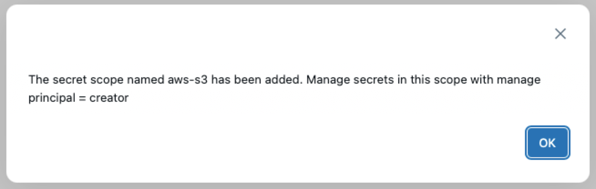
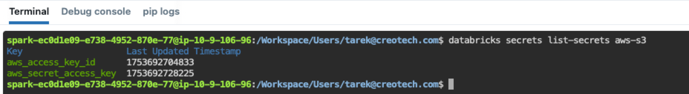

# How to create a Secret Scope in Databricks

1. The main URL template is `https://<databricks-instance>#secrets/createScope` ,  you will need to capture you Databricks instance from your own URL. For example, If you log into `https://cust-success.cloud.databricks.com/`, the instance name is `cust-success.cloud.databricks.com`.

   You will be directed to this landing page **Create Secret Scope**

   

   Enter a scope name. For example `aws-s3`. Then click **Create**

   A pop screen will confirm creation as shonw

   

2. Click on the terminal icon on the bottom right 

   

   Then in the terminal past the following. You will do this twice, as you will be creating two different keys stored inside your secret scope:

   ```bash
   databricks secrets put-secret --json '{
     "scope": "<scope-name>",
     "key": "<key-name>",
     "string_value": "<secret>"
   }’
   ```

   * **scope**: change the scope to the name of the secret scope you just created for example `aws-s3`
   * **Key** this is the name of the key. You will need to create two here. The first one called it `aws_access_key_id` and the second is called `aws_secret_access_key`
   * **string_value**: This is the value of the key from the AWS tokens file you already have

   For example

   ```bash
   databricks secrets put-secret aws-s3 aws_access_key_id --string-value "<secret>"
   databricks secrets put-secret aws-s3 aws_secret_access_key --string-value "dXDhww6QwNW/5hFVlg0x2NDFhSgjbXMAbGRCjbzT"
   
   ```

3. Once done. Confirm that you have create the two keys from the terminal:

   ```bash
   databricks secrets list-secrets <scope-name>
   ```

   for example

   

4. You can close the terminal now.

