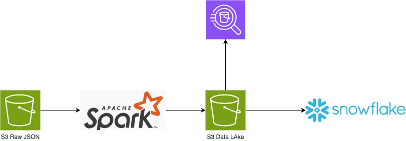

## Project: Million Song Data Lake and Data Warehouse

#### Introduction

A music streaming startup, **Sparkify**, has grown their user base and song database and want to move their processes and data onto the cloud. Their data resides in S3, in a directory of JSON logs on user activity on the app, as well as a directory with JSON metadata on the songs in their app.

As their data engineer, you are tasked with building an ETL pipeline that extracts their data from S3, stages them in a Data Lake, and transforms data into a set of dimensional tables (in Snowflake) for their analytics team to continue finding insights in what songs their users are listening to. You'll be able to test your database and ETL pipeline by running queries given to you by the analytics team from Sparkify and compare your results with their expected results.

#### Project Description

In this project, you'll apply what you've learned about  Databricks (SparkSQL) to build an **ETL** pipeline for a database hosted on Databricks as **Delta Lake Tables**. Read more about Delta Lakes [here](https://docs.databricks.com/aws/en/delta/)

To complete the project, you will need to extract data from S3 source (RAW JSON files). The Raw data will be stored as Delta Tables in Databricks so you can always resume your operation if anything happens without needing to go back to AWS S3.  Create a Data Lake in Databricks for storing the data as Delta Table files after transformation (aka **staging** area), then load the data from the Data Lake into production (Fact tables and Dimensions). Since we only have one environment, you will simulate that process (just follow the instructions in the notebook)


Below is a typical diagram or ETL flow for extracting and transforming data using Spark engines (aka Databricks in out case).



You'll be working with two datasets that reside in S3. Here are the S3 links for each:

- Song data: `s3://techcatalyst-public/song_data`
- Log data: `s3://techcatalyst-public/log_data`

Log data json path example: `s3://techcatalyst-public/log_data/2018-11-01-events.json`

# Song Dataset

The first dataset is a subset of real data from the [Million Song Dataset](http://millionsongdataset.com). Each file is in **JSON** format and contains metadata about a song and the artist of that song. The files are **partitioned** by the first three letters of each song's track ID. For example, here are filepaths to two files in this dataset.

```
song_data/A/B/C/TRABCEI128F424C983.json
song_data/A/A/B/TRAABJL12903CDCF1A.json
```

And below is an example of what a single song file, TRAABJL12903CDCF1A.json, looks like.

```json
{"num_songs": 1, "artist_id": "ARJIE2Y1187B994AB7", "artist_latitude": null, "artist_longitude": null, "artist_location": "", "artist_name": "Line Renaud", "song_id": "SOUPIRU12A6D4FA1E1", "title": "Der Kleine Dompfaff", "duration": 152.92036, "year": 0}
```

# Log Dataset
The second dataset consists of **log** files in JSON format generated by this [event simulator](https://github.com/Interana/eventsim) based on the songs in the dataset above. These simulate app activity logs from an imaginary music streaming app based on configuration settings.

The log files in the dataset you'll be working with are **partitioned** by **year** and **month**. For example, here are filepaths to two files in this dataset.
```bash
log_data/2018/11/2018-11-12-events.json
log_data/2018/11/2018-11-13-events.json
```

And below is an example of what the data in a log file, 2018-11-12-events.json, looks like.


## Schema for Song Play Analysis

Using the **song** and **event** (log files) datasets, you'll need to create a **star schema** optimized for queries on song play analysis. This includes the following tables.

##### Fact Table

1. `songplays` - records in event data associated with song plays i.e. records with page `NextSong`
   - *songplay_id, datetime_id, user_id, level, song_id, artist_id, session_id, location, user_agent*

##### Dimension Tables

1. `users` - users in the app
   - *user_id, first_name, last_name, gender, level*
2. `songs` - songs in music database
   - *song_id, title, artist_id, year, duration*
3. `artists` - artists in music database
   - *artist_id, name, location, lattitude, longitude*
4. `time` - timestamps of records in **songplays**  broken down into specific units
   - datetime, *ts*, start_time,  month, year, dayofmonth, weekofyear. 


## Project Template

To get started with the project, go to the GitHub repo, where you'll find the project template under `Mini Project Delta Lake Project`. The file you will download and use is the `Lab 5_ Million Song Data Warehouse (Student).dbc` file. You can work on your project and submit your work using that notebook. 

The project template includes:

* Databricks dbc file 


#### Document Process

Here's a [guide](https://www.markdownguide.org/basic-syntax/) on Markdown Syntax. You will need to publish the Markdown report to your own personal **GitHub repo**. You will upload the final Databricks notebook and a README.md file, as well as any images/diagrams requested. 

Provide the following in your `README.md` file.

1. Show how the table are structured and joined (example; Try and draw an **ERD diagram**). Hint: check the link above on Star Schema and see the representation. Using the tables you just created you should be able to create something similar. 
2. Update the initial Diagram above (which shows AWS S3, Spark, and Snowflake) to **reflect what you actually did**. The above digram is a generic representation and you need to create a more actual representation of your work. 
3. Discuss the purpose of the Delta Lake Tables, how you broke down the many JSON files into just 5 tables? What is the benefits of this architecture (hint: this is called “**Star Schema**” which reflects a Data Warehouse design model) in context of the startup, Sparkify, and their analytical goals. 
   1. State and explain your database schema design and ETL pipeline.
   2. Create additional queries and analysis to show the benefit of this schema model (star schema) compared to using the original source files (JSON files). Hint: Do so using **SQL**. Think of an analytical question, and write a query that would answer it. Is it more convenient than just writing Python code against the Raw JSON files? Faster? More user friendly? 

3. If Sparkify was considering Snowflake because it is a SQL data warehouse. How would be able to help them understand what you just did and that it should solve their analytical needs without needing to purchase a Snowflake license. Help them understand what they are getting in Databricks. 
   
4. Summarize your process
5. Provide example queries and results for song play analysis.
   1. Be creative 
7. Be ready with a presentation from your group. 

