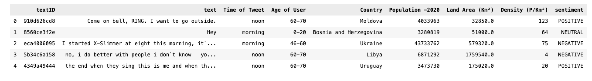
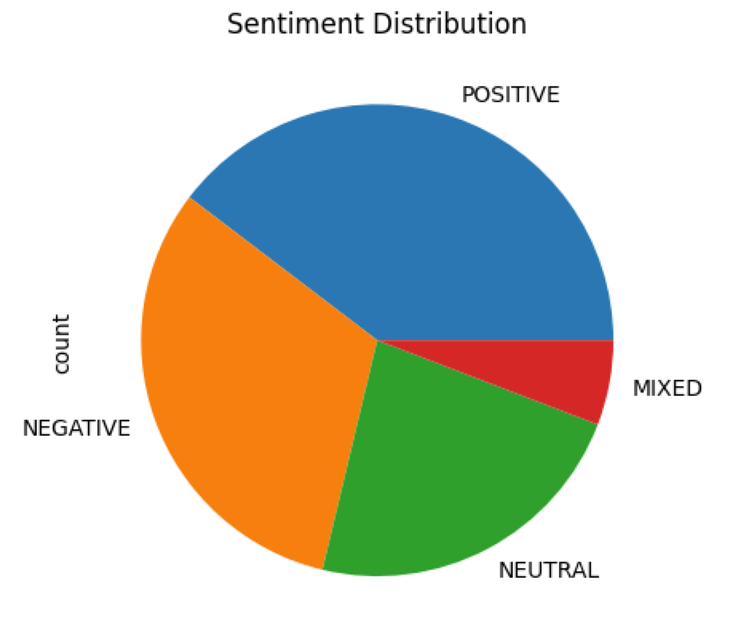

#  Using Comprehend

You will use AWS Comprehend to capture sentiment of several comments and tweets made on a company social media portal. You will store the results as a CSV file in your `TECHCATALYST-RAW/YOURNAME/SENTIMENT/OUTPUT.CSV`

The data is stored in the `sample.csv` file. 

You will need to perform sentiment analysis on each post. The updated CSV will contain a column that captures the sentiment 



You will also upload your visualization as a `.jpg` visual in the same folder



> [!TIP]
>
> ```python
> comprehend_client.detect_sentiment(
>         Text=text_to_analyze,
>         LanguageCode='en'
>     )
> ```
>
> 