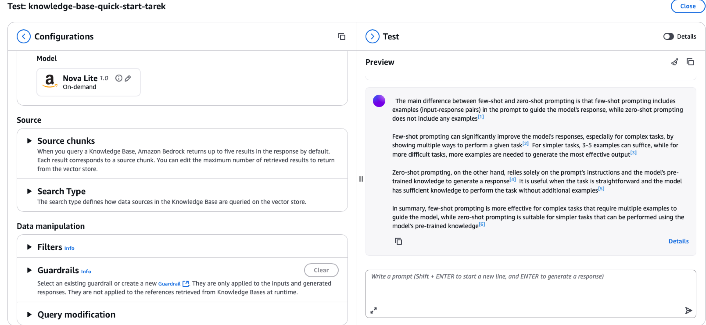

# Creating Your First Amazon Bedrock Knowledge Base

1. On the AWS Management Console, enter **Bedrock** in the search box. Then from the search results, choose **Amazon Bedrock**.

2. From the side navigation panel, choose **Knowledge Bases**.

3. On the **Knowledge Bases** page, choose **Create**. Then choose **Knowledge Base with vector store**.

4. On the **Provide Knowledge Base details** page, enter a name in the **Knowledge Base name** text box: `knowledge-base-quick-start-YOURNAME`

   **NOTE: always make sure to add your name or initials in the end so we can easy locate it and delete when done**. 

5. Then scroll to the **IAM permissions** section. Select the radio button next to **Create and use a new service role** and Make sure the name is easy to find. Use the following`AmazonBedrockExecutionRoleForKnowledgeBase_TECHCATALYST-YOURNAME`

6. Then, scroll to the end of the page. Choose **Next**.

7. Now, on the **Configure data source** page, enter a name for your data source. It will populate a name for you just add hyphen and your name `-YOURNAME` for example `knowledge-base-quick-start-esp1o-data-source-tarek`

8. For the S3 URI use **Browse S3** and navigate to `techcatalyst-bedrock`. I have uploaded a PDF document. You can find this document in the resources folder. This is a 50 page PDF document about Bedrock **Prompt engineering concepts**. It’s a fun read.

9. Then, scroll to the **Content chunking and parsing** section. Leave the settings at their default values. Choose **Next**.

10. On the **Configure data storage and processing** page, from the **Embeddings model** section, choose **Select model**.

11. On the **Select model** pop-up window, choose a model provider and model (select `Titan Text Embeddings V2 `. Then choose **Apply**.

12. Scroll to the **Vector store** section. For **Vector store creation method**, verify that **Quick create a new vector store** is selected. For **Vector store type** select the **Amazon OpenSearch Serverless** option. Then choose **Next**.

13. Now, verify the options that you have set.

14. Scroll to the end of the page. Choose **Create Knowledge Base**. 

15. After 2 to 3 minutes, the **Knowledge Base overview** page appears. 

16. Choose its name from the **Data source** panel. 

17. Select the checkbox next to the name of your data source. Then choose **Sync**.

18. After a few minutes, a success banner appears, to confirm that the sync operation finished. Choose **Test Knowledge Base**.

19. On the **Test** page, from the **Retrieval and response generation** section, choose **Select model**. 

20. In the **Select model** pop-up window, select a model provider, then a model (Select `Amazon` then `Nova Lite`) Choose **Apply**.

21. Enter a simple prompt requesting information that is found in your data source. For this example, the prompt asks for a description of the differences between few-shot and zero-shot prompting. This topic is covered on pages 625 through 627 of the PDF provided for this demonstration. Use the send icon to submit the prompt.

    

22. A response is generated. To understand how your selected model created the response, choose the **Details** link that follows the response. These are listed as **Source chunk1** ..etc, these are the chunks retrieved from the source knowledge base (the PDF file). We will explore this concept further in the future when we dive deeper into the **RAG** concept.

23. Now the **Details** panel is displayed, with information regarding how the response was generated. To close the test panel and return to the landing page for this Knowledge Base, choose **Close**.

> **Discussion **:
>
> ## What Did We Just Build?
>
> **The Big Picture**
>
> - In simple terms, describe what you created today. How is this different from just googling information or asking ChatGPT a question?
> - Before this lab, how would you have found specific information from a large PDF document? What problems does this Knowledge Base solve?
>
> **AI That "Remembers" Your Documents**
>
> - The system could answer questions about content from your specific PDF. Why is this useful compared to a regular AI that only knows general information?
> - What impressed you most about how the system found and used information from your documents?
>
> **Your Experience**
>
> - What was the most confusing part of the lab? What made it click for you?
> - If you had to explain what you built today to a friend or family member, how would you describe it in simple terms?

# Deleting Resources

1. To begin, return to the Amazon Bedrock console. From the side navigation panel, choose **Knowledge Bases**.
2. Select the radio button next to your Knowledge Base. Then, choose **Delete**.
3. A **Delete Knowledge Base** pop-up window appears. Enter **delete** in the text box to confirm the operation. Then, choose **Delete**.
4. A banner appears, to confirm that deletion of the Knowledge Base is in progress.
5. When the deletion is complete, your Knowledge Base is no longer listed.
6. Next, enter **S3** in the console search box. From the search results, choose **S3**.
7. Choose the name of the bucket that houses your Knowledge Base documents.
8. Then, select the checkbox next to any documents that you want to remove. Choose **Delete**.
9. In the confirmation text box, enter **permanently delete**. Then choose **Delete objects**.
10. A success banner confirms that the document has been deleted.