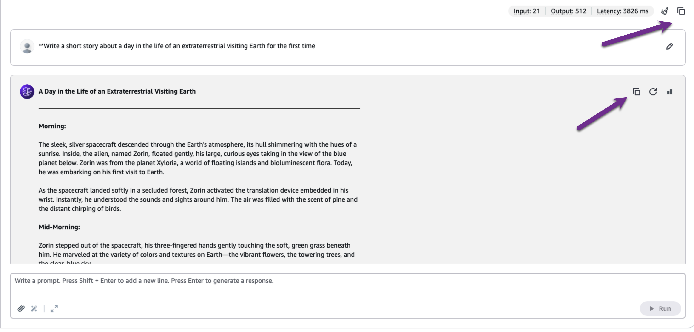
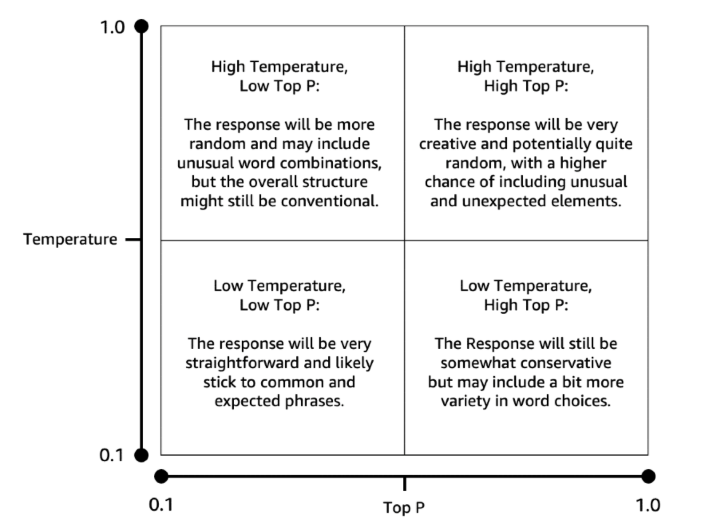

# Demonstration of configuring model parameters in a playground session.

1. On the AWS Management Console, enter **Bedrock** in the search box. Then from the search results, choose **Amazon Bedrock**.
2. From the side navigation panel, under **Playgrounds**, choose **Chat / Text**.
3. In the chat playground panel, choose **Select model**.
4. The **Select model** dialog box appears. From the **Categories** column, choose a model provider. Then, from the **Models** column, choose an available model from the provider that you selected. Then choose **Apply**. 

> Note: Currently only Amazon models are available. For this activity select the **Nova Lite** model

5. In the **Configurations** panel of the chat playground, scroll to the **Randomness and diversity** section.
6. Leave **Temperature** and **Top P** set to their default values. These settings tell the model how creative it can be in its responses. A table that follows the transcript for this video summarizes how these settings affect generated content.
7. Then, in the **Write a prompt** input box, enter the following: **Write a short story about a day in the life of an extraterrestrial visiting Earth for the first time.** You will run the same prompt three more times in this demonstration. Choose **Run**.
8. The generated response is displayed. There are two options for copying text from the chat playground. The first is available outside of the prompts and responses. It will copy the entire conversation to your system’s clipboard. The second is available in each individual response panel, and copies that response to the clipboard.

9. Now leave **Temperature** set to 1 and adjust **Top P** to 0.1. Paste the short story prompt into the **Write a prompt** text box. Then choose **Run**.
10. Next, set **Temperature** to 0.2 and **Top P** to 0.9. Paste the short story prompt into the text box. Then choose **Run**.
11. Now, leave **Temperature** at 0.2 and set **Top P** to 0.1. Paste the short story prompt into the text box. Choose **Run**. 

You have generated four variations of the short story. 

