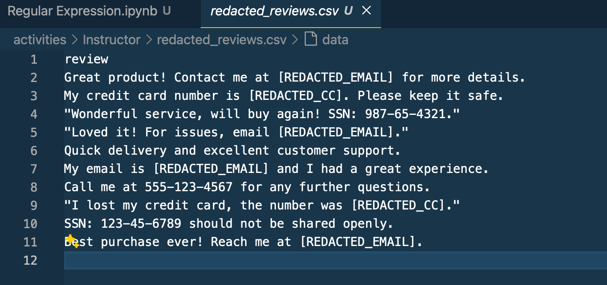

## PII Identification 

```python
import pandas as pd

data = {
    "review": [
        "Great product! Contact me at john.doe@example.com for more details.",
        "My credit card number is 1234-5678-9101-1121. Please keep it safe.",
        "Wonderful service, will buy again! SSN: 987-65-4321.",
        "Loved it! For issues, email support@company.com.",
        "Quick delivery and excellent customer support.",
        "My email is jane.doe@work.net and I had a great experience.",
        "Call me at 555-123-4567 for any further questions.",
        "I lost my credit card, the number was 4321-8765-0987-6543.",
        "SSN: 123-45-6789 should not be shared openly.",
        "Best purchase ever! Reach me at user123@domain.org."
    ]
}

df = pd.DataFrame(data)
print(df)
```

The final outcome needs to be



