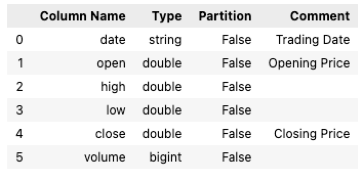
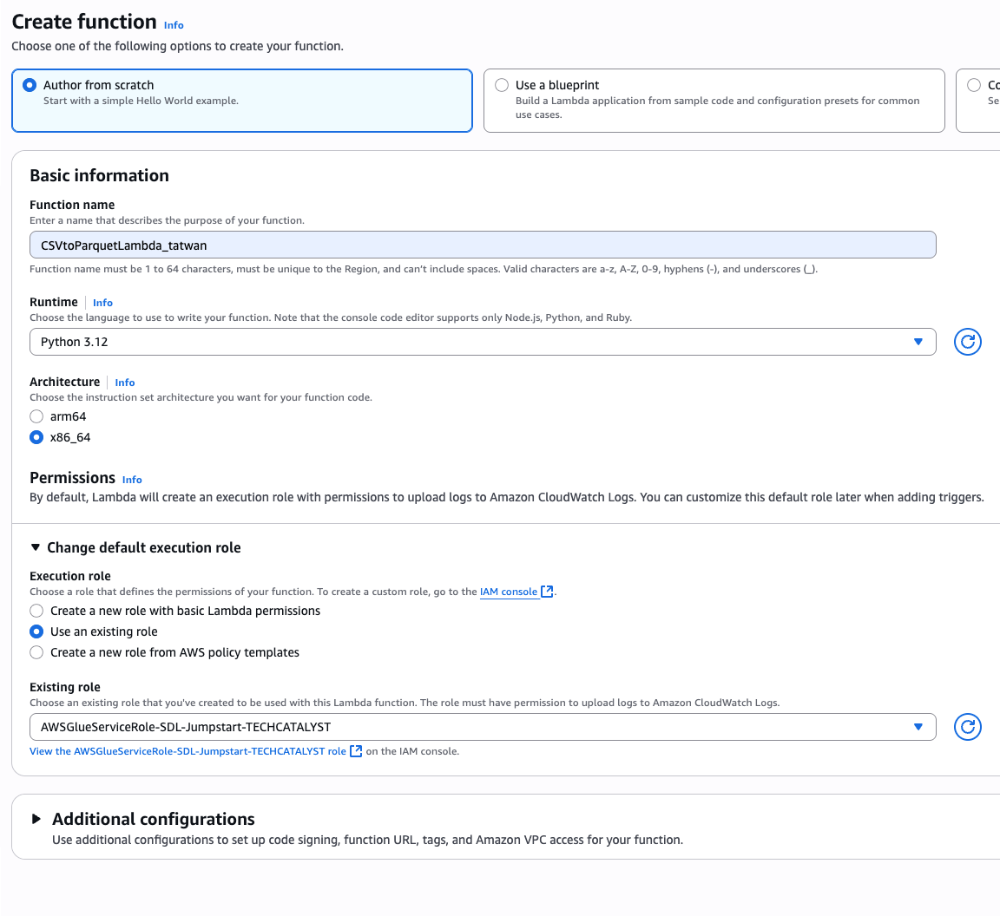
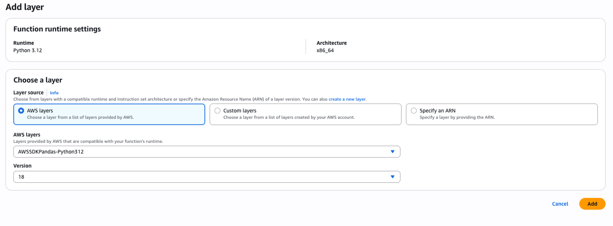
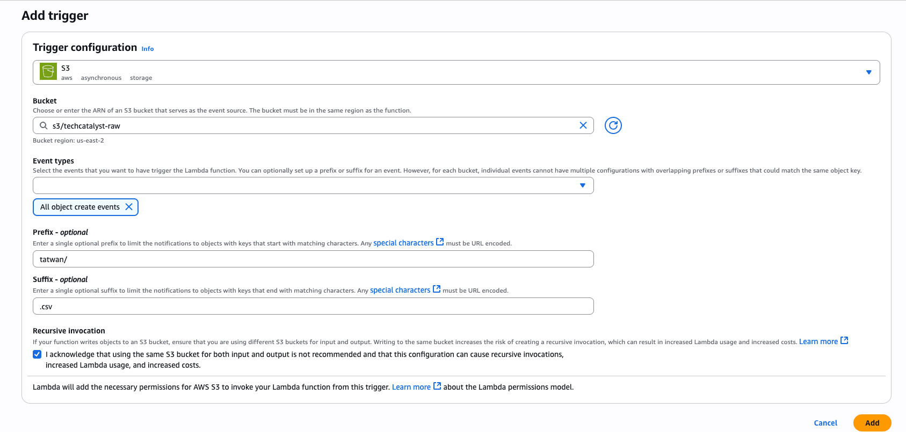
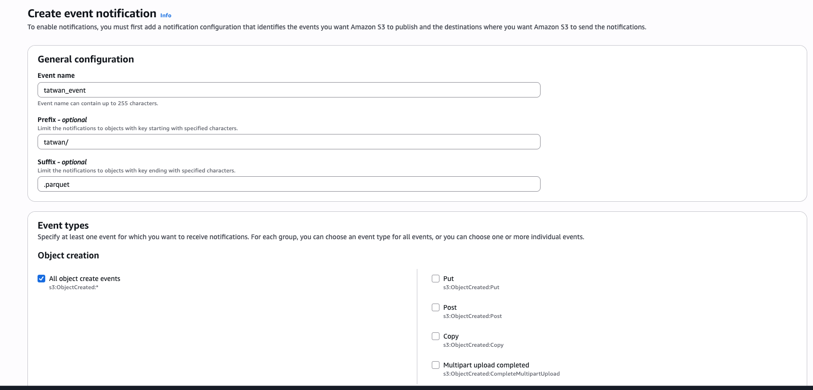
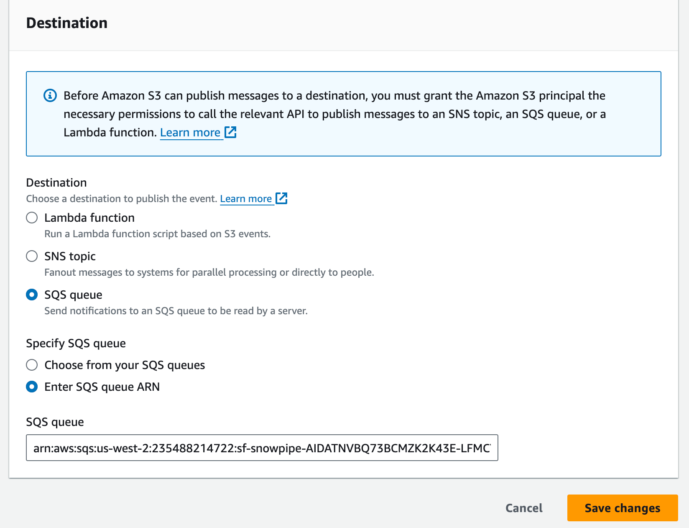
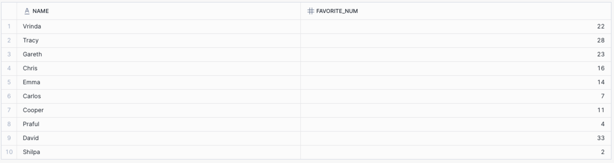

# Lab 1: Research Activity 

### Research Lab Activity: Understanding S3 Upload and Download Methods

> [!WARNING]
>
> Do not skip this section. This will you with Lab 2 below.

**Objective**: Analyze and understand the differences between various methods of uploading and downloading files using the Boto3 library for AWS S3. Determine the appropriate use cases for each method.

#### Instructions:

1. **Read the Provided Information**:
   - Carefully read the descriptions and purposes of each method (`upload_file`, `upload_fileobj`, `put_object`, `download_file`, `download_fileobj`, `get_object`).
   - Understand the parameters, features, and return values of each method.
2. **Research and Analysis**:
   - Research more about these methods from the Boto3 documentation and other reliable sources.
   - Analyze the differences in terms of functionality, efficiency, and use cases.
   - Think about real-world scenarios where each method would be the most appropriate to use.
3. **Complete the Analysis Table**:
   - Fill out the table below based on your research and understanding.
   - For each method, provide a detailed analysis including purpose, best use cases, pros, and cons.

#### Analysis Table:

| **Method**         | **Purpose** | **Best Use Cases** | **Pros** | **Cons** |
| ------------------ | ----------- | ------------------ | -------- | -------- |
| `upload_file`      |             |                    |          |          |
| `upload_fileobj`   |             |                    |          |          |
| `put_object`       |             |                    |          |          |
| `download_file`    |             |                    |          |          |
| `download_fileobj` |             |                    |          |          |
| `get_object`       |             |                    |          |          |

#### Reflection Questions:

1. **Upload Methods**:
   - What are the key differences between `upload_file`, `upload_fileobj`, and `put_object`?
   - When would you choose to use `put_object` over `upload_file` or `upload_fileobj`?
2. **Download Methods**:
   - How does `download_file` differ from `download_fileobj` and `get_object`?
   - In what scenarios would `get_object` be more beneficial than `download_file`?
3. **Efficiency and Performance**:
   - How do multipart uploads and downloads enhance the performance of file transfer operations?
   - What are the limitations of using `put_object` and `get_object` for large files?
4. **Practical Applications**:
   - Consider a scenario where you need to upload a large video file to S3. Which method would you use and why?
   - If you need to process data in memory before saving it locally, which download method would be most suitable?

---

# Lab 2: Exploring AWS Boto3

> [!TIP]
>
> Make sure you have all the needed libraries installed. You can install either using `uv pip install` or `pip install` or `conda install`
>
> ```shell
> uv pip install boto3 python-dotenv
> ```
>
> Don’t forget about your `.env` file
>
> ```
> AWS_ACCESS_KEY_ID=<YOURKEY>
> AWS_SECRET_ACCESS_KEY=<YOURSECRETKEY>
> ```
>
> 

> [!WARNING]
>
> To avoid complications create a `.env` file in the same folder you are working from. Alternatively you can always reference your `.env` outside your folder scope. Here is an example where my `.env` is outside my project folder:
>
> ```python
> from dotenv import load_dotenv
> load_dotenv('../.env')
> ```


### Load your credentials

```python
from dotenv import load_dotenv
load_dotenv() # this assumes .env is inside the same folder you are working from
```

### S3 Client API

> [!NOTE]
>
> Boto3 offers two APIs. One is called **Client API** and another called **Resource API**
>
> * What is the main difference between the two? Document your answer 

```python
# using Boto3 S3 client api
import boto3
import os

s3_client = # YOUR CODE
```

**List all the buckets that contain TECHCATALYST**

```python
# list bucket names
buckets = s3_client.list_buckets()
for bucket in buckets['Buckets']:
    if 'techcatalyst' in bucket['Name']:
        print(bucket['Name'])
```

**List objects in a specific bucket `techcatalyst-raw`**

```python
# list objects in a specific bucket "techcatalyst-raw" 
bucket_name = # YOUR CODE
objects = s3_client.list_objects_v2(Bucket=#YOURCODE)
for obj in objects.get('Contents', []):
    print(obj['Key'])
```

**List only CSV objects in a specific bucket `techcatalyst-raw`**

```python
# list objects that are CSV in a specific bucket "techcatalyst-raw" 
for obj in objects.get('Contents', []):
    # YOUR CODE
```

**Hint**: Check it out [here](https://www.w3schools.com/python/ref_string_endswith.asp)

### Downloading an objects using `download_file`

* Using `download_file` method to download a specific file "stocks/GOOG.csv" from the bucket "techcatalyst-raw"

```python
s3_client.download_file(Bucket='#YOURCODE',  # from which bucket
                        Key='#YOURCODE, # what is the object name, this include the directory/key.csv
                        Filename='YOURCODE') # Filename is what you want to call it once it is downloaded
```

### Downloading an objects using `download_fileobj`

* using `download_fileobject` method to download a specific file "stocks/GOOG.csv" from the bucket "techcatalyst-raw"

```python
import io
io_temp = io.BytesIO()
temp = s3_client.download_fileobj(Bucket='YOURCODE', 
                           			Key='YOURCODE',
                            		Fileobj='YOURCODE') # pass th io.BytesIO object
```

> [!NOTE]
>
> The  `io.BytesIO()` creates an **in-memory binary buffer**. Instead of providing a real file opened on your hard drive, you are passing `io_temp`. This instructs the S3 client to stream the contents of the `stocks/GOOG.csv` file directly into that in-memory buffer.
>
> ## Why Use `io.BytesIO()` Here?
>
> The primary advantage is **efficiency**. It allows you to handle the file data without performing disk I/O (input/output).
>
> - **Avoids Temporary Files**: You don't need to write the CSV file to your hard disk and then read it back into your program. This avoids the overhead of creating, managing, and later deleting a temporary file.
> - **Faster Processing**: Reading from and writing to RAM is significantly faster than doing so with a physical disk (HDD or even SSD).
> - **Seamless Integration**: The resulting `BytesIO` object can be used directly by many other libraries that expect file-like objects.

```python
# show buffer content
print(io_temp.getvalue()[:100])
```

You can also use next

```python
next(io_temp)
```

You can reset the pointer to the beginning or the BytesIO object

```python
io_temp.seek(0) 
```

You also write the content of the BytesIO object to a file

```python
# writing the content of the BytesIO object to a file 
with open('google_stock_downloaded.csv', 'wb') as f:
    f.write(io_temp.getvalue())
```

### Uploading a local file using `upload_file`

* Use one of the files you just downloaded from the previous steps

```python
# uploading a local file using upload_file
s3_client.upload_file(Filename='YOURCODE', # local file name
                      Bucket='YOURCODE', # the bucket target
                      Key='YOURCODE') # destination name, make sure it include YOURNAME/ANY_FILE_NAME.csv
```

### Uploading using `upload_fileobj`

```python
in_memory_file = io.BytesIO(b"YOUR TEXT HERE. WRITE ANY TEXT YOU WANT")
s3_client.upload_fileobj(Fileobj=#YOURCODE,
                          Bucket=#YOURCODE, 
                          Key='YOURCODE') # destination name, make sure it include YOURNAME/ANY_FILE_NAME.txt
```

### List all the objects in your bucket/username

```python
# list objects in a specific bucket "techcatalyst-raw" with prefix "tatwan"
objects = # YOUR CODE
objects.keys()
```

* Can you see all the files you just uploaded? 

# Lab 3: Introduction to AWS Wrangler

**Introduction to AWS SDK for Pandas (awswrangler)**

In this session, we'll explore how to use the **AWS SDK for Pandas**, also known as `awswrangler`, to simplify interactions with AWS services like S3. This library provides a higher-level interface compared to **Boto3**, making it easier to perform data engineering tasks directly in Python.

We'll start with a brief refresher on using Boto3 to interact with S3 and then move on to using `awswrangler` to achieve the same tasks more efficiently.

**If you get stuck, there is no better place than reading the documentation which you can find here: https://aws-sdk-pandas.readthedocs.io/en/stable/**

## Installaion and Setup

To install awswrangler you can install using either `uv pip install`, `pip install` or `conda install`

```shell
uv pip install awswrangler
```
Once installed, make sure you have your `.env` file created with the following information. For awswrangler you may need to update the` .env` if you get an error by adding a `AWS_DEFAULT_REGION`.
```
AWS_ACCESS_KEY_ID=<YOURKEY>
AWS_SECRET_ACCESS_KEY=<YOURSECRETKEY>
AWS_DEFAULT_REGION=us-east-2
```

Then load your credentials 

```python
# load your credentials
from dotenv import load_dotenv
load_dotenv()
```

### Getting to know awswrangler

```python
# import awswrangler
import awswrangler as wr
```

Similar to pandas, awswrangles comes with many reader and writer functions. You can use `wr.s3.read_csv`, `wr.s3.read_parquet`, ..etc

```python
# test if you can read from a private bucket

df = wr.s3.read_csv('s3://techcatalyst-raw/stocks/GOOG.csv')
df.head()
```

```python
# the returned object is actuall a pandas DataFrame
df.info()
```

Now, you have a pandas DataFrame loaded into memory

In AWS Glue, you worked with Glue Catalog, Glue Database, and Glue Tables. If you recall, you used the Glue Crawler to crawl your files in an S3 bucket, then the crawler would populate the metadata information in a Glue Table inside the Glue Database you had to define manually. 

Let's inspect what Glue Database we have available using `awswrangler`:

```python
databases = wr.catalog.databases()
print(databases)
```

These are databases I had created. You will need to create you own database now

```python
name = # ENTER YOUR NAME HERE
database_name = f"{name}_db"
wr.catalog.create_database(database_name)
```

Confirm it was created 

```python
# YOUR CODE
```

Inspect your database to see if it contains any tables

```python
wr.catalog.tables(database=database_name)
```

`awswrangles` allows you to easily write you pandas DataFrame into S3 in any format (e.g., CSV, Parquet, JSON ..etc). You can also specify a Glue Database and a Table so it can write some metadata information. Let's see how that works:

```python
wr.s3.to_parquet(
    df=df, # the DataFrame you just created 
    path=f"s3://techcatalyst-raw/{name}/", # write to the techcatalyst-raw bucket under your folder name (or it would create a new folder if it does not exist)
    dataset=True, 
    database=#YOUR CODE, # the name of the database you just created in AWS Glue 
    table= #YOUR CODE, # pick a table name for example YOURNAME_STOCK
    mode='overwrite'
    )
```

For example, I may get an output like this 

```
{'paths': ['s3://techcatalyst-raw/tatwan/36385087362744ee918c24a23b82e878.snappy.parquet'],
 'partitions_values': {}}
```

The above line confirmst that the parquet file was written in the specified S3 bucket. Let's inspect if a table was written in AWS Glue. You should login to the AWS console (Web), change region to use-east-2, and then navigate to AWS Glue. Check the Database and verify it was created. Then inside that database, verify that the table was created. 

We can also do this via awswrangler

```python
wr.catalog.tables #YOUR CODE
```

You can also do a search for tables by name

```python
wr.catalog.tables(name_contains="stock")
```

To view the content of a specific AWS Glue table using awswrangler, you typically read the data from the underlying data store (often S3) using the Glue table’s catalog metadata. This is how Athena works by utilizing Glue tables.

```python
df = wr.s3.read_parquet_table(database=YOURDATABASE, 
                              table=YOURTABLE)

# Display the DataFrame's first few rows
df.head()
```

You can just request the column types in the table using the get_table_types

```python
wr.catalog.get_table_types(database=YOURDATABASE, 
                           table=YOURTABLE)
```

Get the Glue metadata as a generator that contains dictionaries for all tables in your database

```python
table_details = wr.catalog.get_tables(database=YOURDATABASE)

next(table_details)
```

Glue Tables allows us to add additonal metadata information like description about the data, comments about each column ..etc

```python
# Example adding additional metadata information 

desc = "This is my stock table."
param = {"source": "Google", "class": "stock"}
comments = {
    "Date": "Trading Date",
    "Open": "Opening Price",
    "Close": "Closing Price"
}

wr.s3.to_parquet(
    df=#YOURDATAFRAME,
    path=#BUCKET/FOLDER, # CHANGE THIS TO USE YOUR NAME for example s3://TECHCATALYST/TATWAN
    dataset=True,
    database=#YOURD_DATABASENAME,
    table=#YOUR_TABLENAME,
    mode='overwrite',
    glue_table_settings=wr.typing.GlueTableSettings(description=desc,  # here we are passing some metadata
                                                    parameters=param, 
                                                    columns_comments=comments),
    )
```

You can view the information such as column type, partition, and any comments using the table method. View the content of the table you just created .

```python
wr.catalog.table(database=YOURDATABASE, table=YOUR_TABLE)
```



To list all objects in a specific bucket you can use the `s3.list_objects`

```python
wr.s3.list_objects('s3://techcatalyst-raw/stage/')
```

If you want to download a specific file locally to your machine, you can use the `s3.download`

```python
wr.s3.download(path='s3://techcatalyst-raw/stocks/GOOG.csv', 
               local_file='./new_file.csv')
```

To upload a file from your local machine to S3 you can use `s3.upload()` 

```python
your_name = # ENTER A NAME
file_name = #ENTER YOUR FILE NAME YOU WANT TO UPLOAD
wr.s3.upload(local_file='new_file.csv',path= f's3://techcatalyst-raw/{your_name}/uploads/{file_name}')
```

Let's double check it was uploaded

```python
wr.s3.list_objects(f's3://techcatalyst-raw/{your_name}/uploads/')
```

### Exercise (using Glue Catalog and Athena)

You can execute an Athena query directly using the `wr.athena.read_sql_query()` function. This function runs your SQL query and returns the results as a Pandas DataFrame.

1. Define Configuration 

```python
# A name for the new Glue Database it should be YOURNAME_TAXI
db_name =  # YOUR CODE

# A name for the table it should be YOURNAME_TRIPDATA
table_name =  #YOUR CODE

# the path_direcoty to should point to the bucket (main directory)
s3_path_directory = #YOUR CODE

# The path_file should be the full path to the actual file
s3_path_file = # YOUR CODE

```

2. Get the Schema from the Parquet File Metadata

```python
# uncomment below if you ran into issues to clean things up and rerun the cell
wr.catalog.delete_table_if_exists(database=db_name, table=table_name) 

# Create the new Glue database first based on the db_name you created
# YOUR CODE

# This function can extract the schema from our file and returns a tuple: (schema, partitions). We only need the schema. 
columns_types, partitions_types = wr.s3.read_parquet_metadata(path=s3_path_file)
print("Successfully read schema from Parquet file.")
```

3. Create the Glue Table with the Explicit Schema 

```python

wr.catalog.create_parquet_table(
    database=db_name, # pass the database name
    table=table_name, # pass the table name
    path=s3_path_directory, # use the directoy here 
    columns_types=columns_types,  # Pass the schema here
    partitions_types=partitions_types
)
print(f"Table '{table_name}' created successfully in database '{db_name}'.")
```

> [!TIP]
>
> The `columns_types` object contains the schema from the parquet

4. Now you can query your table/data using **Athena**

```python
query = f"SELECT * FROM {table_name} LIMIT 5"

df = wr.athena.read_sql_query(query, database=db_name)

print("\nQuery Results:")
print(df)
```

### Summary

Hopefully by now you come to appreciate awswrangler.

At its core, it acts as a high-level bridge, extending the power of the popular Pandas library to the AWS cloud environment. Its primary goal is to eliminate the need for extensive "boilerplate" code that data scientists and engineers would otherwise have to write using lower-level libraries like Boto3 to interact with services like S3, Redshift, and Athena.

__It is an official AWS project and is part of the AWS Professional Services portfolio.__

__The Problem It Solves__

Imagine you are a data scientist or data engineer working in Python. Your workflow often looks like this:

1. __Get Data__: You need to read a large CSV or Parquet file from an Amazon S3 bucket into a Pandas DataFrame.
2. __Analyze & Transform__: You perform your analysis, clean the data, and generate new features using Pandas.
3. __Store Results__: You need to save your transformed DataFrame back to S3 or load it into a data warehouse like Amazon Redshift for others to use.

Without AWS Wrangler, this process involves many manual steps:
* Using `Boto3` to connect to S3.
* Downloading the file locally or streaming it into memory.
* Parsing the file format (e.g., CSV, Parquet) into a DataFrame.
* For writing, you'd have to serialize the DataFrame into a specific format (like a CSV string or Parquet file).
* Then, use Boto3 again to upload this new file to S3.
* All of this requires handling AWS credentials, sessions, and potential errors.

__AWS Wrangler simplifies this entire workflow into single-line function calls.__

----

# Lab 4: Hands-on – triggering an AWS Lambda function when a new file arrives in an S3 bucket

> [!WARNING]
>
> Expect to spend a lot of time troubleshooting here. This is common and it is expected. Even though my instructions below have been tested and validated, you will make mistakes, and you will need to troubleshoot using lambdas’ **Monitor** section. You will spend a lot of time trying to read the logs to understand what worked.

In the hands-on activity we’re going to configure an S3 bucket to automatically trigger a Lambda function whenever a new file is written to the bucket. In the Lambda function, we’re going to make use of an open-source Python library called **AWS SDK for pandas**, created by AWS Professional Services to simplify common ETL tasks when working in an AWS environment. We’ll use the AWS SDK for pandas library to convert a CSV file into Parquet format and then update AWS Glue Data Catalog.

Converting a file into Parquet format is a common transformation in order to improve analytic query performance against our data. This can either be done in bulk (such as by using an AWS Glue job that runs every hour to convert files received in the past hour), or it can be done as each file arrives, as we are doing in this hands-on exercise. A similar approach can be used for other use cases, such as updating a `total_sales` value in a database as files are received with daily sales figures from a company’s retail stores across the world. 

> [!IMPORTANT]
>
> To simplify things, a Policy was already created `TechCatalystLambdaS3CWGluePolicy` as well as a role `AWSGlueServiceRole-SDL-Jumpstart-TECHCATALYST`
>
> When asked for  an IAM role for Lambda, you should select the role highlighted above 

## Creating a Lambda function

We are now ready to create our Lambda function that will be triggered whenever a CSV file is uploaded to our source S3 bucket. The uploaded CSV file will be converted into Parquet, written out to the target bucket using the AWS SDK for pandas library:

1. In the AWS console, search for and select the **Lambda** service, and in the left-hand menu, select **Functions** and then click **Create function**. 
2. Select **Author from scratch** and provide a **function name** (such as `CSVtoParquetLambda`).
3. For **Runtime**, select **Python 3.12** from the drop-down list.
4. Expand **Change default execution role** and select **Use an existing role**. From the drop-down list, select the role that assigned to you



5. Do not change any of the **Advanced settings** and click **Create function**.
6. Click on **Layers** in the first box (*Function overview*), and then click **Add a layer**in the **Layers** box.
7. Select **AWS Layers**, and from the dropdown, select the **AWS SDK for pandas layer** 



8. Scroll down to the **Code Source** section in the Lambda console. You will need to update/complete the following code

**WHAT IS THIS CODE DOING?**

```python
import boto3
import awswrangler as wr
from urllib.parse import unquote_plus
import json

def lambda_handler(event, context):
    # Get the source bucket and object name from the Lambda event
    for record in event['Records']:
        source_bucket = record['s3']['bucket']['name']
        source_key = unquote_plus(record['s3']['object']['key'])
    
    print(f'Bucket: {source_bucket}')
    print(f'Key: {source_key}')
    
    input_path = f"s3://{source_bucket}/{source_key}"
    print(f'Input Path: {input_path}')
    
    # Define the destination bucket and key
    destination_bucket = "techcatalyst-public"  # Target bucket name as a string
    
    # Derive the output key (keep same folder structure, replace file extension with .parquet)
    if source_key.lower().endswith('.csv'):
        output_key = source_key[:-4] + ".parquet"
    else:
        output_key = source_key + ".parquet"
        
    output_path = f"s3://{destination_bucket}/{output_key}"
    print(f'Output Path: {output_path}')
    
    # Read the CSV file from S3
    try:
        input_df = wr.s3.read_csv([input_path])
    except Exception as e:
        print("error on read")
        print(e)
        return {
            'statusCode': 500,
            'body': json.dumps('Error reading source CSV file')
        }
    
    # Write the DataFrame to Parquet format in the destination S3 bucket
    result = wr.s3.to_parquet(
		    #YOURCODE
    )
    
    print("RESULT: ")
    print(result)
    
    return {
        'statusCode': 200,
        'body': json.dumps('CSV file converted to Parquet and moved successfully!')
    }

```


9. Click on **Deploy** at the top of the **Code Source** window
10. Click on the **Configuration** tab (bottom left corner of the Code Source box, you will see an icon),  click on **General configuration**. Click the **Edit** button and modify the **Timeout** to be 2 minute (the default timeout of 3 seconds is likely to be too low to convert some files from CSV into Parquet format). Then, click on **Save**. *If you skip this step, you are likely to get an error when your function runs*. 

## Configuring our Lambda function to be triggered by an S3 upload

Our final task is to configure the Lambda function so that whenever a CSV file is uploaded to our landing zone bucket, the Lambda function runs and converts the file into Parquet format:

1. In the **Function Overview** box of our Lambda function, click on **Add trigger**.
2. For **Trigger configuration**, select the **S3** service from the drop-down list.
3. For **Bucket**, select your landing zone bucket.
4. We want our rule to trigger whenever a new file is created in this bucket, no matter what method is used to create it (**Put**, **Post**, or **Copy**), so select **All object create events** from the list.
5. **Make sure to update the prefix to point to your folder**, the screen shot below show how it is pointing to my folder (`tatwan/`)
6. For **suffix**, enter `.csv`. This will configure the trigger to only run the Lambda function when a file with a `.csv` extension is uploaded to our landing zone bucket.
7. Acknowledge the warning about **Recursive invocation**, which can crop up if you set up a trigger on a specific bucket to run a Lambda function and then you get your Lambda function to create a new file in that same bucket and path. 



8. Click **Add** to create the trigger.
9. Use the test.csv template in the resources folder. And upload it using the Boto3 api (previous activity) 
10. If everything has been configured correctly, your Lambda function will have been triggered and will have written out a Parquet-formatted file to your target S3 bucket 

> [!WARNING]
>
> Expect to spend a lot of time troubleshooting here. This is common and it is expected. Even though my instructions below have been tested and validated, you will make mistakes, and you will need to troubleshoot using lambdas’ **Monitor** section. You will spend a lot of time trying to read the logs to understand what worked.


# Lab 5: Automating Snowpipe for Amazon S3

Create a stage as shown pointing to your S3 Bucket

```sql
CREATE OR REPLACE STAGE TECHCATALYS.EXTERNAL_STAGE.<YOURNAME>_AWS_STAGE
        STORAGE_INTEGRATION = s3_int
        URL='s3://techcatalyst-public/tatwan/';
```

Create a CSV file format

```sql
CREATE OR REPLACE FILE FORMAT <YOURNAME>.parquet_format
TYPE = 'PARQUET';
```

Create your table schema

```sql

create or replace transient table techcatalyst.<YOUR SCHEMA>.temp
(
name string,
favorite_num number
);
```

Create a PIPE that uses your stage

```sql
reate or replace pipe TECHCATALYST.EXTERNAL_STAGE.<YOUR SCHEMA>_PIPE
auto_ingest = True
as 
copy into techcatalyst.<YOUR SCHEMA>.temp
from  @TECHCATALYST.EXTERNAL_STAGE.YOUR_STAGE
FILE_FORMAT = (format_name = '<YOURNAME>.parquet_format')
match_by_column_name = case_insensitive;

```

To check your pipe:

```sql
show pipes;
```

Now, COPY the **ARN**


Go to your S3 bucket on AWS and under Properties click Event Notifications and **Create Event Notification**

> [!NOTE]
>
> * Make sure the event name is unique so use your name
> * Make sure you use a **Prefix** this way it only triggers when a file is uploaded to your specific folder. You do not want it to trigger from everyone else’s uploaded 
> * Ensure to add a suffix so it only triggers for a specific data type 
> * And click “All Object Create Event”



Paste the **ARN** you just copied from Show Pipes in snowflake 



Test uploading the CSV file. Do note there will be some latency between even trigger and data being copied.

* You will need to test this by using your upload scripts either using **Boto3** upload_file or **awswrangler** in order to trigger the job. The schema is designed to work with the test.csv file provided. You can call it anything you want.

If everything works then this query should run YOU WILL USE YOUR OWN TABLE:

```sql
SELECT * FROM TECHCATALYST.TATWAN.TEMP limit 10;
```



> [!IMPORTANT]
>
> If you got a NULL, or EMPTY table, you will need to toubleshoot all the way back from the lambda function. This process is called **Debugging**


# Final 

## Bringing it all together 

* Draw a proposed end-to-end solution diagram that highlights what you can accomplish using the skills you learned in the labs. 
* What are some of the use-cases for this solution? 
* You will need to submit an architecture diagram.
* You will need to submit the diagram and your write up all using a URL that points to your personal **GitHub** repository 

## Challenge

* Combined what you learned in the labs  fully automate uploading a CSV file from on-premise from one-bucket to another bucket, and then copy into your snowflake table. 
* Challenge: Use Pandas in Lambda to make simple transformations before writing your final file
* In this example you will read the Stock data. You can use any of the stock datasets we covered before. The Lambda function will read the DATE and CLOSE price, makes sure the DATE Is a Datetime index in Pandas. All transformations will be done using pandas. 

