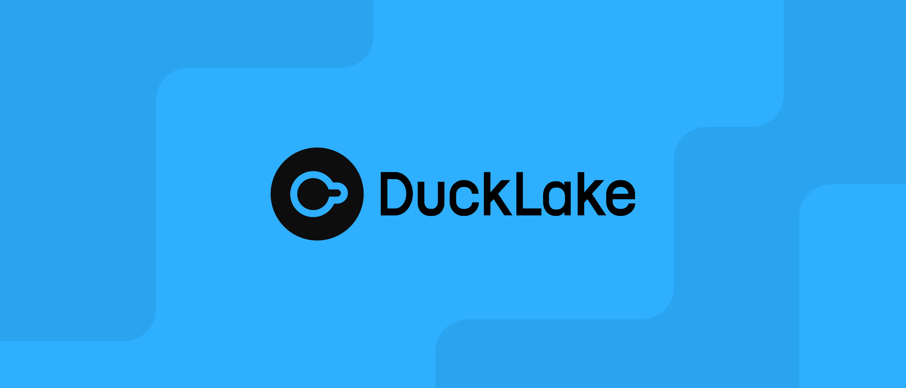

# Lab: A Case Study in Modernizing the Data Lake

## Scenario 📈

You are a team of Data Engineering consultants hired by **"Streamify,"** a rapidly growing online media streaming service.

Streamify's current data architecture is struggling. They have a basic data lake on **Amazon S3**, where raw event data (like user clicks, watch history, and ad impressions) is dumped as large batches of **CSV and JSON files**. Their data analysts and data scientists are complaining about:

1. **Poor Query Performance:** Running analytics with AWS Athena is painfully slow.
2. **Data Quality Issues:** It's difficult to update or delete incorrect records (e.g., due to user privacy requests or data correction), leading to unreliable reports.
3. **No Historical Auditing:** They can't easily query the state of a user's profile from last week, making it hard to debug issues or analyze trends over time.
4. **Frequent Schema Changes:** The development team often adds new fields to the event data, which breaks downstream data pipelines.

Streamify's leadership wants to build a reliable, scalable, and high-performance data lakehouse. They need you to recommend the best data format strategy.

### Your Mission 🎯

Your task is to evaluate modern data lake table formats and recommend the best solution for Streamify. Your recommendation must address all four of their pain points.

------

## 1. Research & Analysis Phase

As a team, investigate the following data formats. While Parquet is a **file format**, the others are **table formats** that typically use Parquet files internally. It's crucial to understand this distinction.

#### Candidate Formats:

- **Parquet** (as the base columnar file format)
- **Avro** (another key file format, especially in streaming)
- **Delta Lake**
- **Apache Hudi**
- **Apache Iceberg**

#### Guiding Questions:

For each format, answer the following questions from the perspective of solving Streamify's problems:

- **Core Features:** What are its 1-3 defining features? (e.g., ACID transactions, time travel, schema enforcement).
- **Solving the Problem:**
  - How does it improve **query performance** over plain CSV/JSON? (Think columnar storage, compression, predicate pushdown).
  - How does it handle data updates and deletes (**mutability**)? Is this an atomic operation?
  - Does it support **time travel** or data versioning to solve the historical auditing problem?
  - How does it manage **schema evolution**? How easily can Streamify add new columns without breaking pipelines?
- **Ecosystem & Compatibility:**
  - Which frameworks support it (Spark, Flink, Presto, etc.)? If you don't know what these are, make a search. 
  - How well does it integrate with the **AWS ecosystem**? Can you use it with S3, AWS Glue Catalog, and Athena?
- **Limitations:** What are its potential drawbacks or trade-offs? (e.g., complexity, storage overhead, write performance).

------

## 2. Deliverable: The Recommendation Report

Prepare a concise report or presentation for Streamify's technical leadership. It should include:

1. **Comparison Matrix:** A summary table comparing all five formats against Streamify's key requirements (Performance, Mutability, Time Travel, Schema Evolution, AWS Integration).
2. **The Final Recommendation:**
   - State which **table format** (Delta, Hudi, or Iceberg) you recommend.
   - Provide a clear **justification** explaining *why* your choice is the best fit to solve Streamify's specific problems.
   - Briefly explain the role **Parquet** (or Avro) would play as the underlying file storage in your proposed solution.

> [!NOTE]
>
> The report should be published on your own GitHub repo. You will share the URL to your GitHub. Ideally, this should be written in Markdown.

### Bonus Challenge (Optional) 🚀

Since DuckLake is fairly new, and few people have experienced it. Try and access DuckLake and see how it compares to the other **table formats**.

