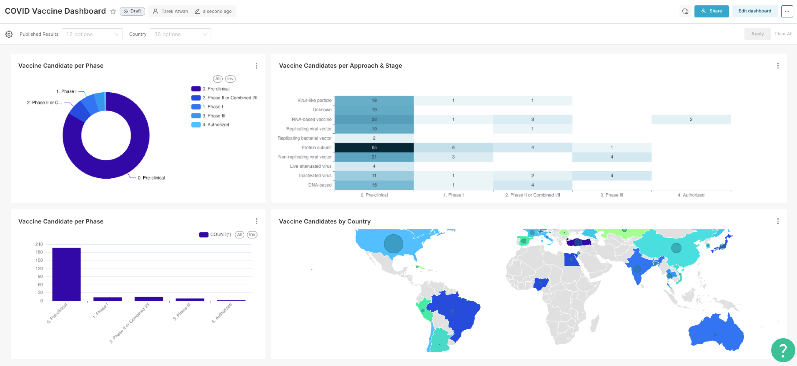
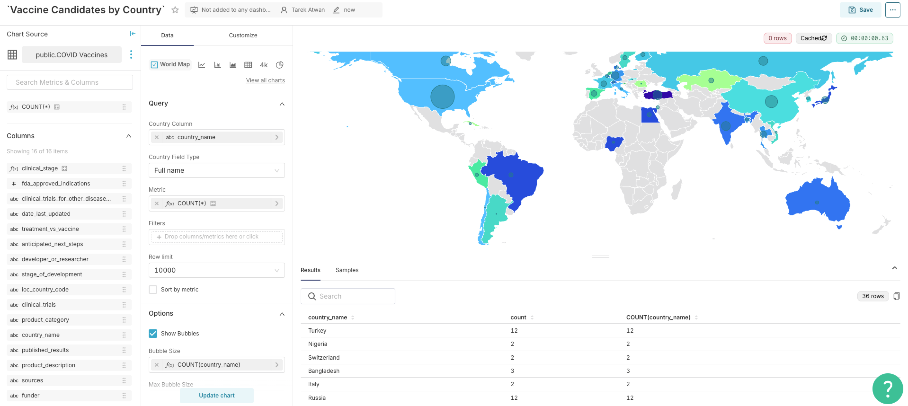
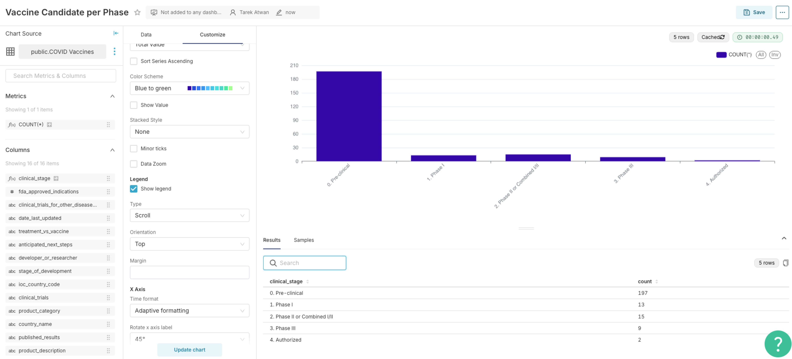
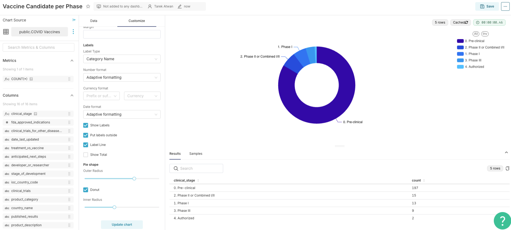
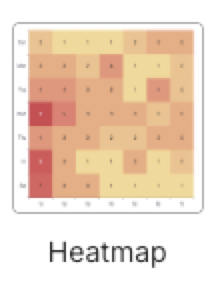
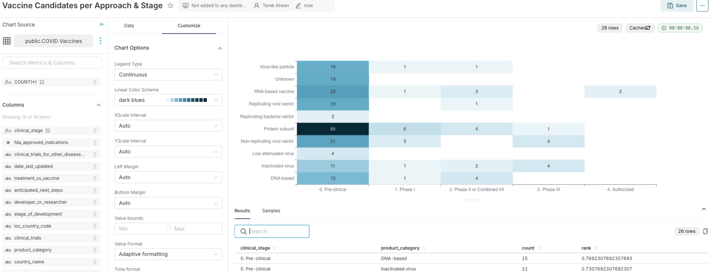

In this lab you will be working with the **COVID Vaccines** dataset



# COVID Dashboard

## Step 1


Create a chart using **World Map** visualization 

1. Drag `country_name` column to the **Country Column** section. 
2. Under **Country Field Type** switch from `CODE ISO 3166-1 alpha-2 (cca2)` to use `Full name`
3. In the **Metric** section drag the `COUNT(*)` metric
4. Hit the **Create  chart** or **Update chart** button
5. In **Options** section, check the **Show Bubbles** box, and drag `country_name` to the **Bubble Size** section. Update the aggregation to be `COUNT` and not `COUNT_DISTINCT`
6. Change **Color by** from Metric to Country
7. For the Color Scheme, you can update to use the `Blue to Green` 
8. Save the chart as `Vaccine Candidates by Country`



---

## Step 2

Let’s create a second chart, this time a **Bar chart**

1. For the **X-axis** drag `clinical_stage` column. Notice, the column starts `f(x)` indicating it is a custom column created for us in the dataset. You can click the right arrow on the right side  then the **Custom SQL** tab to view the transformation that was performed.

   ```sql
   CASE 
   WHEN stage_of_development = 'Pre-clinical' THEN '0. Pre-clinical'
   WHEN stage_of_development = 'Phase I' THEN '1. Phase I' 
   WHEN stage_of_development = 'Phase I/II' or stage_of_development = 'Phase II' THEN '2. Phase II or Combined I/II'
   WHEN stage_of_development = 'Phase III' THEN '3. Phase III'
   WHEN stage_of_development = 'Authorized' THEN '4. Authorized'
   END
   ```

   What this code does is basic clean up and renaming of the values for the column `stage_of_development` and saved as a custom column called `clinical_stage` which is the one you are using.

2. Drag `COUNT(*)` to the **Metrics** section 

3. Click the **Create chart** button

4. Under **Customize** section

   1. Change the color schema to `Blue to green`
   2. head tot he **Rotate x axis label** and change it from `0` to `45` degrees

5. Save the chart as `Vaccine Candidates per Phase`



---

## Step 3

Now, you will create a donut chart based on **Pie Chart** visualization 

1. Drag `clinical_stage` to the **Dimensions** section 
2. Drag `COUNT(*)` to the **Metrics** section
3. Click **Create Chart** button
4. In the **Customize** section
   1. Change the color scheme  to `Blue to green`
   2. Change the location of the legend from `Top` to `Right`
   3. Check the **Label Line** box
   4. Check the **Donut** checkbox 
   5. Change the **Inner Radius** to `40`
5. Save the chart as `Vaccine Candidate per Phase`



---

## Step 4

This time you will be introduced the the **Heatmap** visualization 

1. Drag `clinical_stage` to the **X-axis** section
2. Drag `product_category` to the **Y-axis** section
3. Drag `COUNT(*)` to the **Metrics** section
4. Update both **Sort X Axis** and **Sort Y Axis** to `Axis ascending`
5. In the **Customize** section
   1. Change the **Linear Color schema** to `dark blues`
   2. Uncheck the **Legend** option 
   3. Check the **Show Values** checkbox 
6. Save the chart as `Vaccine Candidates per Approach & Stage`



----

## Step 5

Create the final dashboard with two **filters** on top (Published Results  and Country filters)

