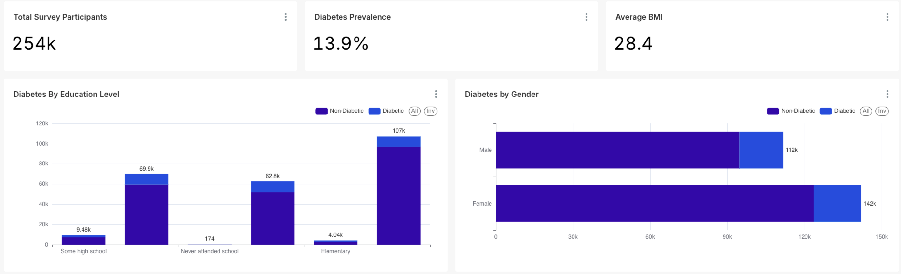
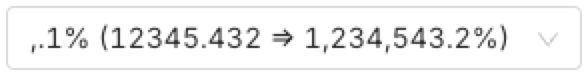
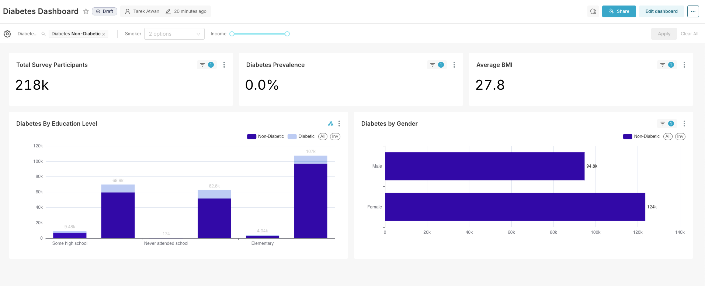

> ### Note
>
> In this activity you will be introduced some advanced concepts using **SQL** to create custom **Metrics** and **Dimensions** 

# Diabetes Dashboard 



1. You will start by creating the `diabetes_dataset` from Snowflake data warehouse. Head to the Datasets section from the top menu, and click **+ Dataset**
   1. Database `Snowflake KHCC`
   2. Schema `superset`
   3. Table `diabetes_dataset`

2. Back under **Datasets** click on the `diabetes_dataset` which should launch the Charts canvas.

3. Create three **Big Number** visualizations as shown:

   1. The first one is the `Total Value Participants` using the `COUNT(*)` metrics. In the Customize tab, chance the **Big Number Font Size** to `Huge`
   2. `Average BMI` using the **BMI** column with **AVG** aggregation. Change the font to `Huge` as well
   3. `Diabetes Prevalence` In the Metrics you will drag the `Diabetes_binary` column, select **SUM** as the aggregation. Click to edit the Metric, and select the **Custom SQL** tab, and update as shown: `SUM(DIABETES_BINARY)/COUNT(*)`.  Change the font to `Huge` and update the **Number format** to be in percentage 

4. Create a **Bar Chart** this time it will reflect Diabetes by Gender. 

   1. Drag Gender to the **y-axis**. Since Gender is a binary `0` or `1` you will need to edit to include a custom SQL to create something more meaningful as shown: 

      ```sql
      CASE 
      WHEN SEX = 1 THEN 'Male'
      ELSE 'Female'
      END
      ```

      Save it as `Gender`

   2. In the **Metrics** drag the `COUNT(*)` metric 

   3. In the **Dimensions**, you will create a custom SQL again, this time covering the diabetes_binary column (0 or 1) into something more meaningful as well as shown:

      ````sql
      CASE
      WHEN DIABETES_BINARY=1 then 'Diabetic'
      ELSE 'Non-Diabetic'
      END
      ````

      Save it as `Diabetes`

   4. In the **Customize** tab,

      1. Switch from Vertical layout to Horizontal layout. Update the color scheme to `Blue to green`
      2. Check the **Show value** box
      3. Change the **Stacked Style** to `Stack`

   5. Save the chart as `Diabeters by Gender`

5. The last chart will be a bar chart this time viewing diabetes by education level (Which is a numeric column)

   1. In the X-axis you will create a custom column based on **Education** 

      ```sql
      CASE
              WHEN Education = 1 THEN 'Never attended school'
              WHEN Education = 2 THEN 'Elementary'
              WHEN Education = 3 THEN 'Some high school'
              WHEN Education = 4 THEN 'High school graduate'
              WHEN Education = 5 THEN 'Some college'
              ELSE 'College graduate'
          END 
      ```

      Save it as **Education**

   2. For the Metrics drag the `COUNT(*)` metric

   3. Under dimensions you will create a custom SQL again, to convert the binary column into something more meaningful

      ```sql
      CASE
      WHEN DIABETES_BINARY=1 then 'Diabetic'
      ELSE 'Non-Diabetic'
      END
      ```

      Save as **Diabetes**

   4. In the **Customize** tab

      1. Change the color schema `Blue to Green`
      2. Check the **Show value** box
      3. Switch **Stacked Style** to `Stack`

   5. Update and save the chart as `Diabetes by Education Level`

---

Last step compile and create your dashboard as shown with the following **filters** on the top bar:




