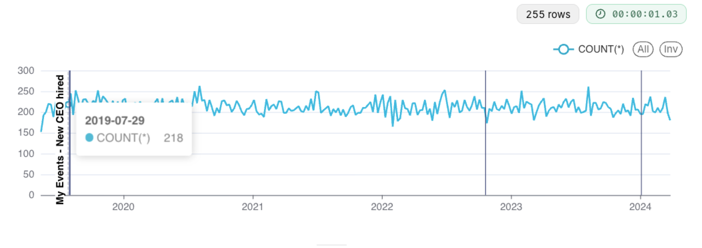

# Annotations

## Interval Annotations

1. Click on **Settings** and select **Annotation Layers**

2. Click **+ Annotation Layer** button and create your first annotation layer

3. In the annotation layer you just created, create your first annotation by clicking on **+ Annotation** 

4. Save your annotation. Then head to **Datasets** section in the top menu, click on the `healthcare_dataset` from the Snowflake database. Create a line chart with the following configurations. 

5. We will add a filter as shown

6. Scroll down to the **Annotations and Layers** section, and click **+ Add annotation layer** 
7. In the popup screen, configure your annotation as shown:

8. Update or create the chart, this should produce the following line chart with annotation (interval annotation)

## Event Annotations

1. From settings, head to annotation layers. Create a new annotation layer. You can call it `healthcare events`
2. Click on **+Annotation**

3. Create the following annotations 

4. Create a similar chart to the previous activity (line chart on `healthcare_dataset`)

5. Add a new event annotation as shown. 

This should produce the following chart 

