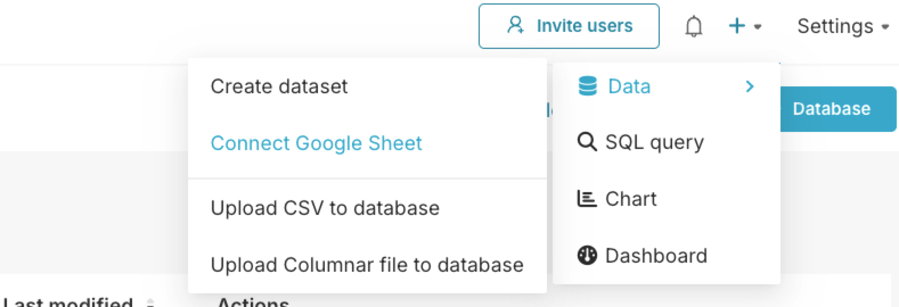
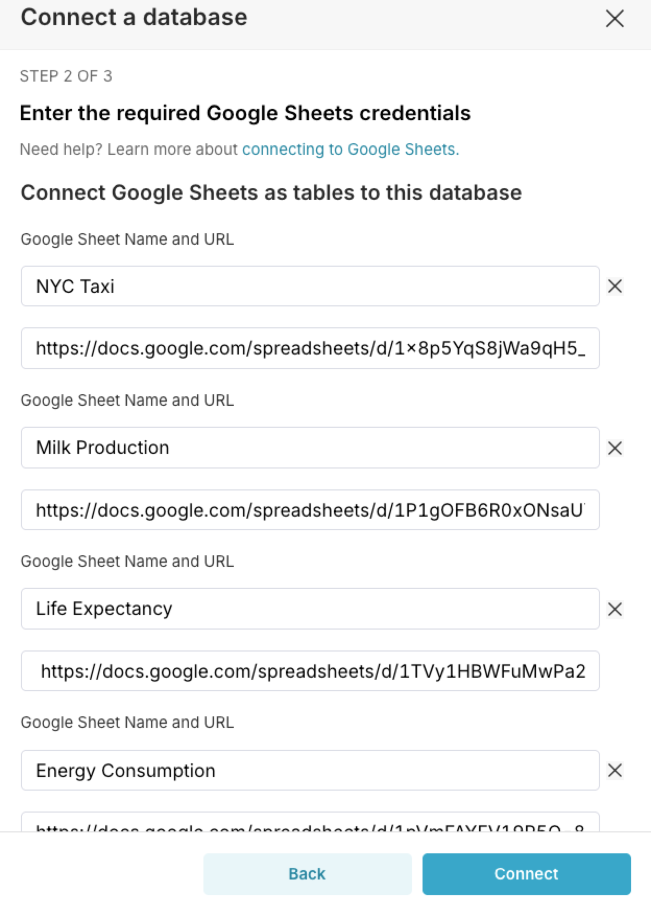
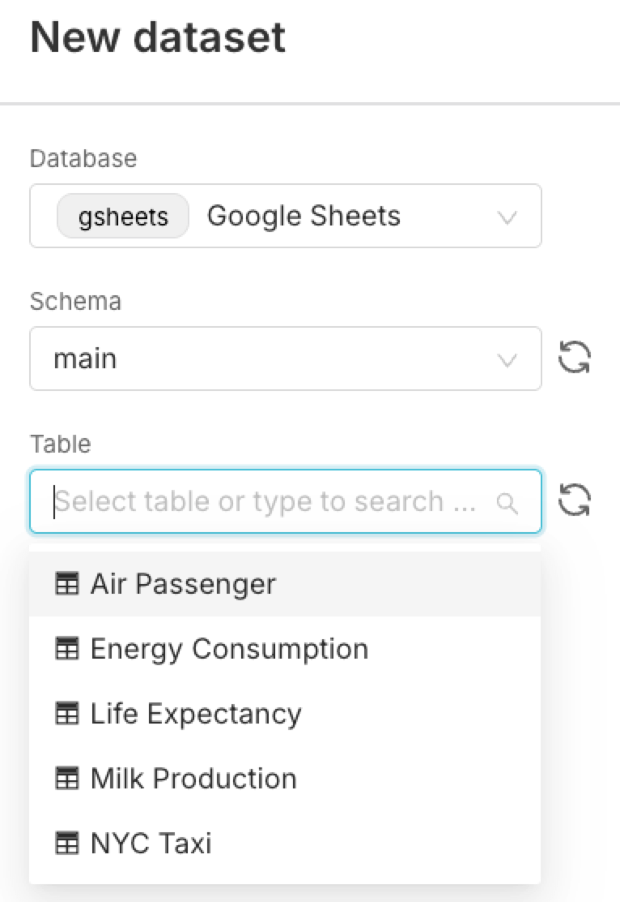
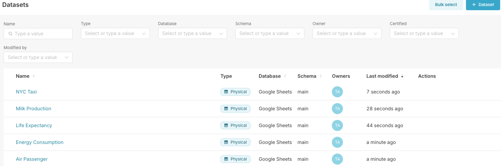
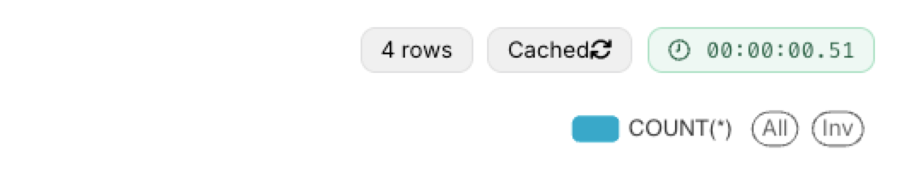

# Google Sheets

**You will first create a Google Sheets database and a connection.**

Click **+** then **Data** and select **Connect Google Sheet**

In the configuration screen. Keep the Display Name as `Google Sheets` and head down to the **Connect Google Sheets as tables to this database**. You will create 5 Google Sheet tables. Here are the URLS and names to use:

1. **NYC Taxi**: https://docs.google.com/spreadsheets/d/1x8p5YqS8jWa9qH5_sUTaE4to0pbq1zscl3J-8QYk1tM/edit?usp=sharing

2. **Milk Production**: https://docs.google.com/spreadsheets/d/1P1gOFB6R0xONsaUYcUUuwxADE3M5jokvir57WtMB5Fw/edit?usp=sharing
3. **Life Expectancy**: https://docs.google.com/spreadsheets/d/1TVy1HBWFuMwPa2nFV6G22UpzqvfeZdc_k-pi0VDTsJc/edit?usp=sharing
4. **Energy Consumption**: https://docs.google.com/spreadsheets/d/1pVmFAYFV19P5O-8DZtbdqYvCHymtAtidT_q0FRsLP8E/edit?usp=sharing
5. **Air Passenger**: https://docs.google.com/spreadsheets/d/1lSHVnkeJhzdDdXnlE7bEeUdfUHsn3PHKASwVJsBQbmo/edit?usp=sharing

Finally, click **Connect** then **Finish**.

**Once the connection and database are created. You will need to create a dataset for each Google Sheet**

Below are the five datasets I just created 

> ### Note
>
> When using Google Sheets, if the source sheet gets updated (e.g., additional rows added), then this should be reflected in the Chart/Dashboard once refreshed. Keep in mind that sometimes, the **Cache** if enabled it needs to be refreshed as well:
>
> 

