# Forecasting Examples

> ### Note
>
> I am using the datasets we just uploaded from Google Sheets (see lab `5.Google Sheets`)

### Life Expectancy 

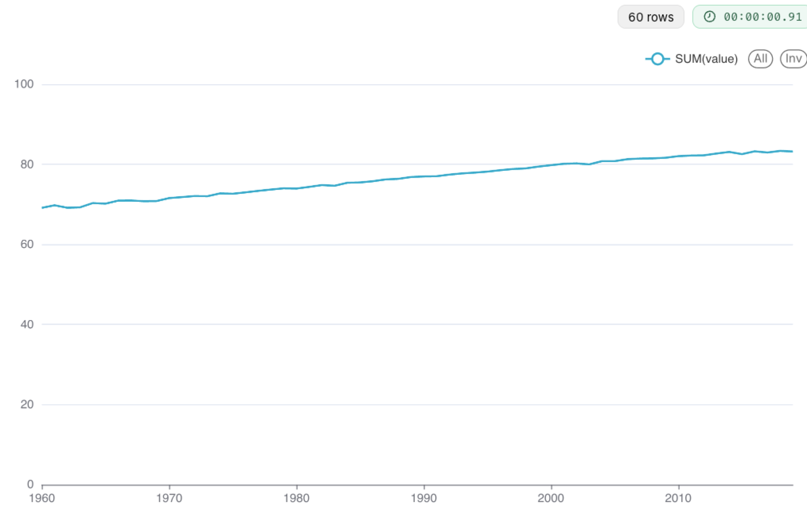

Check the **Truncate Y Axis**

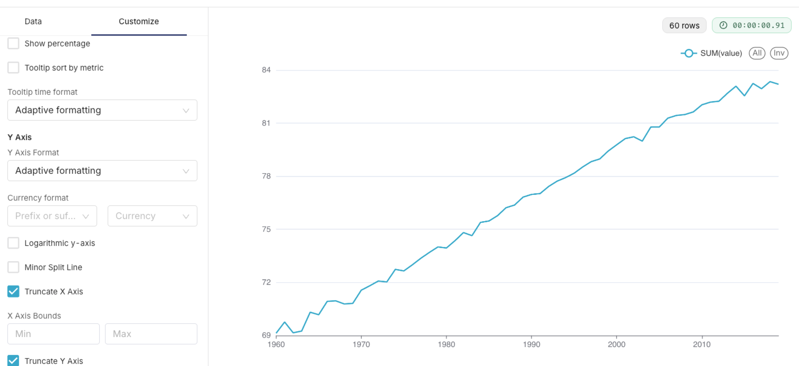

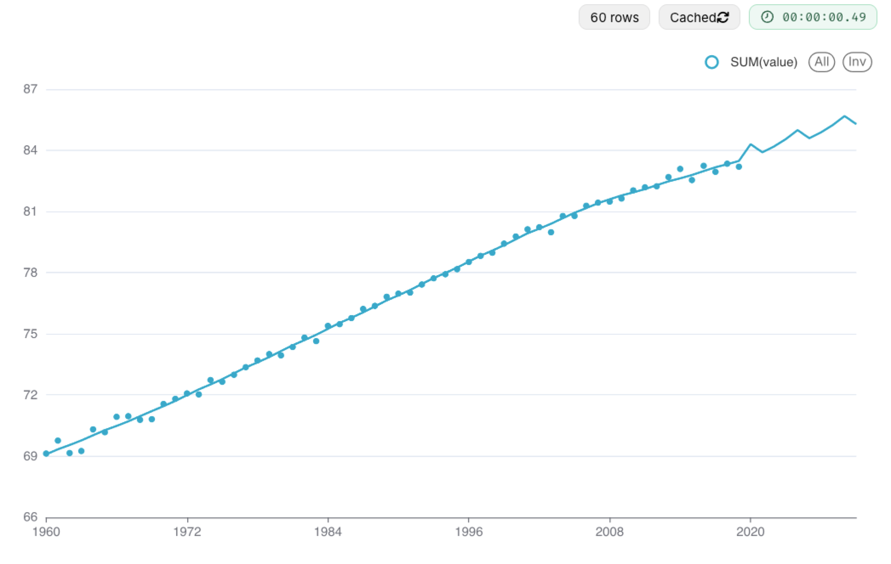

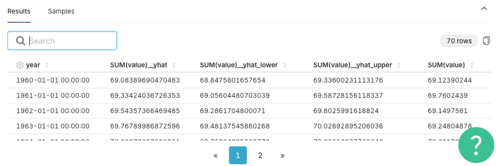

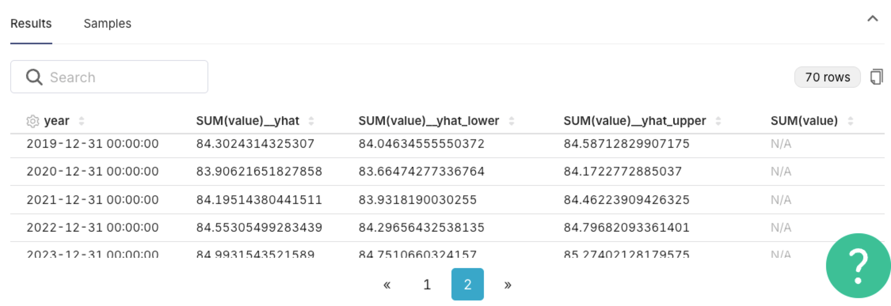

### Milk Production Dataset

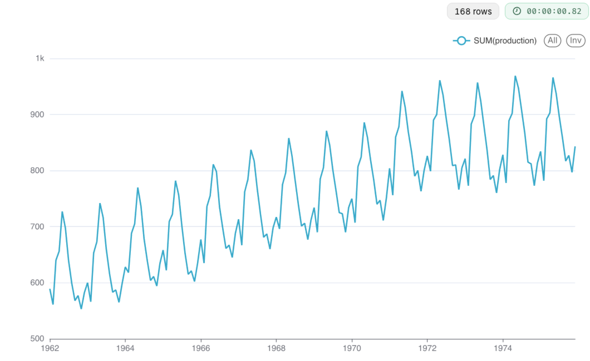

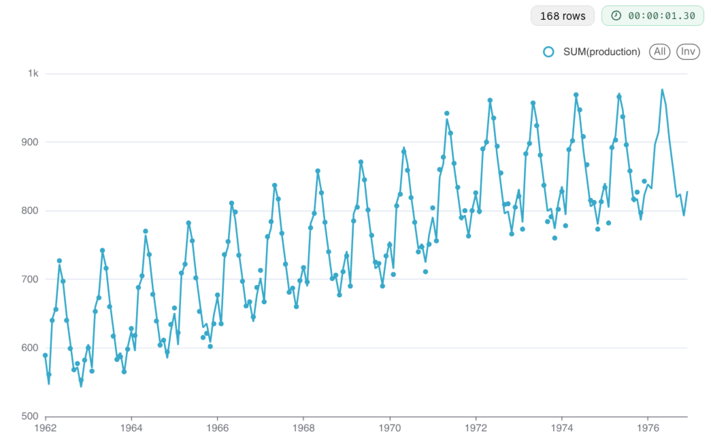

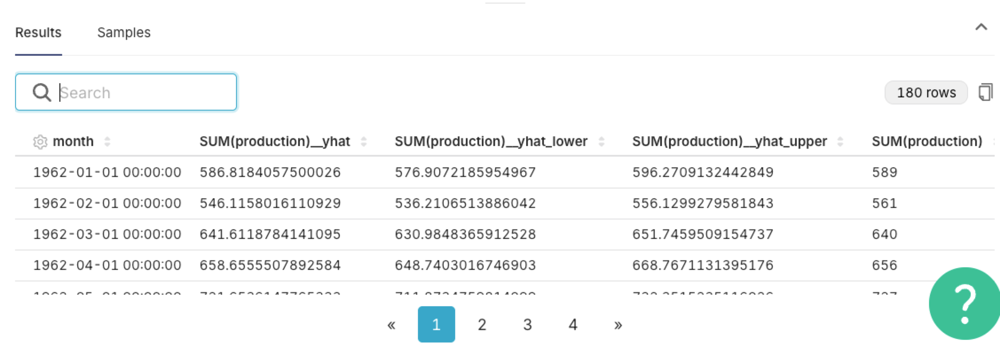

### Air Passenger

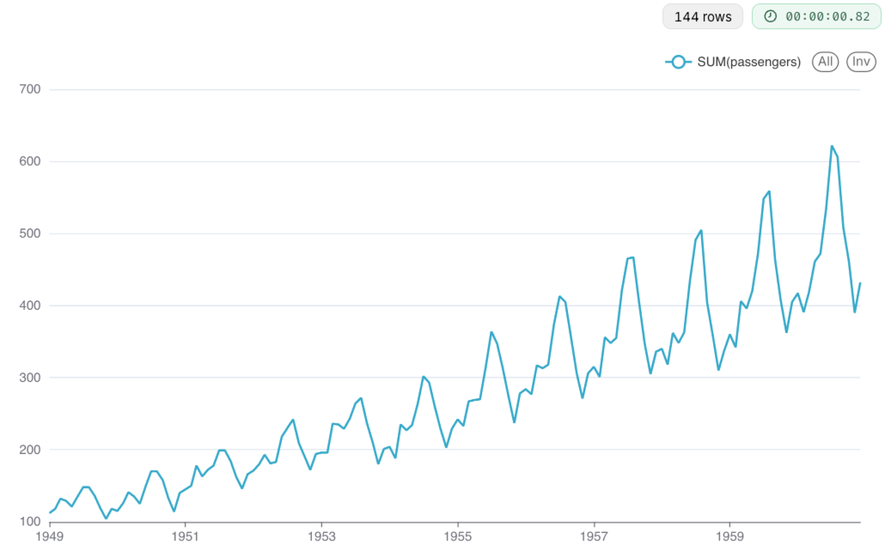

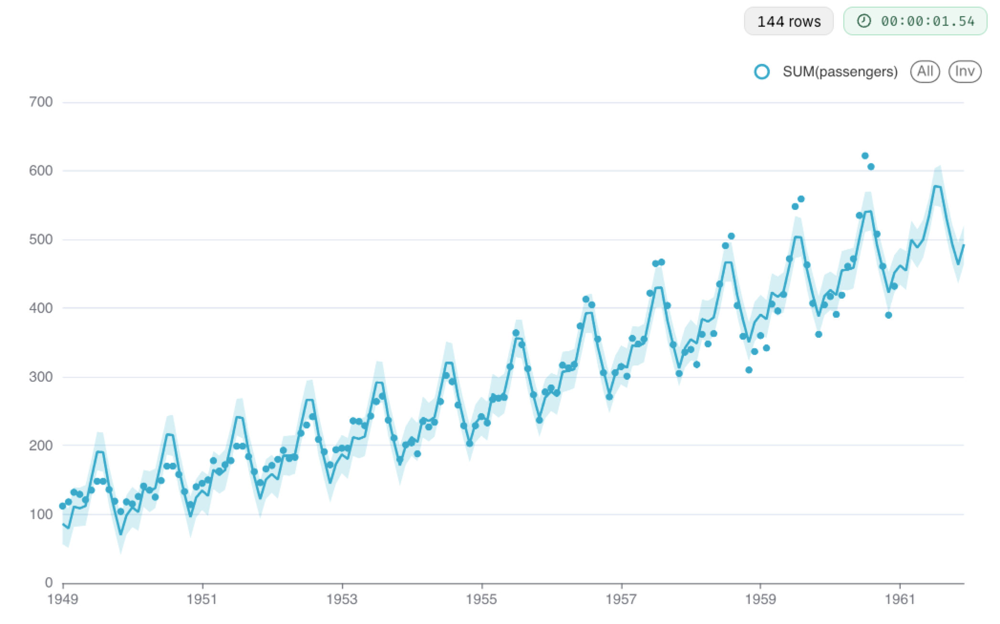

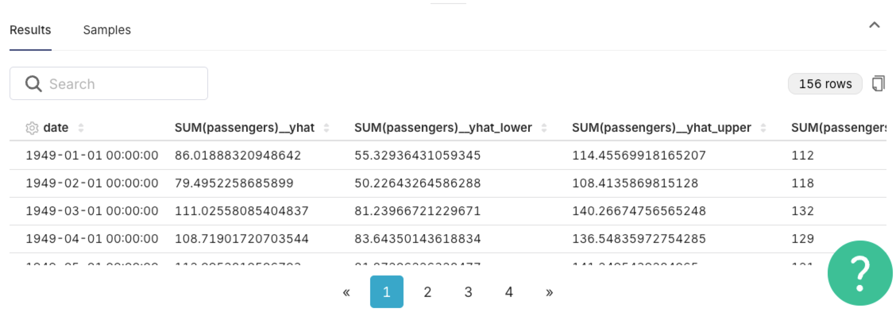

### NYC Taxi 

30 minute interval

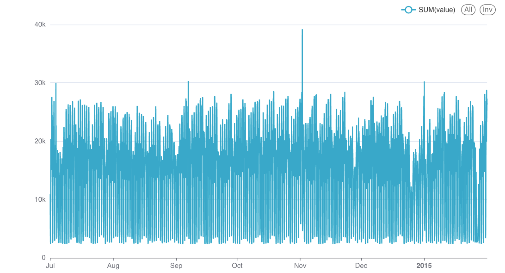

daily interval

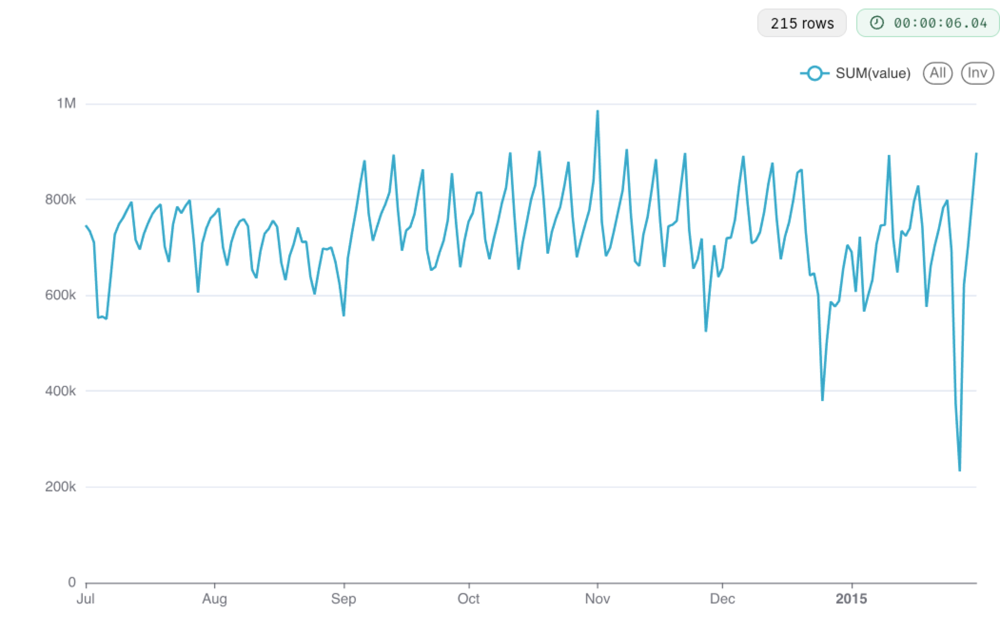

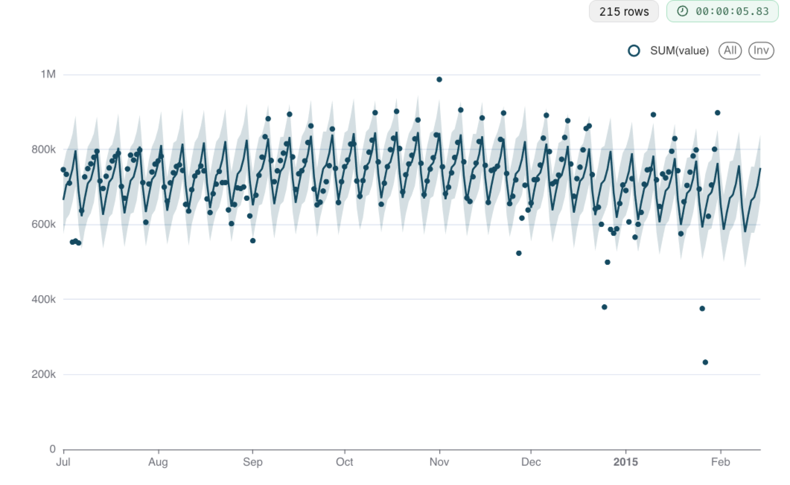

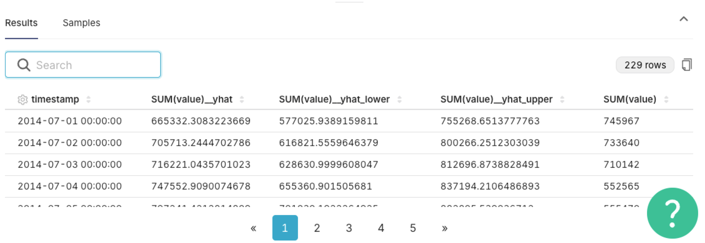

