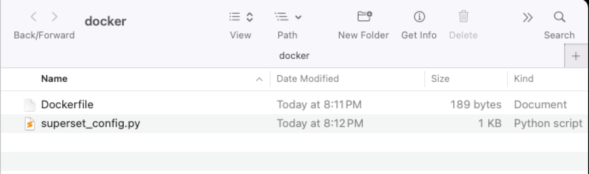

## Instructions (Dev) for installing oracledb 

Keep in mind we are using preset builds from Docker hub. This is great for development and learning superset. If you want to have more control, more production ready setup  see the below comment.

Create `Dockerfile` in your directory:

```dockerfile
USER root
RUN pip install oracledb

# Optional: install other dependencies as needed
# RUN apt-get update && apt-get install -y <other-packages>

USER superset

```

In the same directory create `superset_config.py`

```python
import sys
import oracledb
sys.modules["cx_Oracle"] = oracledb
import cx_Oracle
```

You can also add other configurations in the `superset_config.py`

```python
import sys
import oracledb
sys.modules["cx_Oracle"] = oracledb
import cx_Oracle

FEATURE_FLAGS = {
    "ENABLE_TEMPLATE_PROCESSING": True,
    "DRILL_BY": True,
}
```

For example, I created a directory called `docker` and here are the two files inside:



Then in your terminal run this Docker command from inside the folder that contains the Dockerfile:

```shell
docker build -t my-superset:latest .
```

You can then follow regular instructions that I shared in the class/google drive. This one below as an example to of using the configuration file:

```shell
docker run -d -p 8080:8088 \
  -e "SUPERSET_SECRET_KEY=password" \
  -e "TALISMAN_ENABLED=False" \
  -e "SUPERSET_CONFIG_PATH=/app/superset_config.py" \
  -v $(pwd)/superset_config.py:/app/superset_config.py \
  -v superset_data:/app/superset \
  --name superset my-superset:latest

```

````shell
docker exec -it superset superset fab create-admin \
  --username admin \
  --firstname Admin \
  --lastname Admin \
  --email admin@localhost \
  --password admin
````

```shell
docker exec -it superset superset db upgrade
docker exec -it superset superset init
```

You can continue with adding the option sample dataset …etc 

For example

```shell
docker exec -it superset superset load_examples 
```

> ### Note
>
> **For production and more custom configuration and control you should refer to the documentation here:**
>
> https://superset.apache.org/docs/installation/installation-methods
>
> Which lists three methods:
>
> * Docker Compose
> * Kubernetes
> * And PyPI
>
> Each method has steps outlined in their documentation 

