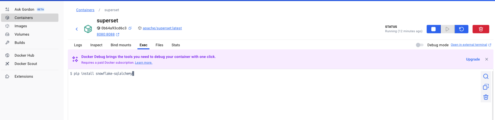

# Apache Superset Docker Instructions


### Download the official Docker Image

```shell
 docker pull apache/superset
```

### Start a container from the superset docker image

Superset requires a secret key for security. You must set the `SUPERSET_SECRET_KEY` environment variable when starting the container. In the example below, I am using `password`. You can change that to the value you want or keep it as is since this setup is for `dev` and training purposes and it is not intended for production environment. 

```shell
docker run -d -p 8080:8088 \
  -e "SUPERSET_SECRET_KEY=password" \
  -e "TALISMAN_ENABLED=False" \
  --name superset apache/superset:latest

```

- `-d`: Run container in detached mode
- `-p 8080:8088`: Map host port 8080 to container port 8088 (Superset default)
- `SUPERSET_SECRET_KEY`: Required for Superset to start
- `TALISMAN_ENABLED=False`: (Optional) Disables strict HTTPS enforcement, useful for local development
- `--name` is the name of the container that you want. In the example, the name is `superset`

###  Initialize Superset and Create an Admin User

 Once the container is running, you need to create an admin account and initialize the application. You can chose different values for the `username`, `firstname`, `lastname`, `email`, and `password`:

```shell
docker exec -it superset superset fab create-admin \
  --username admin \
  --firstname Admin \
  --lastname Admin \
  --email admin@localhost \
  --password admin

```

Then, upgrade and initialize the database 

```shell
docker exec -it superset superset db upgrade
docker exec -it superset superset init
```

You can the  load example data. The sample database `World Bank's Health Nutrition and Population Stat` will be downloaded.

```shell
docker exec -it superset superset load_examples 
```

```
 chmod -R 777 /app/superset_home
```

Finally, you can verify the admin permissions:

```shell
docker exec -it superset superset fab reset-perms
```

### Installing Python libraries 

Sometimes you will need to install additional libraries, for example to connect to **Snowflake** we will need to install  the snowflake-sqlalchemy  library.

There are two ways you can install Python libraries. Either from the host terminal:

```python
docker exec -it superset pip install snowflake-sqlalchemy
```

Alternatively, you can use the Docker Desktop tool, go to the **Exec** tab and then run your pip install:



Once installed, it is generally a good idea to restart the container 

```shell
docker restart superset
```

---

### Additional configurations with `superset_config.py`

There are additional configurations that you an apply using an external config file. This file is named `superset_config.py` file. This file can be located in your host machine, and point to that file when setting up the container as shown:

```shell
docker run -d -p 8080:8088 \
  -e "SUPERSET_SECRET_KEY=password" \
  -e "TALISMAN_ENABLED=False" \
  -e "SUPERSET_CONFIG_PATH=/app/superset_config.py" \
  -v $(pwd)/superset_config.py:/app/superset_config.py \
  -v superset_data:/app/superset \
  --name superset apache/superset:latest

```

superset_config.py

```python
# Enable Jinja templating and set a basic secret key for local use
SECRET_KEY = 'password'
SQLALCHEMY_DATABASE_URI = 'sqlite:////app/superset/superset.db'
DATA_DIR = '/app/superset'

FEATURE_FLAGS = {
    "ENABLE_TEMPLATE_PROCESSING": True,
    "THUMBNAILS": True,
    "THUMBNAILS_SQLA_LISTENERS": True,
    "SCHEDULED_QUERIES": True,
    "EMBEDDED_SUPERSET": True,
    "EMBEDDABLE_CHARTS": True,
    "DRILL_BY": True,
    "ALLOW_ADHOC_SUBQUERY": True
}

# Use built-in metastore cache for all cache types (suitable for playground)
FILTER_STATE_CACHE_CONFIG = {
    "CACHE_TYPE": "SupersetMetastoreCache",
    "CACHE_KEY_PREFIX": "superset_filter_cache",
    "CACHE_DEFAULT_TIMEOUT": 86400,  # 1 day
}

EXPLORE_FORM_DATA_CACHE_CONFIG = {
    "CACHE_TYPE": "SupersetMetastoreCache",
    "CACHE_KEY_PREFIX": "superset_explore_cache",
    "CACHE_DEFAULT_TIMEOUT": 86400,
}

CACHE_CONFIG = {
    "CACHE_TYPE": "SupersetMetastoreCache",
    "CACHE_KEY_PREFIX": "superset_metadata_cache",
    "CACHE_DEFAULT_TIMEOUT": 86400,
}

DATA_CACHE_CONFIG = {
    "CACHE_TYPE": "SupersetMetastoreCache",
    "CACHE_KEY_PREFIX": "superset_results",
    "CACHE_DEFAULT_TIMEOUT": 86400,
}

```

---

## **How to Use Feature Flags**

- Feature flags are typically set in your `superset_config.py` or via environment variables using the `SUPERSET_FEATURE_` prefix.
- Some features require additional configuration (e.g., Celery, SMTP, Slack) to be fully functional, especially for alerts and reports.
- Flags in testing may be unstable; use them in staging environments before deploying to production.

For further details on each flag, consult the official [Superset documentation](https://superset.apache.org/docs/configuration/configuring-superset/) or your deployment's `superset_config.py` comments.

Apache Superset uses feature flags to enable or disable certain features at runtime, allowing administrators to test new functionalities, control feature rollouts, and manage experimental or in-development features without redeploying code. Below is a detailed explanation of the feature flags you listed, grouped by their categories and current status.

### **Features in Testing (Usable but May Contain Bugs)**

- **ALERT_REPORTS**: Enables the Alerts & Reports framework, allowing the creation of automated alerts and scheduled reports that can be sent via email or Slack when certain SQL conditions are met or on a schedule. Requires additional configuration for Celery, SMTP, and/or Slack.
- **ALLOW_FULL_CSV_EXPORT**: Allows users to export entire datasets to CSV, potentially bypassing row limits. Useful for power users but may have performance implications.
- **CACHE_IMPERSONATION**: Changes how caching works when user impersonation is enabled, ensuring cache keys are unique per impersonated user.
- **CONFIRM_DASHBOARD_DIFF**: Prompts users to confirm changes when there are differences detected in dashboard versions, helping prevent accidental overwrites.
- **DYNAMIC_PLUGINS**: Allows loading plugins dynamically at runtime, enabling extensibility without restarting Superset.
- **DATE_FORMAT_IN_EMAIL_SUBJECT**: Enables the use of date formatting codes in email report subjects, so each report email can have a unique subject line with the date, avoiding email threading issues.
- **ENABLE_SUPERSET_META_DB**: Enables use of the Superset Meta Database for storing metadata. This is an advanced feature for managing Superset's internal state.
- **ESTIMATE_QUERY_COST**: Adds the ability to estimate the cost of running a query before execution, useful for large data warehouses or cost-sensitive environments.
- **GLOBAL_ASYNC_QUERIES**: Enables asynchronous query execution globally, improving responsiveness for long-running queries.
- **IMPERSONATE_WITH_EMAIL_PREFIX**: Alters user impersonation logic to use email prefixes, which can help with integration in certain authentication setups.
- **PLAYWRIGHT_REPORTS_AND_THUMBNAILS**: Uses Playwright (a browser automation tool) to generate reports and chart thumbnails, as an alternative to Selenium-based approaches.
- **RLS_IN_SQLLAB**: Enables Row Level Security (RLS) enforcement within SQL Lab, ensuring users only see data they are permitted to access.
- **SSH_TUNNELING**: Allows database connections to be made via SSH tunnels, improving security for connections to databases not directly accessible from the Superset server.
- **USE_ANALAGOUS_COLORS**: Enables the use of analogous color palettes in visualizations for improved aesthetics and accessibility.

### **Flags Retained for Runtime Configuration (Dynamic Configurations)**

These flags can be changed on the fly and act as runtime configurations, not just feature toggles.

- **ALERTS_ATTACH_REPORTS**: Controls whether screenshots or thumbnails are attached to alert notifications sent via email or Slack. Always attached for reports; this flag controls alerts specifically.
- **ALLOW_ADHOC_SUBQUERY**: Allows users to create ad-hoc subqueries within the SQL Lab interface.
- **DASHBOARD_RBAC**: Enables Role-Based Access Control (RBAC) for dashboards, allowing fine-grained permissions for dashboard access (see Superset documentation for details).
- **DATAPANEL_CLOSED_BY_DEFAULT**: Sets the data panel to be closed by default in the Explore view, streamlining the interface for users who prefer more workspace.
- **DRILL_BY**: Enables the "Drill By" feature, allowing users to click on visualizations and drill into more granular data.
- **DRUID_JOINS**: Enables support for joins in Druid datasources.
- **EMBEDDABLE_CHARTS**: Allows charts to be embedded in external websites or applications.
- **EMBEDDED_SUPERSET**: Enables embedding of Superset itself in other applications, such as through iframes or web components.
- **ENABLE_TEMPLATE_PROCESSING**: Allows the use of Jinja templating in SQL queries and other configuration fields, enabling dynamic query generation.
- **ESCAPE_MARKDOWN_HTML**: Escapes HTML in Markdown widgets to prevent XSS vulnerabilities.
- **LISTVIEWS_DEFAULT_CARD_VIEW**: Sets the default view for list pages (e.g., dashboards, charts) to a card view instead of a table.
- **SCHEDULED_QUERIES**: Enables the scheduling of arbitrary SQL queries, not just dashboard or chart reports.
- **SLACK_ENABLE_AVATARS**: Enables Slack avatars in notifications (see config.py for details).
- **SQLLAB_BACKEND_PERSISTENCE**: Persists SQL Lab sessions and queries in the backend database, allowing users to resume work across sessions.
- **SQL_VALIDATORS_BY_ENGINE**: Enables engine-specific SQL validators for improved query validation and error messaging.
- **THUMBNAILS**: Enables generation and display of chart and dashboard thumbnails in the UI and notifications.
