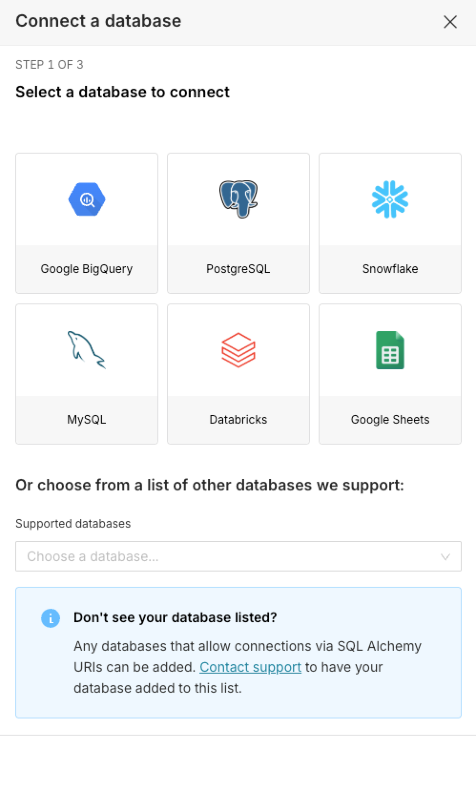
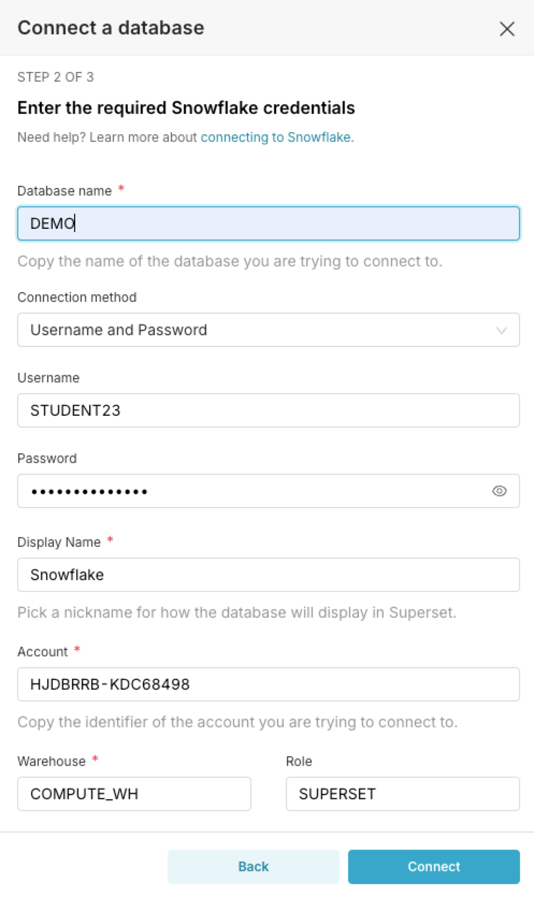
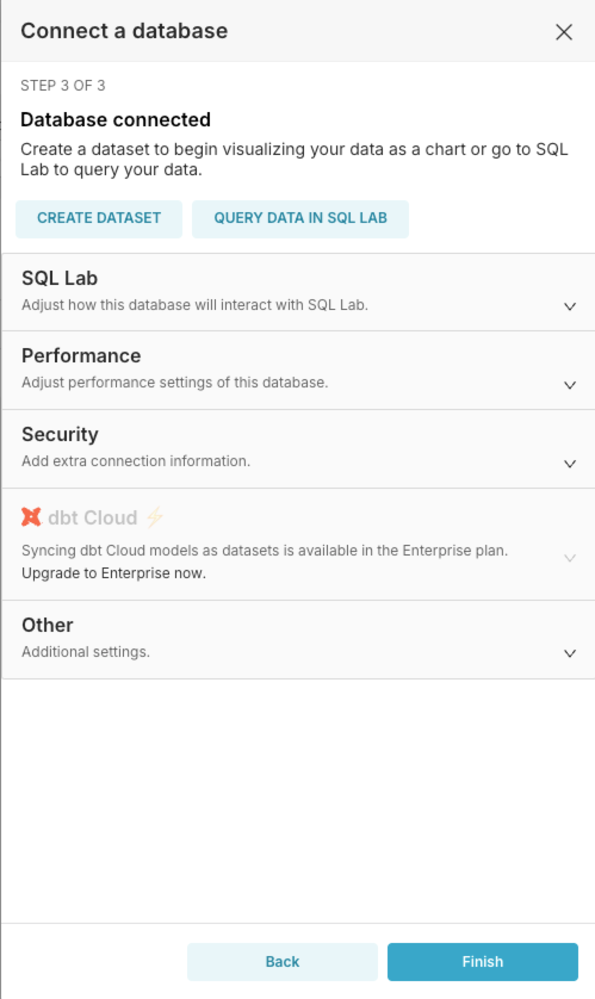
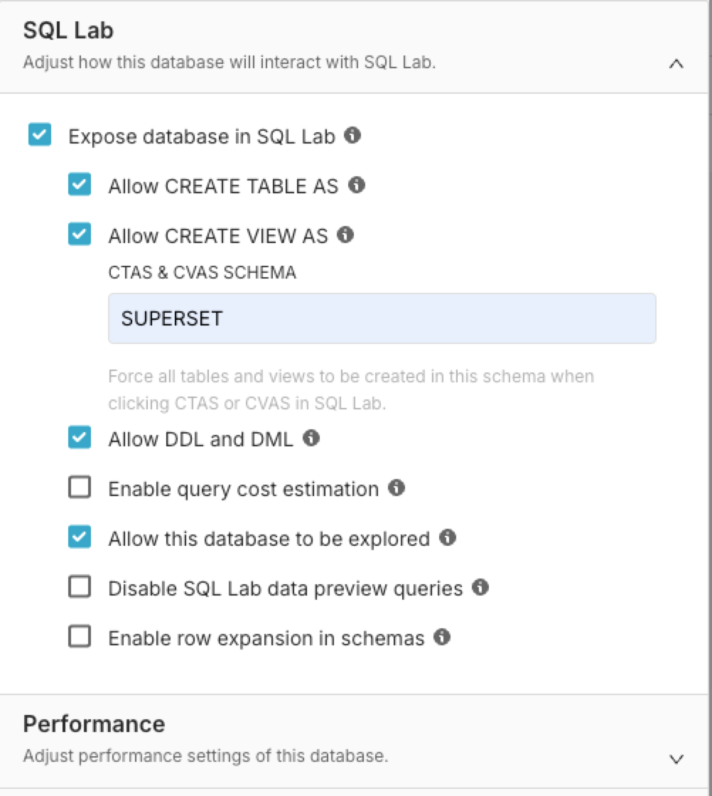
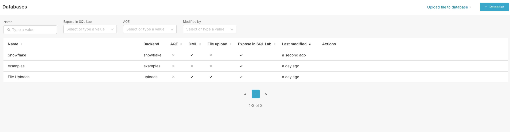
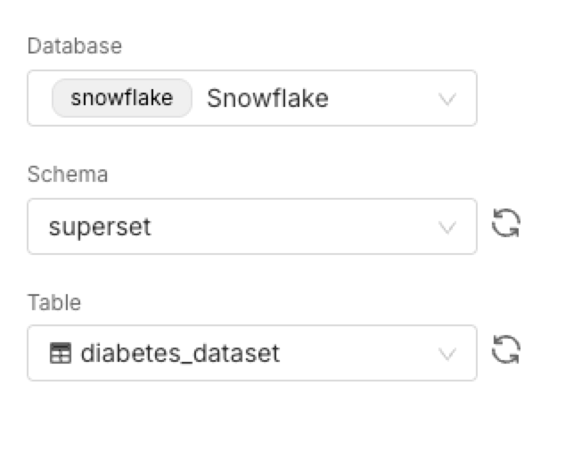
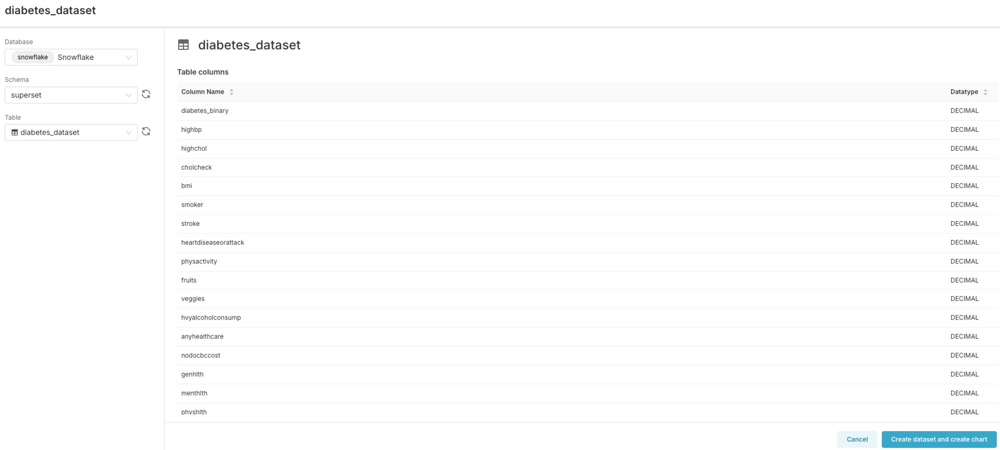

# Connecting to Snowflake Database

* From the **Settings** menu select **Database Connections**

* Click the **+ Database** button to create a new database connection

* Select Snowflake 

  

* Use the following information:

  * Database name: **DEMO**
  * Username: Your username, example **STUDENT1**
  * Password: `KHCC_training1`
  * Display Name: Keep as **Snowflake**
  * Account: `HJDBRRB-KDC68498`
  * Warehouse: `COMPUTE_WH`
  * Role: `SUPERSET`

Click **Connect**. This may take few second. If everything works out you will see `STEP 3 of 3` section

* Expand the **SQL Lab** section and check the following boxes:

Finally, click **Finish**

You should see the following under **Databases**

## Create a Dataset

Under the **Datasets** menu, click **+ Dataset**

Select the Snowflake database, then the Superset schema, finally the `diabetes_dataset` table 

Click **Create dataset and create chart**

This may take few seconds.

