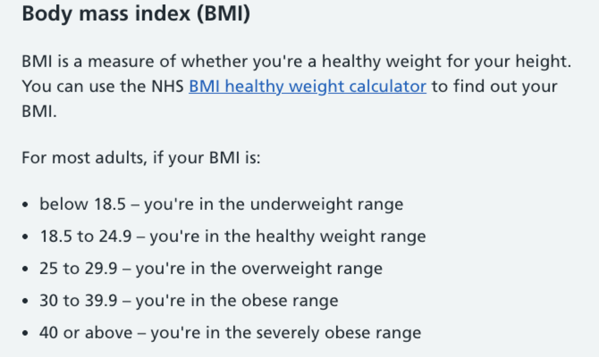
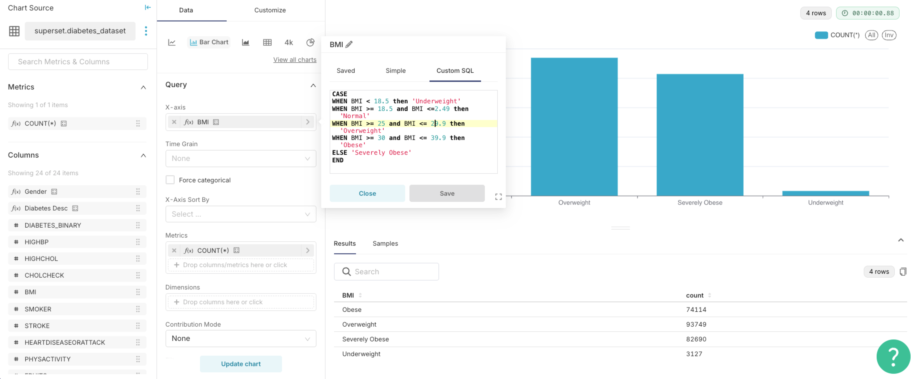
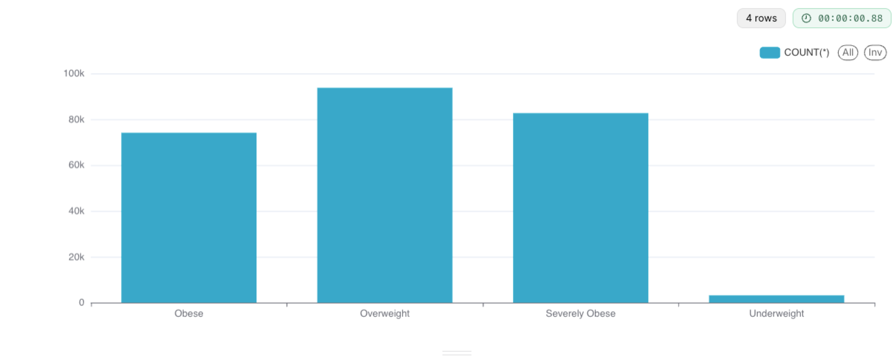
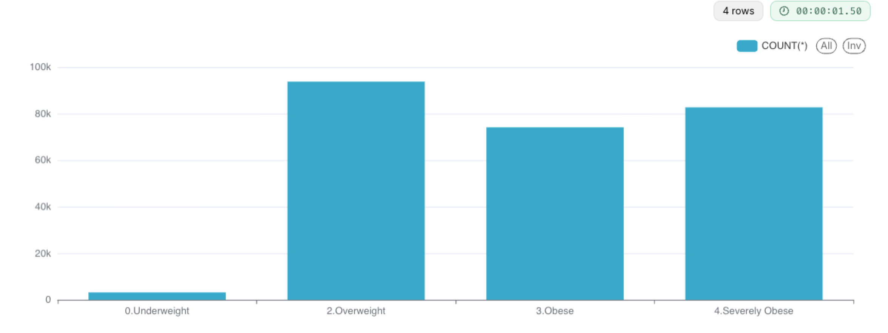
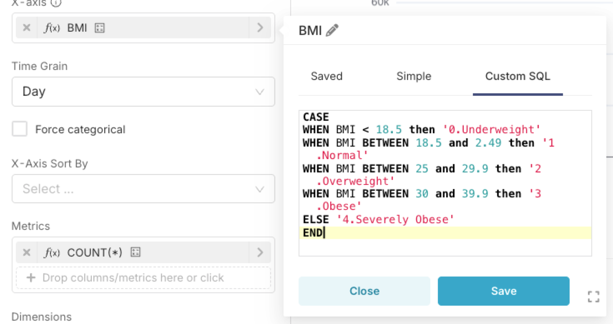
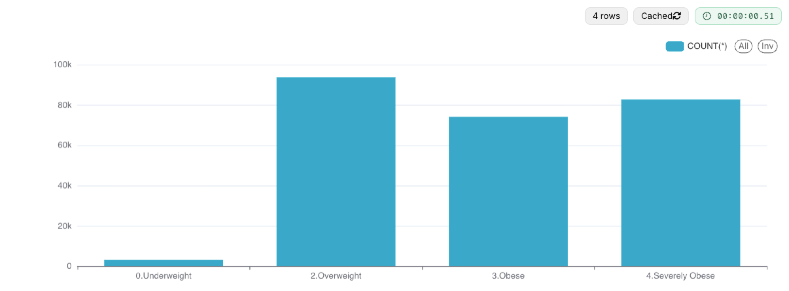

## using SQL CASE Statements

Example using `diabetes_dataset` in which we have numeric column `BMI` that we need to group its values into discrete buckets using **CASE** statement. 

Reference https://www.nhs.uk/conditions/obesity/

We will convert the logic into SQL



```sql
CASE 
WHEN BMI < 18.5 then 'Underweight'
WHEN BMI >= 18.5 and BMI <=2.49 then 'Normal'
WHEN BMI >= 25 and BMI <= 29.9 then 'Overweight'
WHEN BMI >= 30 and BMI <= 39.9 then 'Obese'
ELSE 'Severely Obese'
END
```





Further to maintain a specific order we can use the following

```sql
CASE 
WHEN BMI < 18.5 then '0.Underweight'
WHEN BMI >= 18.5 and BMI <=2.49 then '1.Normal'
WHEN BMI >= 25 and BMI <= 29.9 then '2.Overweight'
WHEN BMI >= 30 and BMI <= 39.9 then '3.Obese'
ELSE '4.Severely Obese'
END
```



Alternatively, a simpler way to write the SQL is leveraging the `BETWEEN` clause 

```sql
CASE 
WHEN BMI < 18.5 then '0.Underweight'
WHEN BMI BETWEEN 18.5 and 2.49 then '1.Normal'
WHEN BMI BETWEEN 25 and 29.9 then '2.Overweight'
WHEN BMI BETWEEN 30 and 39.9 then '3.Obese'
ELSE '4.Severely Obese'
END
```





---

