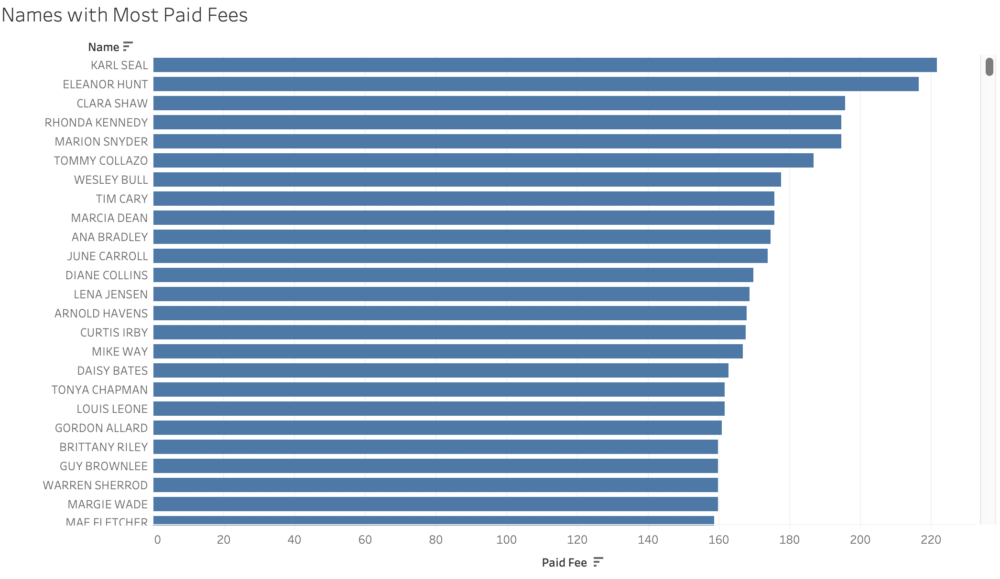
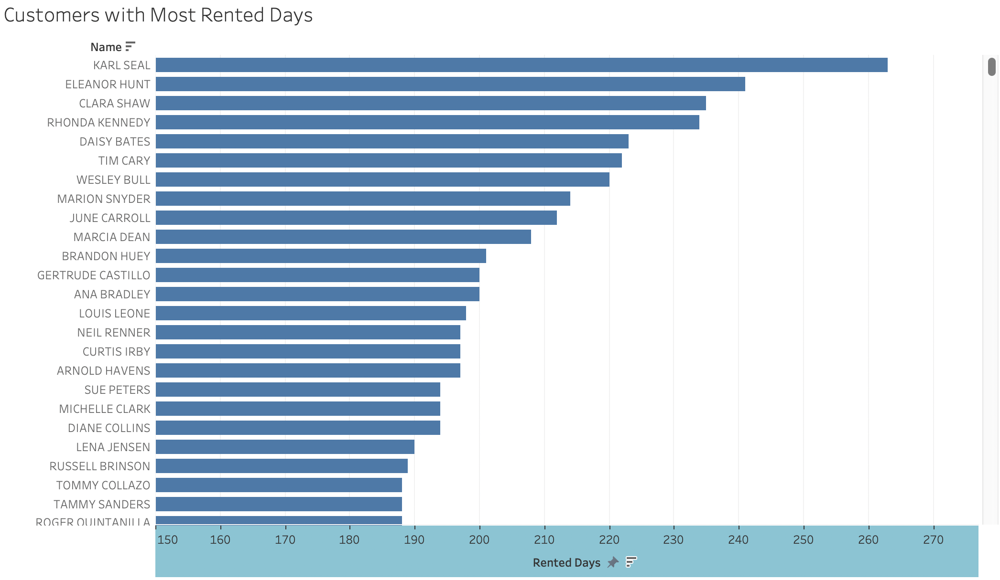
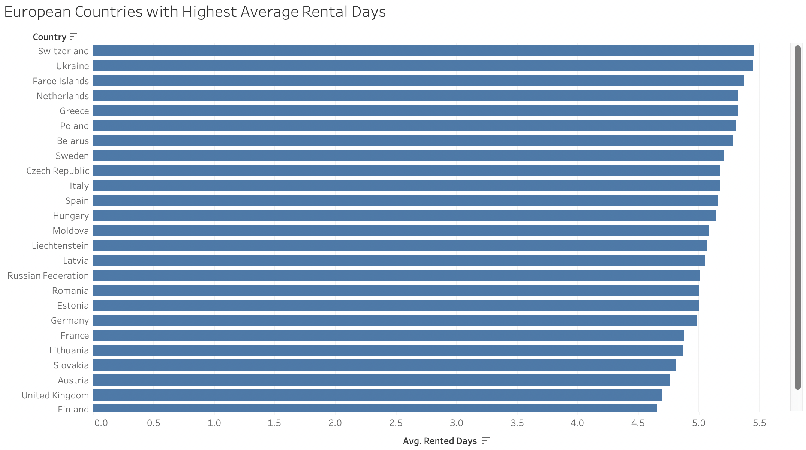
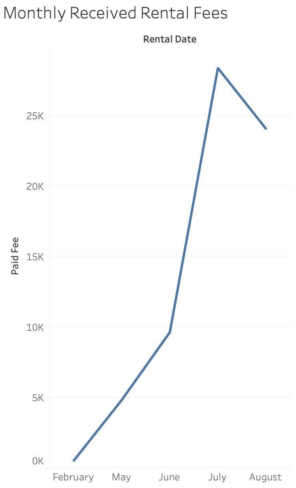
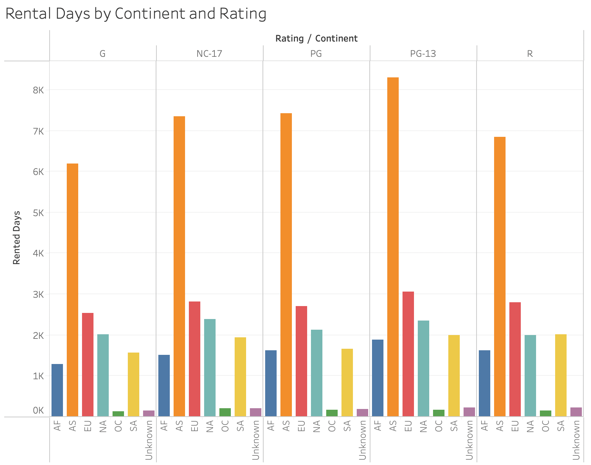

# Data Exploration with Tableau

In this activity, you will recreate visualizations by using Tableau.

## Instructions

* Using `GlobalRentals.xlsx`, visualize the following data:

   * The customers with the highest amount of paid fees, as in the following image:

   

   * The customers with more than 150 rental days, as in the following image:

   

   * The European countries with the highest average days of rental, as in the following image:

   

   * A monthly timeline of payments for rentals, as in the following image:

   

   * The rental days by continent and rating, as in the following image:

   

