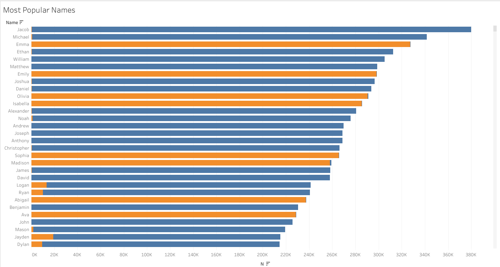
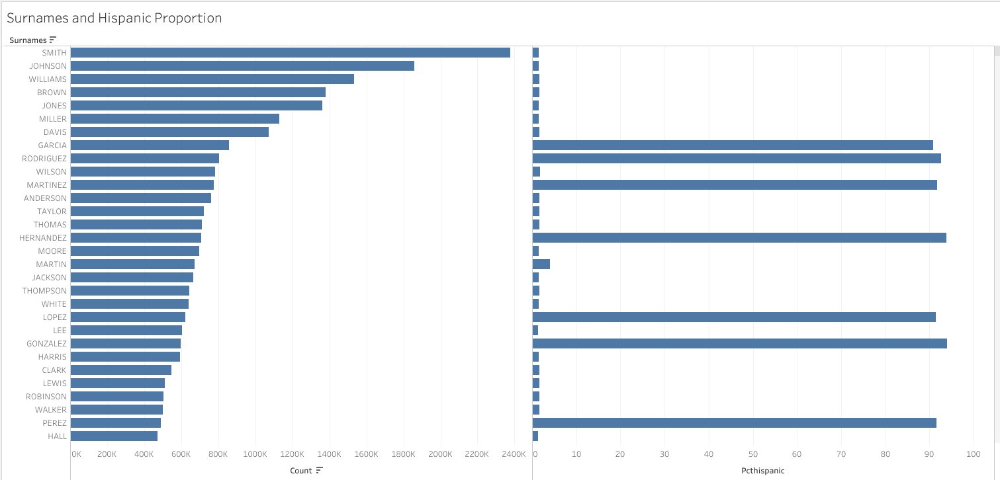
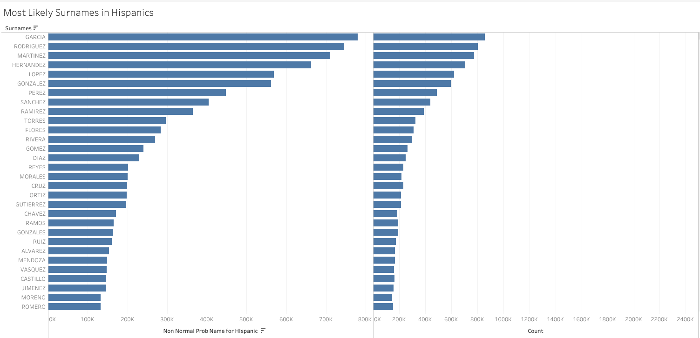
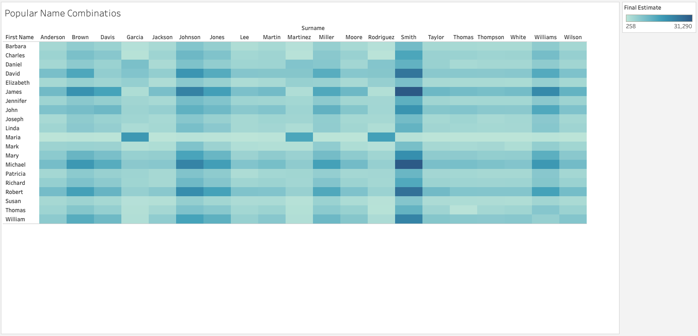

# Popular Baby Names

In this activity, you’ll create visualizations using data on popular baby names and surnames, along with demographics and popular name-surname combinations.

## Instructions

* Create several visualizations of names and their popularity, including the following:

  * The most popular baby names during the period from 2000 through 2017

  * The popularity of surnames and the proportion of Hispanic individuals with this surname

* Create a visualization for the provided popular name combinations.

* Create more specific visualizations:

  * For example, you could study how the popularity of your name, or someone you know, has changed over the years.

---

## References

Mona Chalabi, Andrew Flowers. (2014). Dear Mona, What's The Most Common Name In America? FiverThirtyEight [https://fivethirtyeight.com/](https://fivethirtyeight.com/)
[https://github.com/fivethirtyeight/data/tree/master/most-common-name](https://github.com/fivethirtyeight/data/tree/master/most-common-name)

 
