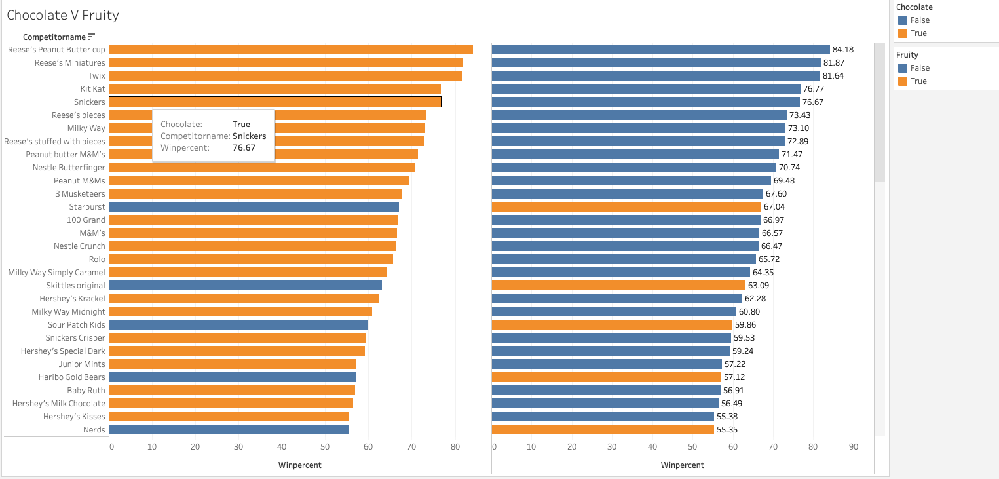
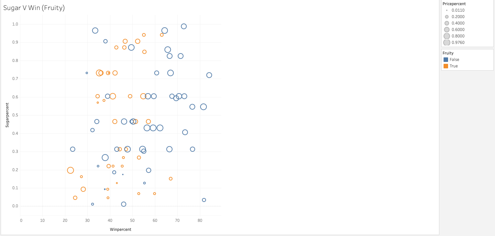
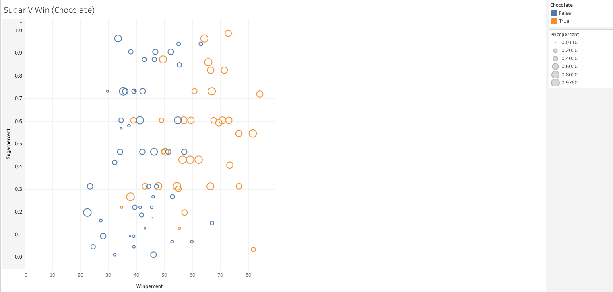

# The Ultimate Candy

You will now create charts to compare a few candies. The charts themselves are quite basic but will be made more complex using Tableau marks.

## Instructions

* Create a pair of bar graphs that chart the win percentage of each candy, then color the bars according to whether they are fruity and/or chocolatey.

* Create a scatter plot comparing the sugar percentage against the win percentage. Color the points based on whether they are chocolatey, and size them according to price.

* Create one more scatter plot comparing the sugar percentage against the win percentage. Color the points based on whether they are fruity, and size them according to price.

## References

ESPN Internet Ventures. (2014). The Ultimate Halloween Candy Power Ranking. [https://www.kaggle.com/fivethirtyeight/the-ultimate-halloween-candy-power-ranking/](https://www.kaggle.com/fivethirtyeight/the-ultimate-halloween-candy-power-ranking/)

