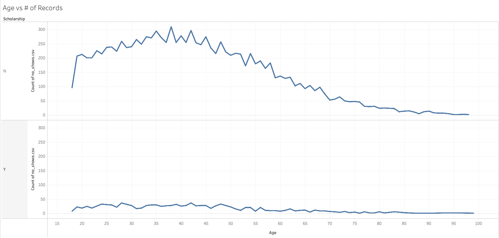
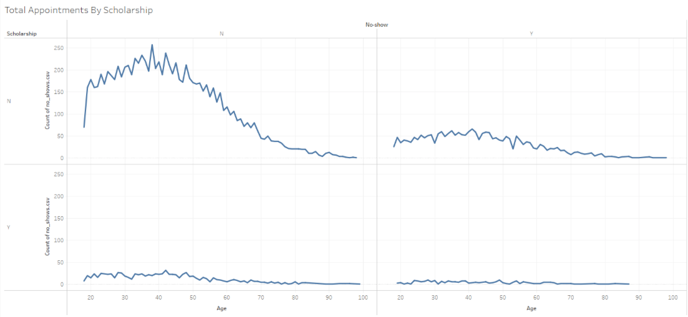
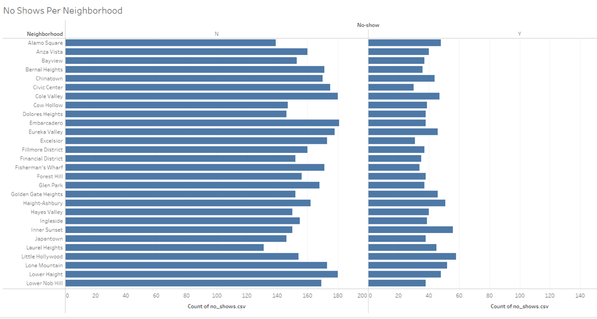
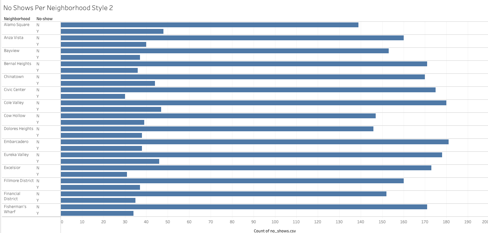
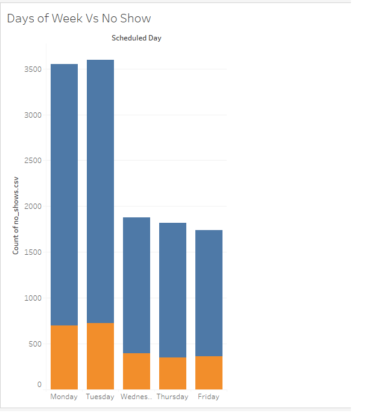
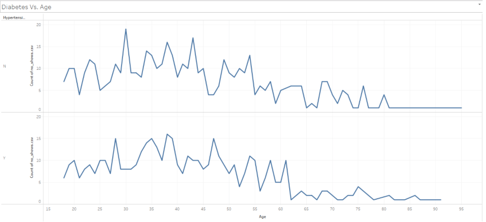
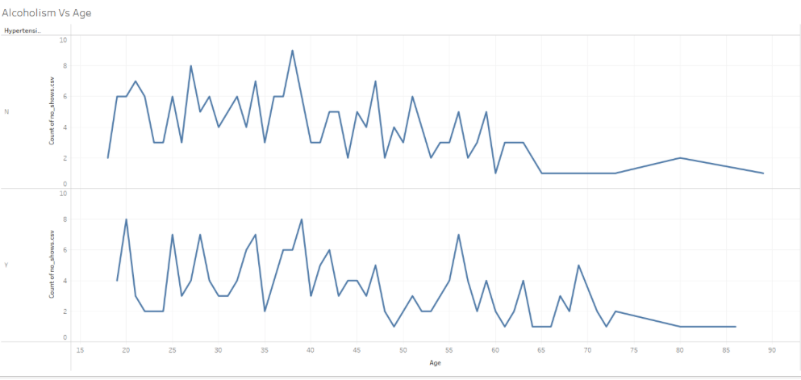

# No Shows

You will now spend time creating a series of visualizations that provide insights into who is more or less likely to show up to a doctor’s appointment.

## Instructions

* Create a line chart that compares the ages of patients against the total number of appointments. Then, split this graph based on Scholarship and whether the patient showed up to their appointment.

* For this first step, you'll need to convert `Age` from a Measure to a Dimension
* 

* Create a pair of bar charts that compare how many patients showed up to appointments versus how many were no-shows in different neighborhoods.

* Create a stacked bar chart that compares no-shows to those who made it to their appointment based on the day of the week.

* Create a pair of bar charts that compare how many patients showed up to appointments versus how many were no-shows for individuals with diabetes according to their hypertension status and age group

* Create a pair of bar charts that compare how many patients showed up to appointments versus how many were no-shows for individuals with alcoholism according to their hypertension status and age group

