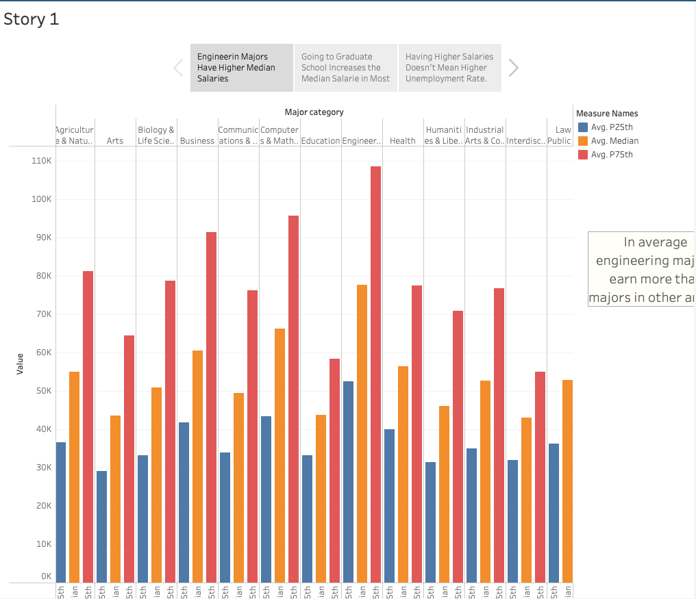
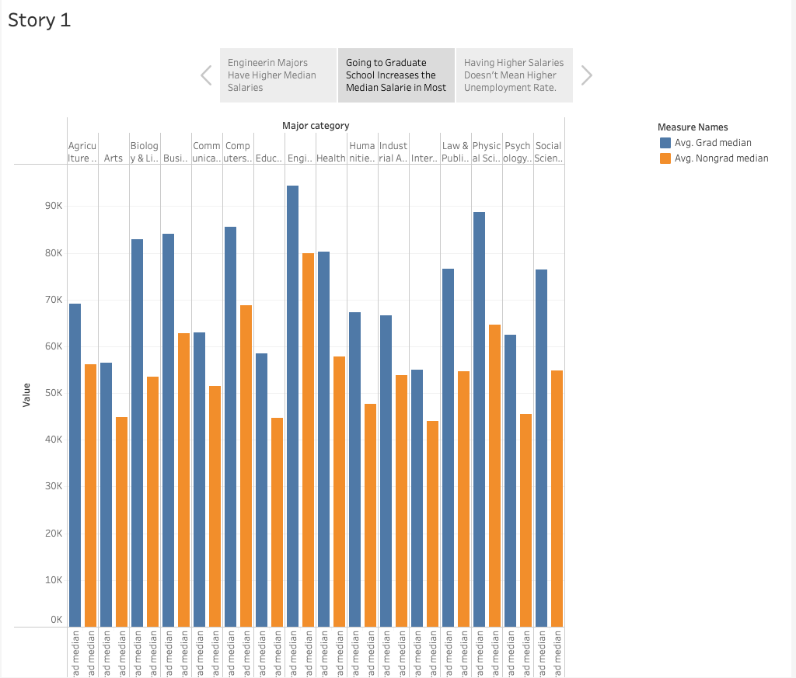
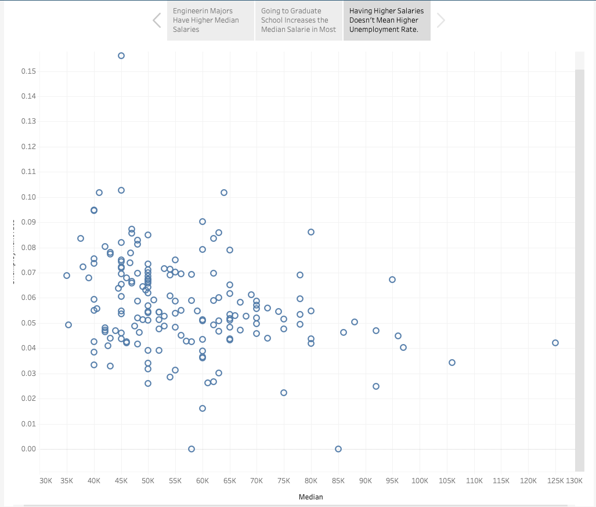

# Degrees That Pay

You will now build on everything you have learned today to create a story in Tableau that visualizes what degrees/universities/regions “pay off” the most over time.

## Instructions

* Create a story using the datasets provided, and formulate graphs that might be used to explore the following hypotheses:

* "Ivy League school graduates generally start their careers with higher salaries."

* "Going to school in the West or Northeast generally results in higher starting salaries."

* "Higher starting salaries generally correlate to higher midcareer salaries."

    **Note:** You do not have to join any of the data for this activity. The worksheets that you will be creating do not require you to join the datasets in Tableau.

## Bonus

Create a chart that visualizes starting median salaries, by major, against midcareer median, 75th percentile, and 90th percentile salaries.

## References

"The Economic Guide to Picking A College Major". (2014). Ben Casselman. [FiveThirtyEight](https://fivethirtyeight.com/)
[https://github.com/fivethirtyeight/data/tree/master/college-majors](https://github.com/fivethirtyeight/data/tree/master/college-majors)

