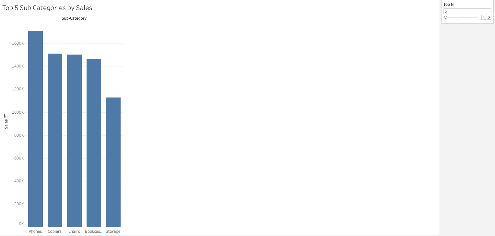
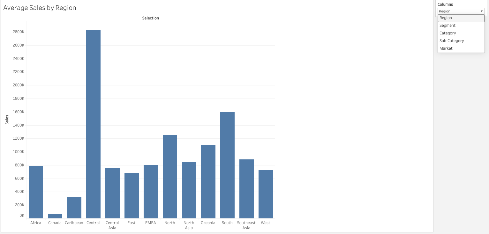
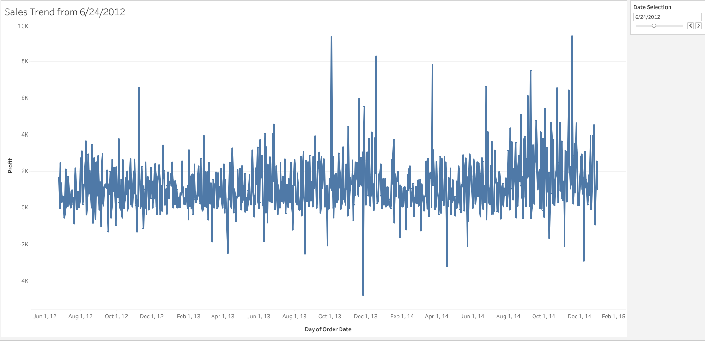
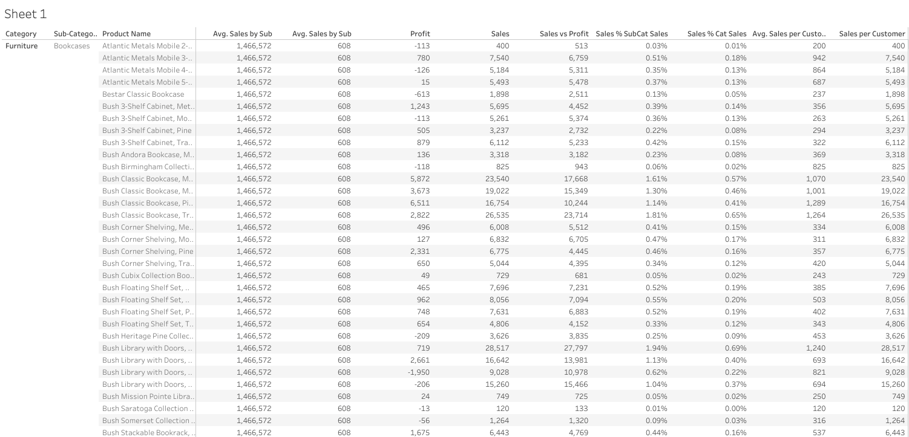
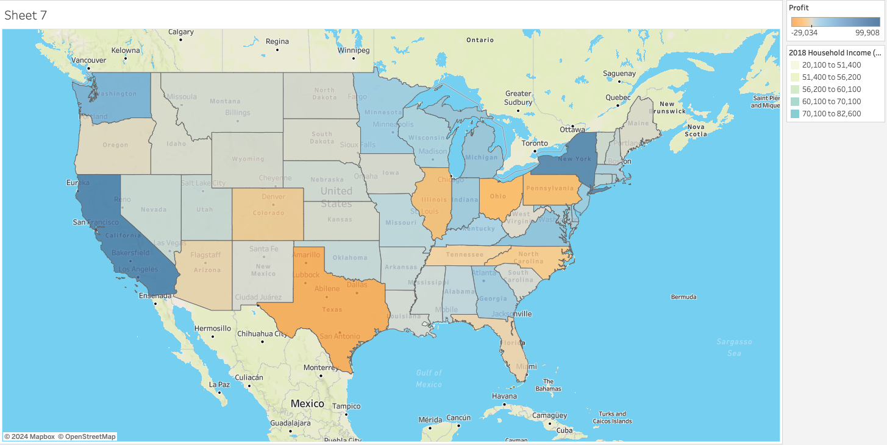

# Tableau Parameters and LOB Practice 

**Create a Dynamic Top N Charts as Shown**

**Create a Dynamic Column Selection as Shown**

**Create a Dynamic Date Filter base on Order Date with 30-day Increment**

**Create the following LOB Report**

Make sure the view is full screen

**Create a Products Hierarchy and a Geography Hierarchy**

**Map Formatting**

Show Profit by State 

