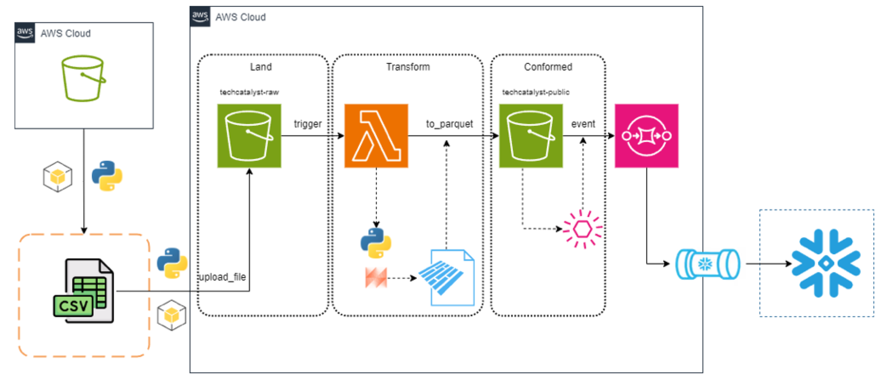
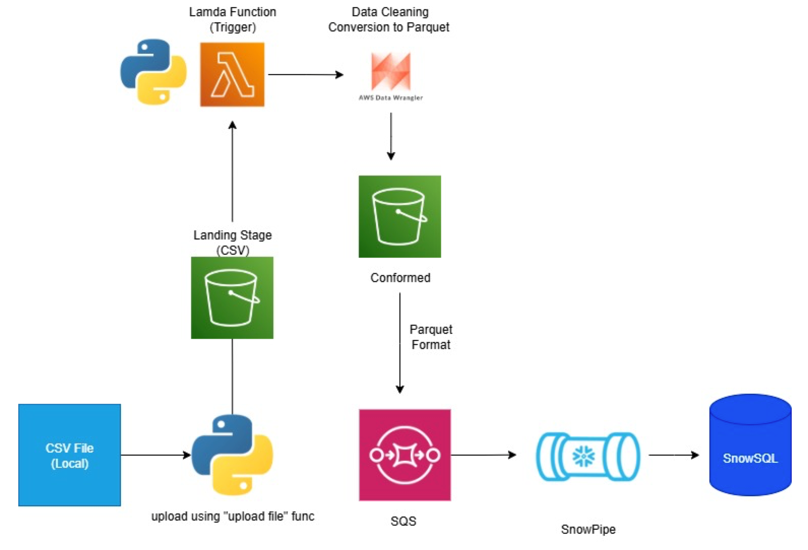

# The Hartford: TechCatalyst Data Engineering 2025

* [Learning Plan](#learning-journey)
* [Student Showcase](#Student-Showcase)
* [Key Data Engineering Skills](#key-data-engineering-skills)
* [Most Underrated Skills for Data Engineers](#Most-Underrated-Skills-for-Data-Engineers)
* [AWS](#aws-console)
* [Resources](#resources)
  * [Python Resources](#python-pandas-resources)
  * [SQL Resources](#sql-resources)
  * [SQL Window Functions](#sql-window-functions)
  * [Snowflake](#snowflake)

---

# Learning Journey

## Student Showcase (11 Students)

* [Blake](https://github.com/Havenfire/techcatalyst-2025/blob/master/S3_Snowflake_Pipeline/Lab_Written_solutions.md)

  

* [Jaden](https://github.com/JadenAstle/techcatalyst-2025/blob/main/aws_snowpipe_labs/submission.md)

  

* [Ben](https://github.com/BenA669/BAtechca/blob/main/lab1-5/etl_solution.md)

  

* [Fabiola](https://github.com/fabiola-rojas/techcat2025-fabiola/tree/baeb1ed41030e6a973ed5af3e50b9682840e5087/w6-work/S3%20and%20Snowflake%20(w6d1))

  

* [Emma](https://github.com/emmaparadis/techcatalyst2025/blob/main/AWS_Snowpipe_Project/lab.md)

  

* Suchita

  

* [Shaswat](https://github.com/Shaswat975/techcatalyst-2025/tree/main/Week%206%20Labs%201-5)

  

  

* [Melissa](https://github.com/melissarfranco25/techCat25/tree/main/Training/Week_6)

  

* [Camrenn](https://github.com/CamrennWallace-Rivera/techcatalyst-2025/blob/main/Camrenn_SnowPipe_Lab/Cam_Pipe.md)

  

* [XanderMacha](https://github.com/xandermacha/techcat-de-2025/blob/master/s3%20and%20snowpipe/s3%20and%20snowpipe.md)

  

* [Alexia](https://github.com/AlexiaAdams/techcat-2025/tree/main/Snowpipe)

  

  
  
  

# Key Data Engineering Skills

[Source](https://www.tealhq.com/skills/data-engineer)

## Most Underrated Skills for Data Engineers

While technical prowess often takes the spotlight in Data Engineering, there are subtle yet powerful skills that are crucial for success but frequently overlooked.

### 1. Data Intuition

The ability to sense patterns and anomalies in data without immediate analysis is a nuanced skill for Data Engineers. This intuition guides effective data architecture and can preemptively identify potential issues, ensuring data reliability and quality before they become costly.

### 2. Effective Communication

Data Engineers must translate complex data concepts into clear, actionable insights for cross-functional teams. Mastering this communication bridges the gap between technical and non-technical stakeholders, facilitating better decision-making and project alignment.

### 3. Business Acumen

Understanding the business context in which data solutions are applied enables Data Engineers to design systems that truly align with organizational goals. This skill ensures that technical efforts are not just precise, but also pragmatic and impactful, driving real business value.

## AWS Console

* Web Console Access: https://developintelligence.signin.aws.amazon.com/console

# Resources

## Command Line

1. [Data Science at the Command Line](https://jeroenjanssens.com/dsatcl/)

## Python Pandas Resources

* https://www.w3schools.com They have tutorials for Python, Pandas, and SQL
* https://automatetheboringstuff.com Great book for getting up to speed on Python
* https://wesmckinney.com/book/ Python for Data Analysis by the author of the Pandas library 

## SQL Resources

* https://www.w3schools.com They have tutorials for Python, Pandas, and SQL
* https://mode.com/sql-tutorial/introduction-to-sql 

### SQL Window Functions

* [Data Camp: Window Functions Cheat Sheet (download)](https://images.datacamp.com/image/upload/v1713890725/Marketing/Blog/SQL_Window_Functions_1_1.pdf)

* [Learn SQL: Window Functions Cheat Sheet (download)](https://learnsql.com/blog/sql-window-functions-cheat-sheet/Window_Functions_Cheat_Sheet.pdf)

  ## Snowflake

  * [Snowflake Portal](https://wpa36811.snowflakecomputing.com/)
  * [Snowflake TPCH Benchmark Data Model](https://docs.snowflake.com/en/user-guide/sample-data-tpch)

  
